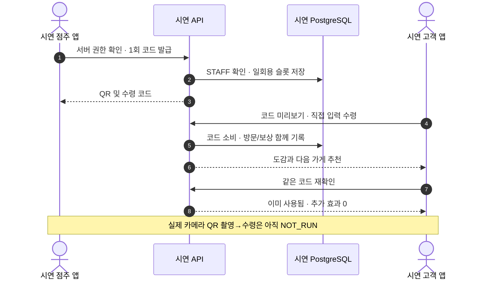
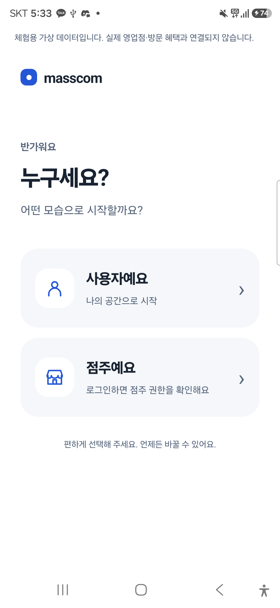
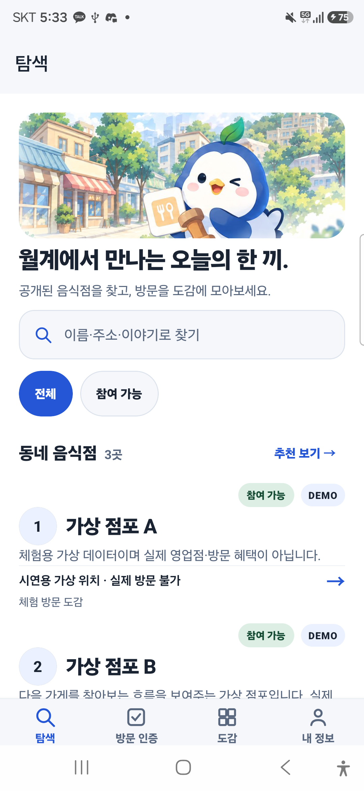
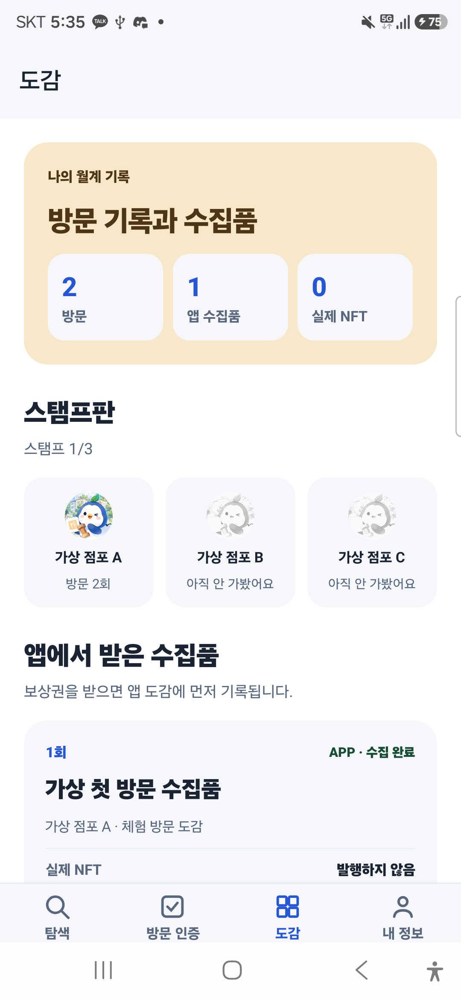
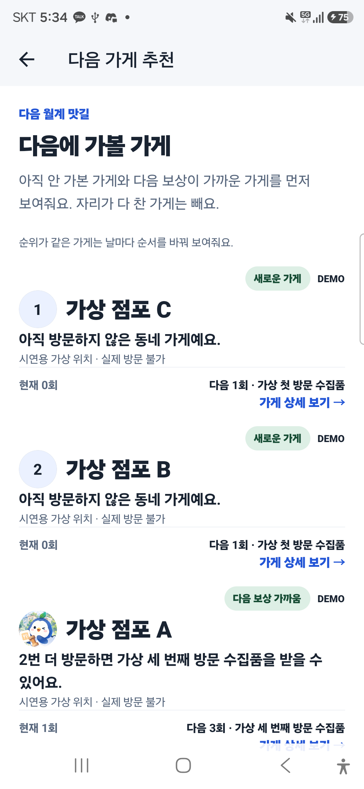
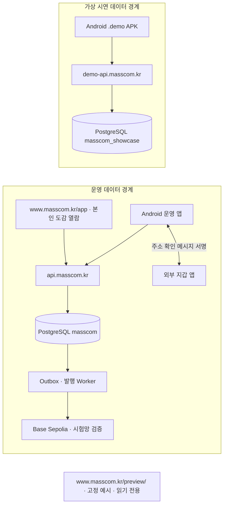

<p align="center">
  
</p>

<h1 align="center">월계 마스코트 · MassCOM</h1>

<p align="center">동네 가게를 발견하고, 방문을 기록하고, 마스코트를 모으는 Android 서비스.<br>외부 지갑 NFT는 선택 기능이며 앱 수집품과 실제 발행 상태를 구분합니다.</p>

<p align="center">
  
  
  
  
  
</p>

<p align="center">
  <a href="https://www.masscom.kr/preview/">시연 웹 보기</a> ·
  <a href="https://github.com/2026-KW-HACKATHON/27_MassCOM/releases/tag/showcase-android-v0.1.0-preview.3">시연 APK 받기</a> ·
  <a href="https://github.com/2026-KW-HACKATHON/27_MassCOM/releases/tag/android-v0.1.0-test.3">운영 테스트 APK 받기</a> ·
  <a href="https://www.masscom.kr/app/">운영 웹 보기</a> ·
  <a href="docs/TEST_STATUS.md">검증 현황</a> ·
  <a href="#설치검증">직접 실행</a>
</p>

> 배너는 콘셉트 일러스트입니다. 시연 점포·방문은 가상 데이터이며 협약 점포, Google Play 승인, 매출 증가를 뜻하지 않습니다. 현재 시연 APK에서는 두 초대 계정의 로그인·점주 발급·고객 **직접 코드 입력 수령·중복 거절**까지 폰에서 확인했습니다. 실제 카메라 QR 촬영→수령, 시연 앱 외부 지갑·NFT 발행은 별도 `NOT_RUN`입니다.

## 왜 만드는가

| 대상 | 다루는 문제 | MassCOM의 접근 | 현재 근거 |
| --- | --- | --- | --- |
| 지역 이용자 | 가게를 찾은 뒤 방문 경험이 이어지지 않음 | 탐색 → 방문 기록 → 마스코트 도감 → 다음 가게 추천 | [가상 점포 3곳·두 계정 폰 실기](docs/evidence/showcase-two-account-phone-2026-09-27.json) |
| 점주·직원 | 방문 확인과 중복 수령을 구분해야 함 | 서버 권한 확인 뒤 일회용 코드 발급, 사용 후 추가 효과 차단 | [Android 발급·수령·재입력](docs/evidence/showcase-two-account-phone-2026-09-27.json) |
| 지갑이 없는 사람 | 탐색과 방문에 암호화폐 지갑이 진입 장벽이 됨 | 앱 수집품은 지갑 없이 사용하고 NFT 발행만 외부 지갑으로 분리 | [도감의 앱 수집품 1·실제 NFT 0](docs/evidence/showcase-android-apk-2026-09-27.json) |

## 지금 열어보기

| 구분 | 바로 열기·받기 | 현재 상태 |
| --- | --- | --- |
| 운영 웹 | [www.masscom.kr/app/](https://www.masscom.kr/app/) | 실제 운영 데이터, Google 로그인·읽기 전용 본인 도감. Samsung Chrome의 www 로그인·재열기·로그아웃 확인 |
| **시연 웹** | [설치 없이 바로 보기](https://www.masscom.kr/preview/) · [GitHub 웹 전용 미리보기 태그](https://github.com/2026-KW-HACKATHON/27_MassCOM/releases/tag/showcase-web-v0.1.0-preview.1) | 가상 점포 A·B·C와 예시 수집품을 표시하는 정적 시연, 실제 방문·NFT 실적 아님 |
| 운영 Android 테스트 앱 | [test.3 APK](https://github.com/2026-KW-HACKATHON/27_MassCOM/releases/tag/android-v0.1.0-test.3) | 운영 package·업로드 키 사전 릴리스. [Samsung 로그인·복원과 16KB 설치](docs/evidence/operating-android-test3-2026-09-28.json)는 확인했지만 Play 승인·실제 점포·현장 QR·운영 지갑 재검증은 아님 |
| **시연 Android 앱** | [Preview 3 APK](https://github.com/2026-KW-HACKATHON/27_MassCOM/releases/tag/showcase-android-v0.1.0-preview.3) · [설치·검증 상태](docs/ANDROID_DOWNLOADS.md) | 별도 package·키·API의 사전 릴리스. [서명·GitHub digest](docs/evidence/showcase-preview3-release-2026-09-27.json)와 [Samsung 설치·가상 3점포·Google 취소 후 재진입](docs/evidence/showcase-preview3-phone-2026-09-28.json)은 확인. **초대 밖 실제 계정 로그인·카메라 QR 촬영 수령·지갑·NFT는 미검증** |

저장소는 사용자가 공개로 전환했습니다. GitHub Release와 시연 웹은 GitHub 로그인·소스 다운로드 없이 열 수 있습니다.

**현재 판정:** 필수 36개 시험 ID는 31 `PASS` / 2 `BLOCKED` / 3 `NOT_RUN`입니다. Base Sepolia 발행과 운영 지갑 검증은 [별도 증거](docs/TEST_STATUS.md)가 있고, 시연 APK에는 전용 지갑·발행 기능을 자동으로 포함하지 않았습니다. [시연 APK 세부 상태](docs/ANDROID_DOWNLOADS.md)와 [현재 차단 항목](docs/BLOCKERS.md)이 아래 그림보다 우선합니다.

`www.masscom.kr`은 포털·운영 웹(`/app/`)·읽기 전용 시연 웹(`/preview/`)의 대표 주소입니다. `api.masscom.kr`과 `demo-api.masscom.kr`은 서로 다른 운영/가상 데이터베이스에 연결됩니다. 저장소와 APK 사전 릴리스는 공개됐지만 테스트 설치본을 Google Play 승인·일반 운영 출시로 보지 않습니다.

## 한눈에 보기

<details>
<summary>개발 문서·검증 근거 전체 보기</summary>


- [모바일 개발용 UI 시안·로컬 실행](apps/mobile/README.md): 개발용 미리보기를 보존하고 시연 APK에는 첫 역할 선택·권한 확인·빈 공간 투어를 분리했다. 운영 앱의 네 기능 탭은 유지하며 [시연 설치본 실기 범위](docs/evidence/showcase-android-apk-2026-09-27.json)를 따로 기록했다.
- 시연 Android 빌드·배포: `kr.masscom.wolgye.demo`/`masscom-demo`, 전용 Google·Keychain 서명·[공개 API](https://demo-api.masscom.kr/health)를 사용한다. [최신 Preview 3 APK](https://github.com/2026-KW-HACKATHON/27_MassCOM/releases/tag/showcase-android-v0.1.0-preview.3)는 [서명·GitHub digest](docs/evidence/showcase-preview3-release-2026-09-27.json)와 [Samsung 설치·기본 화면](docs/evidence/showcase-preview3-phone-2026-09-28.json)까지 확인했다. [Preview 2](https://github.com/2026-KW-HACKATHON/27_MassCOM/releases/tag/showcase-android-v0.1.0-preview.2)의 그림 화면과 Preview 1의 [두 계정 직접 코드 수령](docs/evidence/showcase-two-account-phone-2026-09-27.json)은 이전 설치본 실증이다. 초대 밖 계정 로그인·실제 카메라 QR 촬영→수령은 `NOT_RUN`이다.
- [시연 호스트 격리](infra/showcase-host/README.md): 기존 Lightsail의 독립 API/DB에 가상 A/B/C를 기동하고 두 초대 계정의 내부 발급→수령→도감·중복 방지를 [당시 내부 API 증거](docs/evidence/showcase-internal-auth-claim-2026-09-27.json)로 확인했다. [PR #192](https://github.com/2026-KW-HACKATHON/27_MassCOM/pull/192) 병합 뒤 **시연 API만** 새 고객 로그인 코드로 [배포](docs/evidence/showcase-open-login-api-deployment-2026-09-27.json)했다. 새 APK 기본 화면은 폰에서 확인했지만 초대 밖 실계정 로그인과 지갑/NFT는 별도 미검증이다.
- [기존 Lightsail의 포털·운영 웹 이관](infra/lightsail/README.md): AWS DNS·공인 TLS와 운영 웹 Google 로그인을 확인했습니다. [최신 apex/www 설치 안내](docs/evidence/public-open-page-2026-09-28.json)는 운영 test.3·시연 Preview 3을 공개 연결하며 이전 [삭제 안내·www 배포](docs/evidence/web-only-deployment-2026-09-28.json)를 유지합니다. Samsung Android Chrome의 서로 다른 Google 계정 2개 순차 로그인·빈 도감·세션 전환은 이전 웹 실증이고 [최신 운영 APK의 폰 로그인](docs/evidence/operating-android-test3-2026-09-28.json)은 별도 확인했습니다. 실제 기록이 있는 계정 간 도감 격리는 미검증입니다.
- [기존 서버 SSH 접속](docs/SERVER_ACCESS.md): 이 Mac의 `ssh masscom` 및 더블클릭 접속 파일 사용법. AWS 콘솔 로그인과 별개이며 개인키는 Git 밖에 보관

- [모바일 디자인 기준](DESIGN.md): 탐색·방문 인증·도감·내 정보와 읽기 전용 시연 웹의 파란 팔레트·접근성 원칙
- [AI 모델 사용 기준](docs/AI_MODEL_ROUTING.md): GPT‑6 Luna/Sol/Astra 작업별 사용처와 검증 경계
- [모바일 UI 변경 명세](docs/superpowers/specs/2026-09-23-mobile-ui-navigation-design.md): Issue #126의 범위·보존 조건·검증 기준
- [프로젝트 포털](docs/index.html): 흐름·아키텍처·평가 증거·결정 상태를 시각적으로 탐색
- [공개 프로젝트 포털](https://www.masscom.kr): 다운로드 없이 열리는 기존 AWS Lightsail의 실제 HTTPS 배포
- [Android 설치본 상태](docs/ANDROID_DOWNLOADS.md): 운영 테스트 APK와 별도 시연 APK의 설치 링크·패키지·미검증 범위
- [시연용 읽기 전용 웹](apps/showcase-web/README.md) · [운영용 읽기 전용 웹](apps/production-web/README.md): 별도 코드·데이터 경계. 기존 apex에서 Android Chrome의 서로 다른 2계정 순차 로그인은 확인했고, 새 www에서는 1계정 로그인·로그아웃과 apex 세션 유지까지 확인했습니다. www의 두 번째 계정과 기록이 있는 도감의 교차 노출은 미검증입니다.
- [현재 HTTPS 시연 웹](https://www.masscom.kr/preview/): 가상 점포 A·B·C 고정 예시. 기존 Vercel 주소는 장애 복구용으로 보존
- [공개 계정 삭제 안내](https://www.masscom.kr/account-deletion): 이메일 요청·보존 정보·지갑 비밀 경계. 안전한 계정 대상 확인·실제 삭제 처리 절차는 [미완료](docs/BLOCKERS.md)
- [발표·시연 페이지](docs/presentation.html): 3분·5분 발표 장면과 실제/미실행 증거 경계
- [현장 검증 빈 기록지](docs/FIELD_VALIDATION.md): 동의·과업·결과를 미리 채우지 않은 양식
- [제출 체크리스트](docs/SUBMISSION_CHECKLIST.md): 승인 전 공개·태그·제출 금지 경계
- [제출 증거 manifest](docs/SUBMISSION_EVIDENCE.json): 2026-09-23 main 기준선(PR #130까지)의 CI·PR·스크린샷·BLOCKED/NOT_RUN 기계 판독 기록. 이후 상태는 [현재 상태](docs/PROJECT_STATE.md)가 우선
- [포털 시각 검증](docs/evidence/project-portal-visual-verdict.json): 데스크톱·모바일 뷰포트와 접근성 결과
- [현재 상태](docs/PROJECT_STATE.md): 실제 완료·미완료·BLOCKER
- 이슈 [#136](https://github.com/2026-KW-HACKATHON/27_MassCOM/issues/136)·[#137](https://github.com/2026-KW-HACKATHON/27_MassCOM/issues/137)은 미완료 상태로 다시 열었습니다. [시연 앱 진입 계획](docs/superpowers/plans/2026-09-24-issue136-showcase-entry.md), [외부 시연 전달 계획](docs/superpowers/plans/2026-09-24-issue137-showcase-delivery.md), [운영 웹 본인 도감 계획](docs/superpowers/plans/2026-09-24-issue137-production-collection.md)은 실행 계획이지 구현·실기 검증 완료 증거가 아닙니다.
- [제품 요구사항](docs/PRD.md): RQ-001~RQ-021
- [결정 기록](docs/DECISIONS.md): 승인·제안·외부 확인 구분
- [테스트 원장](docs/TEST_STATUS.md): v3 19절의 36개 ID와 실행 근거
- [Phase 1 지갑 연결](docs/PHASE1_WALLET_LINK.md): Android·Reown·SIWE 구현과 실제 MetaMask 검증
- [실제 Android 기기 증거](docs/evidence/android-physical-device.json): 빌드·설치·실행·복귀·MetaMask 준비 상태
- [실제 지갑 흐름 증거](docs/evidence/android-wallet-connection.json): 연결·체인 전환·서명·서버 확인·복원 결과
- [미설치 지갑 복귀 증거](docs/evidence/android-wallet-missing.json): 스토어 이동·수동 복귀·한국어 재시도 안내
- [지갑 주소 변경 증거](docs/evidence/android-wallet-address-change.json): 계정별 확인 격리와 MetaMask 세션 한계
- [음식점 탐색 Android 증거](docs/evidence/android-merchant-discovery.json): 지갑 없는 목록·상세·선택적 지갑 이동
- [방문 수령·도감 Android 증거](docs/evidence/android-claim-collection.json): 점주 권한·1회 코드·고객 수령·상태 분리
- [다음 가게 추천 Android 증거](docs/evidence/android-recommendations.json): 미방문 우선·이유 공개·정원 제외·상세 복귀
- [NFT 계약 로컬 증거](docs/evidence/foundry-contract-local.json): C01~C04·상한·reward key·영구 잠금·Anvil 발행
- [Phase 3 발행·복구 증거](docs/evidence/phase3-worker-anvil-android.json): W07·M01~M08·Android 접수/완료·재발행 없는 복구
- [계정 삭제·개인정보 증거](docs/evidence/account-deletion-privacy.json): D01·D03·Android 삭제 안내와 운영 경계
- [출시 준비 체크리스트](docs/RELEASE_READINESS.md): AAB·서명·16KB·App Links·Data safety·폐쇄 테스트
- [보안 경계](docs/SECURITY.md): 허용 메서드·nonce·의존성 위험
- [전체 보안 감사](docs/SECURITY_AUDIT_2026-09-20.md): Claude·독립 리뷰 HIGH 수정과 운영 전 MEDIUM
- [평가 대응표](docs/EVALUATION_MAP.md): 요구사항·Issue·PR·코드·시험·실증·발표 연결
- [Play Console 등록 초안](docs/PLAY_CONSOLE_DRAFT.md): 실제 Console 입력 전 준비한 텍스트·자료 초안

### 포털 로컬 미리보기

```bash
python3 -m http.server 4173 --directory docs
```

브라우저에서 `http://127.0.0.1:4173/`을 엽니다. GitHub Pages 공개 배포는 저장소 가시성과 조직 요금제를 확인한 뒤 별도 승인으로 진행합니다.

</details>

## 핵심 사용자 흐름



두 초대 계정의 Android **직접 코드 입력** 흐름은 [폰·DB 실측](docs/evidence/showcase-two-account-phone-2026-09-27.json)에서 확인했습니다. 지갑은 선택 기능이라 시연 앱에서 없어도 탐색·방문 인증·도감을 사용합니다. 앱 수집품과 실제 발행 NFT는 별도 상태이며, 시연 앱의 지갑·NFT는 아직 활성화하지 않았습니다.

## 실제 Android 화면

아래는 마스코트 UI를 반영한 시연 APK(source `c956d1f`, [#185](https://github.com/2026-KW-HACKATHON/27_MassCOM/pull/185)·[#186](https://github.com/2026-KW-HACKATHON/27_MassCOM/pull/186))를 Samsung SM-S928N·Android 16에서 촬영한 화면입니다([실기 기록](docs/evidence/ui-mascot-2026-09-27/device-check.json)). [Preview 1 Release](https://github.com/2026-KW-HACKATHON/27_MassCOM/releases/tag/showcase-android-v0.1.0-preview.1)의 APK는 이전 UI(source `c53c199`)이며, 이전 화면은 [기록 폴더](docs/evidence/readme-showcase-2026-09-27/)에 보존합니다. 점포·방문·수집품은 모두 **가상 시연 데이터**이며 화면 이미지는 기획 목업이 아닙니다.

| 시연 진입 | 가상 점포 탐색·마스코트 배너 |
| :---: | :---: |
|  |  |
| **도감 스탬프판: 방문 2 · 앱 수집품 1 · 실제 NFT 0** | **다음 가게 추천: 가본 곳만 스탬프** |
|  |  |

### 가상 점포별 수집품 그림

가상 점포 A·B·C의 [카드 그림 3종과 적용 기준](docs/SHOWCASE_COLLECTIBLE_ART.md)을 만들었습니다. [Preview 2 APK](https://github.com/2026-KW-HACKATHON/27_MassCOM/releases/tag/showcase-android-v0.1.0-preview.2)에서는 해당 점포의 **본인 도감에 존재하는 가상 보상권 카드에만** 그림을 보여줍니다([새 APK 실기](docs/evidence/showcase-collectible-art-2026-09-27/device-check.json)). 아래는 이미지 자산 미리보기이지 발행 완료 NFT나 세 점포의 수집 실적이 아닙니다.

| A | B | C |
| :---: | :---: | :---: |
|  |  |  |

외부 지갑의 NFT 썸네일은 별개입니다. 현재 실증 메타데이터에 이미지 URI가 없어 이번 앱 그림을 온체인 표시 완료로 계산하지 않습니다.

## 단계별 진행

| 단계 | 확인된 것 | 아직 남은 것 |
| --- | --- | --- |
| 0 · 기반 | 저장소·CI·요구사항·평가 근거 | 심사 시 공개 전환은 별도 승인 |
| 1 · 외부 지갑 | 개발 앱의 MetaMask 주소 확인 서명·서버 검증 | 시연 APK의 전용 Reown 연동, 동일 세션 주소 변경·미지원 지갑 실기 |
| 2 · 방문·도감 | 시연 APK 두 계정의 코드 발급→직접 입력 수령→중복 거절, 앱 도감 | 실제 카메라 QR 촬영→수령, 실제 제휴 점포 |
| 3 · NFT | Local Anvil·Base Sepolia 발행/복구 검증 | 시연 앱 별도 지갑·발행 연동, 메인넷은 별도 승인 |
| 4–5 · 출시·실증 | 개인정보 안내·발표 자료·private 시연 APK | Play 제출·현장 실증·최종 제출 |

[36개 필수 시험 ID와 실행 근거](docs/TEST_STATUS.md)에서 `PASS / BLOCKED / NOT_RUN`을 구분합니다. 목표 인원·점포 수는 확보 실적이 아닙니다.

## 실제 기능 상태

| 영역 | 상태 | 증거 또는 다음 조건 |
| --- | --- | --- |
| 저장소·문서·CI 기준선 | `VERIFIED` | PR #2·#4 merge, GitHub Actions PASS |
| 프로젝트 포털 | `VERIFIED` | PR #6, CI PASS, 접근성·반응형 증거 저장 |
| 운영용 웹 | `IN_PROGRESS` | AWS HTTPS `/app/`·공개 점포 0건, 데스크톱 본인 빈 도감·새로고침·로그아웃·익명 401 PASS. Samsung Android Chrome에서 Google A/B 순차 로그인, A 로그아웃 후 B 세션 유지 PASS. 실제 기록이 있는 계정 간 격리·최신 Android APK는 `NOT_RUN` |
| Android 고객 앱 | `IMPLEMENTED` | Expo 57 dev-client, Android 16 AVD와 Samsung SM-S928N 실기기 debug APK 설치·실행·복귀 |
| Android 기본 UI 네 탭 | `VERIFIED` | 탐색·방문 인증·도감·내 정보, 360dp·200% 글씨·실시간 다크 모드·뒤로 가기·개발 scheme를 Samsung Android 16에서 확인. 모바일 자동 146개·typecheck·lint·Android export PASS([증거](docs/evidence/android-ui-navigation-2026-09-23.json)) |
| 탐색 검색·참여 상태 필터 | `IN_PROGRESS` | 공개 API가 반환한 실제 점포 이름·주소·이야기·캠페인만 로컬 검색. 모바일 148개 자동 시험 PASS. Samsung에서 실제 0건의 라이트·다크·상태표시줄을 확인했으나 점포가 없어 검색·필터 실기는 `NOT_RUN`([증거](docs/evidence/android-discovery-2026-09-23.json)) |
| 공개 점포·캠페인 API | `IMPLEMENTED` | PR #14 merge `a27d0d0`, main CI run `35300158651` PASS |
| Android 음식점 목록·상세 | `VERIFIED` | PR #45, Samsung Android 16에서 DEMO 3곳 목록→상세→선택적 지갑 이동 PASS |
| 점주·직원 권한 API | `IMPLEMENTED` | PR #18 merge `e242c99`, main CI run `35302502498` PASS |
| 일회용 QR 슬롯 API | `IMPLEMENTED` | PR #20, 원문 미저장·버전 잠금 재발급·preview·단일 소비 기반 |
| 방문·고정 보상권 | `IMPLEMENTED` | PR #22, QR 소비·KST 일일 진행·첫/3/5회 보상권을 한 DB 트랜잭션으로 처리 |
| 점주·직원 방문 확인 UI | `VERIFIED` | PR #46, loopback DEMO 계정의 STAFF 권한 확인→1인 코드 발급·재발급 Android 실기 PASS; 운영 인증·별도 웹은 미구현 |
| 고객 방문 수령·도감 | `VERIFIED` | PR #46, preview→redeem→방문 1·앱 수집품 1·실제 NFT 0 분리 표시와 중복 409 PASS |
| 다음 음식점 추천 | `VERIFIED` | PR #47, 정원 마감 제외·미방문 우선·다음 고정 보상 설명·한국 날짜별 회전·상세 연결 PASS |
| 캠페인 참여 등록 API | `IMPLEMENTED` | Issue #73, `POST /campaigns/:id/enrollments` 정원 원자 예약·멱등 재요청, R02 PostgreSQL 동시 20요청 PASS. Android 참여 화면과 수령 시 등록 요구는 미구현(`PLANNED`) |
| 주소 확인 API | `IMPLEMENTED` | ERC-4361 challenge·실제 서명 복구·nonce 소비 15 tests PASS |
| PostgreSQL | `IN_PROGRESS` | 점포·캠페인·멤버십·claim slot·방문·보상권·지갑 challenge·Google session migration 구현. Lightsail 사설 Compose DB에서 migration·session 발급 확인, 외부 백업 복원은 `NOT_RUN` |
| NFT 계약 | `VERIFIED` | Foundry 8/8·fuzz 128·Anvil 발행과 Base Sepolia 계약·role·cap 1 proof series·Worker token #1 PASS |
| wallet binding·mint job·Outbox | `IMPLEMENTED` | PR #50, SIWE 영속화·동시 20요청 job/Outbox 하나·고정 수령인 PostgreSQL 통합 PASS |
| Worker | `VERIFIED` | PR #51, PostgreSQL lease heartbeat·시도·이벤트·자산, 체인 설정 사전 검사, receipt/event/state 대조, 응답 유실·lease·재조직 전 확정 복구를 로컬 Anvil에서 검증 |
| Reown 외부 지갑 코드 | `IMPLEMENTED` | AppKit 2.0.6, 외부 지갑 전용 기능 플래그·메서드 allowlist |
| 외부 지갑에 표시할 서비스 출처 | `IN_PROGRESS` | [PR #134](https://github.com/2026-KW-HACKATHON/27_MassCOM/pull/134)에서 메타데이터를 `https://masscom.kr`과 기존 포털 표식으로 변경. 공개 자산 HTTPS는 `VERIFIED`; MetaMask 재연결은 지갑 잠금으로 `BLOCKED`, 운영 APK 반영은 `NOT_RUN` |
| 외부 지갑 실기 | `VERIFIED` | MetaMask 핵심 흐름·W06 PASS; W04 동일 세션 주소 전환과 W05 미지원 스마트지갑은 준비된 외부 환경 부재로 `BLOCKED` |
| NFT 발행 전체 흐름 | `VERIFIED` | Local Anvil 장애·복구와 Base Sepolia PostgreSQL job/Outbox→암호화 service minter→receipt/event/owner/locked→DB FINALIZED·재실행 무작업 PASS |
| 계정 삭제·개인정보 | `IN_PROGRESS` | D01·D03 로컬 PASS, 공개 안내 HTTPS 200·앱의 웹 요청 링크는 로컬 구현. 이메일 요청을 검증된 계정과 연결하는 절차 및 운영 fresh reauthentication 삭제·D02 계정 전환은 미완료([B-020](docs/BLOCKERS.md)) |
| 외부 HTTPS·Play 제출 | `IN_PROGRESS` | [웹 전용 배포](docs/evidence/web-only-deployment-2026-09-28.json)와 공개 API·포털 HTTPS, [GitHub 운영 test.3 APK](docs/evidence/operating-android-test3-2026-09-28.json)의 Samsung 로그인·16KB 설치 PASS. 폰의 App Link 도메인은 verified지만 자동 열기는 사용자 설정으로 비활성화. Play App Signing OAuth·Console 제출은 `NOT_RUN/BLOCKED` |

상태 정의는 `PLANNED / IN_PROGRESS / IMPLEMENTED / VERIFIED / BLOCKED / NOT_RUN`입니다. 구현 코드가 있어도 필요한 환경에서 검증하지 않았다면 `VERIFIED`로 올리지 않습니다.

## 보안·제품 경계

- 기존 블록체인을 사용하며 자체 체인·자체 사용자 지갑을 만들지 않습니다.
- 사용자 개인키·복구 문구를 요구하거나 보관하지 않습니다.
- 외부 지갑에는 주소 확인용 메시지 서명만 요청합니다.
- 송금·`approve`·`permit`·스왑·구매·내장 지갑 기능을 넣지 않습니다.
- 발행 요청의 수령 주소와 연결 버전을 고정하고 재시도로 중복 발행하지 않습니다.
- DEMO 계정 헤더는 loopback 이외 바인드에서 API 기동을 거부합니다. 운영 Caddy는 로그인 제한용 원 클라이언트 IP를 덮어써 전달하고 API는 명시 설정에서만 사용합니다. [운영 API·Caddy 배포와 HTTPS/401 확인](docs/evidence/lightsail-api-deployment-2026-09-23.json)은 `PASS`; 외부 두 IP 제한 실증은 `NOT_RUN`입니다.
- 체인 이벤트의 블록 해시와 현재 정식 블록 해시가 다르면 Worker는 최종 완료로 저장하지 않고 재시도합니다. 오프라인 로그아웃 시 로컬 정보는 지우되 서버 세션 회수 실패를 알립니다.
- 개인정보·주문번호·정확한 식사 시각을 온체인/IPFS에 넣지 않습니다.

## 아키텍처



시연 DB는 운영 DB와 계정·볼륨·Docker 네트워크를 공유하지 않습니다([공개 edge 실측](docs/evidence/showcase-public-edge-2026-09-27.json)). `apps/mobile`, `apps/api`, `apps/worker`, `apps/api/migrations`, `contracts`, `infra/lightsail`이 구현됐고 별도 점주 웹은 후속 범위입니다. 운영 앱의 시험망 NFT 검증과 시연 앱의 가상 수집품을 같은 완료 상태로 보지 않습니다.

### 기술 구현에서 중요한 경계

| 문제 | 구현에서 지키는 조건 | 코드·검증 |
| --- | --- | --- |
| 같은 날 반복 방문 | 방문 이벤트는 남겨도 한국 날짜의 보상 진행은 한 번만 증가 | [방문 트랜잭션](apps/api/src/postgres/claim-slot-service.ts) · [두 계정 폰 재입력 증거](docs/evidence/showcase-two-account-phone-2026-09-27.json) |
| Worker 동시 재시도 | 발행 작업과 Outbox를 함께 잠그고, 불확실한 거래는 기존 해시부터 대조 | [작업 lease](apps/worker/src/postgres-mint-repository.ts) · [Anvil 장애 복구](docs/evidence/phase3-worker-anvil-android.json) |
| 지갑 요청의 범위 | 주소 확인용 메시지 서명만 허용하고 송금·승인·구매 메서드는 차단 | [메서드 정책](apps/mobile/src/wallet/wallet-method-policy.ts) · [회귀 시험](apps/mobile/src/wallet/wallet-method-policy.test.ts) |

예를 들어 방문 진행을 기록하는 SQL은 이미 유효한 같은 점포·같은 한국 날짜의 진행이 있으면 두 번째 보상 진행 행을 만들지 않습니다.

```sql
ON CONFLICT (customer_account_id, merchant_id, business_date)
  WHERE status = 'VALID' AND progress_counted
DO NOTHING
```

이것은 [실제 구현의 일부](apps/api/src/postgres/claim-slot-service.ts)이며, 방문 2건과 앱 수집품 1개가 동시에 성립한 [시연 DB·폰 결과](docs/evidence/showcase-two-account-phone-2026-09-27.json)와 연결됩니다. 발행 Worker가 시연 APK에서 가동된다는 뜻은 아닙니다.

## 기술 선택 상태

| 영역 | 채택한 기술 | 이 프로젝트에서 맡는 일 | 실제 상태 |
| --- | --- | --- | --- |
| Android | React Native · Expo SDK 57 · TypeScript | 운영·시연 package를 분리하고 같은 코드의 사용자 흐름을 검증 | 시연 APK 폰 실기 `PASS`, Play 제출 `NOT_RUN` |
| 서버·DB | Node.js · TypeScript · PostgreSQL | 점주 권한, 일회용 코드, 방문·보상권을 서버/트랜잭션에서 판정 | 시연 HTTPS·두 계정 수령·중복 거절 `PASS` |
| 배포 | 기존 AWS Lightsail · Docker Compose · Caddy | 운영/시연 DB 격리와 각 HTTPS host의 TLS·라우팅 | [외부 서버 실측](docs/evidence/showcase-public-edge-2026-09-27.json) `PASS` |
| 외부 지갑 | Reown AppKit · SIWE 주소 확인 | 개인키를 보관하지 않고 지갑의 주소 통제를 검증 | 운영 개발 앱 실기 근거 있음, 시연 APK 연결 `NOT_RUN` |
| 블록체인 | Foundry · Base Sepolia | 기존 체인에서 NFT 계약·발행/복구를 시험 | 시험망 검증 `PASS`, Base 메인넷 배포 `NOT_RUN` |

D-004~D-008은 2026-09-18 승인됐습니다. 유료 자원 생성·메인넷·공개 배포는 이 승인에 포함되지 않습니다.

## 설치·검증

저장소 기준선 검사는 추가 패키지가 필요하지 않습니다.

```bash
git clone --recurse-submodules https://github.com/2026-KW-HACKATHON/27_MassCOM.git
cd 27_MassCOM
git submodule update --init --recursive  # 이미 clone한 저장소에서 실행
bash tests/bootstrap/check_secrets_test.sh
PR_TITLE='한국어 PR 제목'
PR_BODY='변경 내용과 실제 검증 결과를 설명하는 한국어 본문'
bash scripts/check-pr-korean.sh "$PR_TITLE" "$PR_BODY"
bash tests/bootstrap/check_pr_korean_test.sh  # checker 자체 회귀 시험
bash tests/bootstrap/verify_bootstrap_test.sh
bash tests/site/check_site_accessibility_test.sh
bash tests/site/verify_project_site_test.sh
```

Phase 1·2 앱과 API 검증:

```bash
npm ci --prefix apps/api
npm test --prefix apps/api
npm run typecheck --prefix apps/api
npm ci --prefix apps/mobile
npm test --prefix apps/mobile
npm run typecheck --prefix apps/mobile
npm run lint --prefix apps/mobile
npm run export:android --prefix apps/mobile
bash scripts/check-privacy.sh
bash tests/bootstrap/check_privacy_test.sh
```

Phase 3 계약·Worker 검증:

```bash
./scripts/forge.sh fmt --check
./scripts/forge.sh build
./scripts/forge.sh test -vvv
./scripts/forge.sh lint
npm ci --prefix apps/worker
npm test --prefix apps/worker
npm run typecheck --prefix apps/worker
TEST_DATABASE_URL='postgresql://사용자@127.0.0.1:5432/masscom_test' npm run test:postgres --prefix apps/worker
```

`npm run test:anvil --prefix apps/worker`는 별도 로컬 Anvil과 `_test` 데이터베이스가 필요합니다. Worker 실행 entrypoint는 `CHAIN_ID=31337`과 `ALLOW_UNLOCKED_LOCAL_MINTER=true`를 동시에 요구해 운영 키나 공개 체인에 사용할 수 없도록 제한했습니다. `CHAIN_REORG_MARGIN`은 cursor보다 다시 확인할 블록 수이며 현재 로컬 기본값은 12입니다. `MINTER_MIN_BALANCE_WEI`(기본 0) 이하로 민터 잔액이 내려가면 신규 전송을 미루고 재시도합니다.

Base Sepolia에는 계약 `0x1edca95bb453d8456cfe28c6e24c4e51172e36c4`를 암호화 Foundry keystore로 배포했고, cap 1 proof series에서 실제 Worker job/Outbox→service minter→receipt/event/owner/locked/metadata→DB FINALIZED를 PASS했습니다. mainnet 배포는 하지 않았습니다.

```bash
scripts/deploy-base-sepolia.sh <keystore-account>          # 시뮬레이션
scripts/deploy-base-sepolia.sh <keystore-account> --broadcast  # 실제 배포(NOT_RUN)
```

`BASE_SEPOLIA_ADMIN`·`BASE_SEPOLIA_MINTER`·`BASE_SEPOLIA_PAUSER` 환경 변수가 필수이며 `BASE_SEPOLIA_RPC_URL`은 선택(기본 `https://sepolia.base.org`)입니다. Android 운영 package `APP_VARIANT`와 release AAB 빌드는 [`apps/mobile/README.md`](apps/mobile/README.md)를 따릅니다.

Phase 2 점포 카탈로그, 점포별 권한, QR 수령 슬롯, 방문·보상권 검증은 실제 PostgreSQL 연결이 필요합니다.

```bash
export DATABASE_URL='postgresql://사용자@127.0.0.1:5432/masscom_dev'
read -s MERCHANT_REFERENCE_HMAC_SECRET && export MERCHANT_REFERENCE_HMAC_SECRET
read -s PGPASSWORD && export PGPASSWORD
npm run db:migrate --prefix apps/api
export TEST_DATABASE_URL='postgresql://사용자@127.0.0.1:5432/masscom_test'
DATABASE_URL="$TEST_DATABASE_URL" npm run db:migrate --prefix apps/api
npm run test:postgres --prefix apps/api
```

통합 테스트는 테이블을 비우므로 DB 이름이 `_test`로 끝나는 전용 데이터베이스만 허용합니다. `GET /merchants`는 로그인·지갑 없이 활성 점포와 공개 중인 현재 캠페인만 반환합니다. 점주용 API는 활성 점포 멤버십을 매 요청 확인합니다. QR token은 SHA-256, 주문 참조는 점포 범위 HMAC-SHA-256만 저장합니다. 재발급은 직전 `tokenVersion`을 조건으로 한 요청만 성공시킵니다. 수령 POST는 슬롯 소비·방문 이벤트·한국 날짜 진행도·첫/3/5회 보상권을 한 트랜잭션으로 처리합니다. 저장소에는 실제 협약 점포 seed를 넣지 않으며 테스트 fixture는 `demo: true`로 구분합니다.

상세 development build 절차와 환경 변수는 [`apps/mobile/README.md`](apps/mobile/README.md), [`apps/api/README.md`](apps/api/README.md), [`apps/worker/README.md`](apps/worker/README.md)를 따릅니다.

## 데모·배포·출시

- 정적 프로젝트 포털: [https://www.masscom.kr](https://www.masscom.kr)·`/privacy`·`/account-deletion` 공인 TLS와 HTTPS 200 `VERIFIED`; 기존 apex 호환 경로도 유지
- 읽기 전용 시연 웹: [https://www.masscom.kr/preview/](https://www.masscom.kr/preview/)의 가상 A·B·C HTML/CSS가 저장소 원본과 바이트 일치([전환 증거](docs/evidence/www-web-cutover-2026-09-25.json)). 로컬 라이트/다크·대비·반응형 검사도 PASS([기존 증거](docs/evidence/design-consistency-2026-09-24/README.md)). Android 시연 앱과 진행 동기화되지 않으며 고정 예시는 실제 협약 점포·방문·NFT 실적이 아닙니다.
- 읽기 전용 운영 웹: [https://www.masscom.kr/app/](https://www.masscom.kr/app/)이 기존 Lightsail의 운영 데이터(현재 공개 점포 0곳)를 표시합니다. OAuth 비밀값은 Git 밖 권한 600 런타임에 있습니다. Samsung Android Chrome에서 www의 한 기존 Google 계정 로그인·빈 도감·URL 재열기·로그아웃과 www 로그아웃 뒤 apex 로그인 유지가 PASS입니다. 기존 apex의 두 계정 순차 로그인은 [이전 증거](docs/evidence/android-web-auth-2026-09-25.json)이고, www의 두 번째 계정과 기록이 있는 도감의 교차 노출은 `NOT_RUN`입니다.
- 운영 Android UI: Issue #142에서 개발용 파란 시안과 네 탭·보조 화면의 색상 기준을 통일했고, 후속 Issue #146에서 ‘내 정보’ 렌더 오류를 수정했습니다. Samsung Android 16 개발 앱의 [오류 전후 UI](docs/evidence/android-dev-ui-2026-09-24/README.md)와 [로컬 가상 방문 수령→도감→추천](docs/evidence/android-local-claim-2026-09-24/README.md)을 구분합니다. [최신 운영 test.3 APK](docs/evidence/operating-android-test3-2026-09-28.json)는 폰 설치·고객 로그인·운영 빈 상태까지 확인했고, 실제 QR 촬영→수령·외부 지갑은 미검증입니다.
- 로컬 API 시연 데이터: [전용 DB 실행 방법](apps/api/README.md#격리된-로컬-시연-점포)에 따라 `masscom_showcase_test`에 가상 점포 A·B·C와 각 점포의 1/3/5회 목표를 생성. 실제 영업점·방문·NFT가 아니며 운영 API/DB에는 미적용. 정적 시연 웹과도 아직 실시간 연결되지 않습니다.
- 로컬 시연 API·DB: [독립 Docker 환경](infra/showcase-local/README.md)은 운영 Compose와 다른 프로젝트·볼륨·loopback 포트로만 실행합니다. 이는 [현재 외부 시연 API](docs/evidence/showcase-public-edge-2026-09-27.json)와 별도이며, 외부 API·폰 로그인의 최신 판정은 위 실증을 따릅니다. 고객 QR 수령·지갑·NFT는 이 로컬 환경과 외부 시연 앱 모두에서 별도 미검증입니다.
- 운영 API: AWS Lightsail 서울 리전의 기존 [배포 이력](docs/evidence/lightsail-api-deployment-2026-09-23.json)에 이어 코드 PR #169의 merge `3c59ac0`을 배포했고 `https://api.masscom.kr/health` 200, 웹 호스트 경계 DB migration 0016·0017 및 기존 PostgreSQL 컨테이너 보존을 확인했습니다([전환 증거](docs/evidence/www-web-cutover-2026-09-25.json)). DB·API 내부 포트는 비공개이며 www 단일 계정 로그인은 PASS, 기록이 있는 두 계정 도감 격리는 별도 `NOT_RUN`입니다.
- Google 로그인: Samsung SM-S928N Android 16에서 실제 동의→ID token→외부 API session·콜드 스타트 복원·logout revoke `PASS`; 두 번째 계정 전환은 `NOT_RUN`
- Android debug APK: Android 16 16KB AVD와 Samsung SM-S928N 실기기에서 빌드·설치·실행·홈 복귀·콜드 스타트 검증, 저장소에는 미포함
- Android 음식점 탐색: 로컬 PostgreSQL의 `demo: true` 점포 3곳으로 목록·상세·고정 보상 조건·선택적 지갑 이동 검증
- Android 방문 수령: loopback DEMO에서 점주 권한→1회 코드→고객 수령→도감 검증; 점주 화면의 QR을 고객 화면에서 촬영해 같은 수령 API로 연결(권한 거부 시 수동 입력, 수령용이 아닌 QR·연속 인식은 앱에서 걸러냄). 실제 촬영→수령 실기는 `NOT_RUN`
- Android 다음 가게: 미방문·다음 고정 보상 이유를 표시하고 기존 상세 탐색으로 복귀하는 순환 검증
- NFT 계약: 고정 Docker Foundry로 C01~C04와 로컬 Anvil 발행 검증; 테스트넷·메인넷으로 표현하지 않음
- NFT 발행 요청: 클라이언트 주소·series 입력을 무시하고 검증된 binding/version에서 수령인을 고정해 보상권·job·Outbox 원자 저장
- NFT 발행 Worker: Local Anvil에서 중복 Worker·응답 유실·설정 오류·이벤트 불일치·확정 전 재조직·DB 복구와 RPC 중단·발행 중지·민터 잔액 부족·DB 장애 뒤 자동 복구(O02, Issue #77)를 검증하고 Android가 접수/확인 중/등록 완료를 구분
- 공개 GitHub 설치본: [운영 test.3](https://github.com/2026-KW-HACKATHON/27_MassCOM/releases/tag/android-v0.1.0-test.3)과 [시연 Preview 3](https://github.com/2026-KW-HACKATHON/27_MassCOM/releases/tag/showcase-android-v0.1.0-preview.3)은 로그인 없이 각각 내려받습니다. APK SHA-256·서명·source marker는 [운영](docs/evidence/operating-android-test3-2026-09-28.json)·[시연](docs/evidence/showcase-preview3-release-2026-09-27.json) 증거를 따릅니다.
- 운영 package ID `kr.masscom.wolgye`(개발 `kr.masscom.wolgye.dev`), scheme `masscom`/`masscom-dev`: `IMPLEMENTED`; 시연 `kr.masscom.wolgye.demo`/`masscom-demo`는 별도 API·키로 서명·Samsung 동시 설치 PASS. 운영 test.3은 4KB Samsung 로그인·16KB AVD 설치/콜드 실행 PASS이며 시연 가상 데이터는 운영에 없음
- 백업·복원 drill: `scripts/db-restore-drill.sh`로 dump→scratch DB 복원→행 수·migration 대조를 로컬 PostgreSQL 18에서 PASS. 운영 DB·외부 백업 저장소는 `NOT_RUN`
- 실기 시험 절차는 [`docs/DEVICE_TEST_PLAN.md`](docs/DEVICE_TEST_PLAN.md), 외부 HTTPS·로그인 실제 결정은 [`docs/HOSTING_LOGIN_PROPOSAL.md`](docs/HOSTING_LOGIN_PROPOSAL.md)를 따릅니다.
- 운영 AAB 지갑 진입점 검사(W08): upload key 서명본을 공식 bundletool로 읽어 package와 source marker를 확인하고 결제 권한·결제/온램프/내장 지갑 SDK·AppKit 기능 flag·계정 화면 도달 경로·세션 메서드를 정적 검사해 PASS. 실기기 UI는 별도 `NOT_RUN`
- upload keystore·공개 인증서 핀·[test.3 AAB/APK](docs/evidence/operating-android-test3-2026-09-28.json), 4KB Samsung 로그인·16KB AVD 설치·콜드 실행과 verified App Link 도메인: `VERIFIED`. 자동 App Link 열기는 폰 설정으로 `BLOCKED`, Play Console 제출은 `NOT_RUN`
- 계정 삭제: 앱 내부 Local DEMO와 PostgreSQL 미전송 취소·제출 거래 보존·비식별화 PASS; 외부 HTTPS 삭제 URL PASS, 운영 fresh reauthentication 삭제는 `NOT_RUN`
- 실제 Reown 지갑 흐름: 개발 package MetaMask 연결·서명·자동 복귀·콜드 스타트 서버 binding 복원과 W06 `PASS`; Account 1 검증이 Account 2 재연결에 승계되지 않음 `PASS`; 운영 release package, 정확한 W04 동일 세션 변경과 W05 스마트지갑은 `NOT_RUN/BLOCKED`
- 테스트넷 계약·Worker 발행 1건: `VERIFIED` Base Sepolia, [구조화 증거](docs/evidence/base-sepolia-deployment.json)
- 메인넷·Google Play·대회 제출: 명시 승인 전 실행 금지
- 저장소: 현재 `PRIVATE`; 심사 시점 public 요구는 [대회 규칙](docs/COMPETITION.md)에 기록

개인 Google Play 계정 적격성, 사업자·법률·개인정보·금융 기능 신고는 실제 기능과 Console 기준으로 다시 확인합니다.

## 대회·기여·출처

- 대회 규칙과 일정: [docs/COMPETITION.md](docs/COMPETITION.md)
- 자료명·버전·SHA-256: [docs/SOURCE_INDEX.md](docs/SOURCE_INDEX.md)
- AI 사용과 사람 검토 구분: [docs/AI_USAGE.md](docs/AI_USAGE.md)
- 외부 코드·자산·라이선스: [THIRD_PARTY_NOTICES.md](THIRD_PARTY_NOTICES.md)
- 인수인계: [docs/HANDOFF.md](docs/HANDOFF.md)

없는 협약 점포·현장 검증·Play 승인·매출 증가·사람의 기여를 만들지 않습니다. 목표 인원과 점포 수는 확보 실적과 분리합니다.

## Git·리뷰 운영

`Issue → 작업 브랜치 → 테스트 → 한글 PR → CI → merge → main CI` 순서를 사용합니다. main은 통합 기준선으로 유지하고, merge된 원격 브랜치와 worktree는 상태를 확인한 뒤 정리합니다. 커밋은 왜 변경했는지와 `Tested / Not-tested` 경계를 Lore trailer로 남깁니다. 보안·계정·민팅 변경은 독립 code-reviewer와 architect가 모두 증거를 반환하기 전 merge-ready로 표시하지 않습니다.
