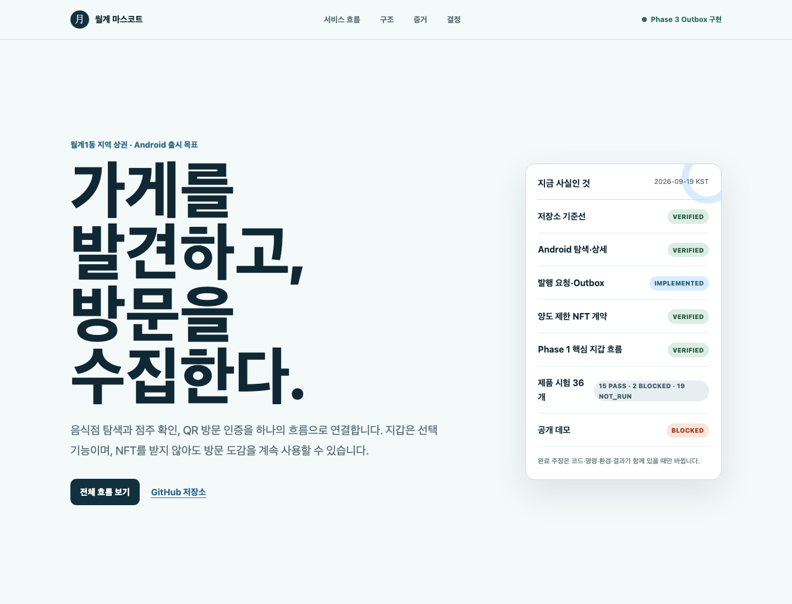

# 월계 마스코트(가칭)

월계1동 음식점을 발견하고, 실제 이용 인증으로 마스코트 도감을 채우며, 원하는 수집품을 외부 지갑에 NFT로 발급받는 Android 서비스입니다.

> 현재 상태: Phase 0~3와 Base Sepolia 핵심 흐름 `VERIFIED` · 외부 HTTPS·Google 로그인·Android App Links 실기 `VERIFIED` · Phase 4 출시 기반과 Phase 5 발표·증거 준비 `IN_PROGRESS` · 필수 시험 31 `PASS` / 2 `BLOCKED` / 3 `NOT_RUN`

[](docs/index.html)

## 한눈에 보기

- [모바일 디자인 기준](DESIGN.md): 탐색·방문 인증·도감·내 정보의 화면 구조와 접근성 원칙
- [모바일 UI 변경 명세](docs/superpowers/specs/2026-09-23-mobile-ui-navigation-design.md): Issue #126의 범위·보존 조건·검증 기준
- [프로젝트 포털](docs/index.html): 흐름·아키텍처·평가 증거·결정 상태를 시각적으로 탐색
- [공개 프로젝트 포털](https://masscom.kr): 다운로드 없이 열리는 실제 Vercel 배포
- [공개 계정 삭제 안내](https://masscom.kr/account-deletion): 삭제 요청·보존 정보·지갑 비밀 경계
- [발표·시연 페이지](docs/presentation.html): 3분·5분 발표 장면과 실제/미실행 증거 경계
- [현장 검증 빈 기록지](docs/FIELD_VALIDATION.md): 동의·과업·결과를 미리 채우지 않은 양식
- [제출 체크리스트](docs/SUBMISSION_CHECKLIST.md): 승인 전 공개·태그·제출 금지 경계
- [제출 증거 manifest](docs/SUBMISSION_EVIDENCE.json): main 기준선·CI·PR·스크린샷·BLOCKED/NOT_RUN 기계 판독 기록
- [포털 시각 검증](docs/evidence/project-portal-visual-verdict.json): 데스크톱·모바일 뷰포트와 접근성 결과
- [현재 상태](docs/PROJECT_STATE.md): 실제 완료·미완료·BLOCKER
- [제품 요구사항](docs/PRD.md): RQ-001~RQ-021
- [결정 기록](docs/DECISIONS.md): 승인·제안·외부 확인 구분
- [테스트 원장](docs/TEST_STATUS.md): v3 19절의 36개 ID와 실행 근거
- [Phase 1 지갑 연결](docs/PHASE1_WALLET_LINK.md): Android·Reown·SIWE 구현과 실제 MetaMask 검증
- [실제 Android 기기 증거](docs/evidence/android-physical-device.json): 빌드·설치·실행·복귀·MetaMask 준비 상태
- [실제 지갑 흐름 증거](docs/evidence/android-wallet-connection.json): 연결·체인 전환·서명·서버 확인·복원 결과
- [미설치 지갑 복귀 증거](docs/evidence/android-wallet-missing.json): 스토어 이동·수동 복귀·한국어 재시도 안내
- [지갑 주소 변경 증거](docs/evidence/android-wallet-address-change.json): 계정별 확인 격리와 MetaMask 세션 한계
- [음식점 탐색 Android 증거](docs/evidence/android-merchant-discovery.json): 지갑 없는 목록·상세·선택적 지갑 이동
- [방문 수령·도감 Android 증거](docs/evidence/android-claim-collection.json): 점주 권한·1회 코드·고객 수령·상태 분리
- [다음 가게 추천 Android 증거](docs/evidence/android-recommendations.json): 미방문 우선·이유 공개·정원 제외·상세 복귀
- [NFT 계약 로컬 증거](docs/evidence/foundry-contract-local.json): C01~C04·상한·reward key·영구 잠금·Anvil 발행
- [Phase 3 발행·복구 증거](docs/evidence/phase3-worker-anvil-android.json): W07·M01~M08·Android 접수/완료·재발행 없는 복구
- [계정 삭제·개인정보 증거](docs/evidence/account-deletion-privacy.json): D01·D03·Android 삭제 안내와 운영 경계
- [출시 준비 체크리스트](docs/RELEASE_READINESS.md): AAB·서명·16KB·App Links·Data safety·폐쇄 테스트
- [보안 경계](docs/SECURITY.md): 허용 메서드·nonce·의존성 위험
- [전체 보안 감사](docs/SECURITY_AUDIT_2026-09-20.md): Claude·독립 리뷰 HIGH 수정과 운영 전 MEDIUM
- [평가 대응표](docs/EVALUATION_MAP.md): 요구사항·Issue·PR·코드·시험·실증·발표 연결
- [Play Console 등록 초안](docs/PLAY_CONSOLE_DRAFT.md): 실제 Console 입력 전 준비한 텍스트·자료 초안

### 포털 로컬 미리보기

```bash
python3 -m http.server 4173 --directory docs
```

브라우저에서 `http://127.0.0.1:4173/`을 엽니다. GitHub Pages 공개 배포는 저장소 가시성과 조직 요금제를 확인한 뒤 별도 승인으로 진행합니다.

## 핵심 사용자 흐름

`음식점 탐색 → 점주 이용 확인 → QR 인증 → 보상권 → 외부 지갑 연결 → 주소 확인 서명 → 기존 블록체인 NFT 발행 → 도감 → 다음 음식점 탐색`

지갑은 선택 기능입니다. 지갑이 없어도 탐색·방문 인증·방문 도감을 사용할 수 있어야 하며, 앱 수집품과 실제 발행 NFT를 구분합니다.

## 실제 기능 상태

| 영역 | 상태 | 증거 또는 다음 조건 |
| --- | --- | --- |
| 저장소·문서·CI 기준선 | `VERIFIED` | PR #2·#4 merge, GitHub Actions PASS |
| 프로젝트 포털 | `VERIFIED` | PR #6, CI PASS, 접근성·반응형 증거 저장 |
| Android 고객 앱 | `IMPLEMENTED` | Expo 57 dev-client, Android 16 AVD와 Samsung SM-S928N 실기기 debug APK 설치·실행·복귀 |
| Android 기본 UI 네 탭 | `VERIFIED` | 탐색·방문 인증·도감·내 정보, 360dp·200% 글씨·실시간 다크 모드·뒤로 가기·개발 scheme를 Samsung Android 16에서 확인. 모바일 자동 146개·typecheck·lint·Android export PASS([증거](docs/evidence/android-ui-navigation-2026-09-23.json)) |
| 공개 점포·캠페인 API | `IMPLEMENTED` | PR #14 merge `a27d0d0`, main CI run `35300158651` PASS |
| Android 음식점 목록·상세 | `VERIFIED` | PR #45, Samsung Android 16에서 DEMO 3곳 목록→상세→선택적 지갑 이동 PASS |
| 점주·직원 권한 API | `IMPLEMENTED` | PR #18 merge `e242c99`, main CI run `35302502498` PASS |
| 일회용 QR 슬롯 API | `IMPLEMENTED` | PR #20, 원문 미저장·버전 잠금 재발급·preview·단일 소비 기반 |
| 방문·고정 보상권 | `IMPLEMENTED` | PR #22, QR 소비·KST 일일 진행·첫/3/5회 보상권을 한 DB 트랜잭션으로 처리 |
| 점주·직원 방문 확인 UI | `VERIFIED` | PR #46, loopback DEMO 계정의 STAFF 권한 확인→1인 코드 발급·재발급 Android 실기 PASS; 운영 인증·별도 웹은 미구현 |
| 고객 방문 수령·도감 | `VERIFIED` | PR #46, preview→redeem→방문 1·앱 수집품 1·실제 NFT 0 분리 표시와 중복 409 PASS |
| 다음 음식점 추천 | `VERIFIED` | PR #47, 정원 마감 제외·미방문 우선·다음 고정 보상 설명·한국 날짜별 회전·상세 연결 PASS |
| 캠페인 참여 등록 API | `IMPLEMENTED` | Issue #73, `POST /campaigns/:id/enrollments` 정원 원자 예약·멱등 재요청, R02 PostgreSQL 동시 20요청 PASS. Android 참여 화면과 수령 시 등록 요구는 미구현(`PLANNED`) |
| 주소 확인 API | `IMPLEMENTED` | ERC-4361 challenge·실제 서명 복구·nonce 소비 15 tests PASS |
| PostgreSQL | `IN_PROGRESS` | 점포·캠페인·멤버십·claim slot·방문·보상권·지갑 challenge·Google session migration 구현. Lightsail 사설 Compose DB에서 migration·session 발급 확인, 외부 백업 복원은 `NOT_RUN` |
| NFT 계약 | `VERIFIED` | Foundry 8/8·fuzz 128·Anvil 발행과 Base Sepolia 계약·role·cap 1 proof series·Worker token #1 PASS |
| wallet binding·mint job·Outbox | `IMPLEMENTED` | PR #50, SIWE 영속화·동시 20요청 job/Outbox 하나·고정 수령인 PostgreSQL 통합 PASS |
| Worker | `VERIFIED` | PR #51, PostgreSQL lease heartbeat·시도·이벤트·자산, 체인 설정 사전 검사, receipt/event/state 대조, 응답 유실·lease·재조직 전 확정 복구를 로컬 Anvil에서 검증 |
| Reown 외부 지갑 코드 | `IMPLEMENTED` | AppKit 2.0.6, 외부 지갑 전용 기능 플래그·메서드 allowlist |
| 외부 지갑 실기 | `VERIFIED` | MetaMask 핵심 흐름·W06 PASS; W04 동일 세션 주소 전환과 W05 미지원 스마트지갑은 준비된 외부 환경 부재로 `BLOCKED` |
| NFT 발행 전체 흐름 | `VERIFIED` | Local Anvil 장애·복구와 Base Sepolia PostgreSQL job/Outbox→암호화 service minter→receipt/event/owner/locked→DB FINALIZED·재실행 무작업 PASS |
| 계정 삭제·개인정보 | `IN_PROGRESS` | D01·D03 로컬 PASS, 공개 삭제·개인정보 HTTPS 페이지 PASS; 운영 fresh reauthentication 삭제와 D02 계정 전환은 미완료 |
| 외부 HTTPS·Play 제출 | `IN_PROGRESS` | 외부 API·포털, private GitHub test.2 APK, 4KB/16KB 설치·`masscom.kr/open` verified App Link PASS. Play App Signing OAuth·Console 제출은 `NOT_RUN/BLOCKED` |

상태 정의는 `PLANNED / IN_PROGRESS / IMPLEMENTED / VERIFIED / BLOCKED / NOT_RUN`입니다. 구현 코드가 있어도 필요한 환경에서 검증하지 않았다면 `VERIFIED`로 올리지 않습니다.

## 보안·제품 경계

- 기존 블록체인을 사용하며 자체 체인·자체 사용자 지갑을 만들지 않습니다.
- 사용자 개인키·복구 문구를 요구하거나 보관하지 않습니다.
- 외부 지갑에는 주소 확인용 메시지 서명만 요청합니다.
- 송금·`approve`·`permit`·스왑·구매·내장 지갑 기능을 넣지 않습니다.
- 발행 요청의 수령 주소와 연결 버전을 고정하고 재시도로 중복 발행하지 않습니다.
- 개인정보·주문번호·정확한 식사 시각을 온체인/IPFS에 넣지 않습니다.

## 아키텍처

```text
Android 앱 ─┐
            ├─ HTTPS API ─ PostgreSQL ─ Outbox/Worker ─ 기존 블록체인
점주 웹 ────┘       │
                    └─ 외부 지갑 주소 확인 서명
```

현재 `apps/mobile`, `apps/api`, `apps/worker`, `apps/api/migrations`, `contracts`, `infra/lightsail`이 구현됐습니다. 별도 점주 웹은 후속 Phase 범위입니다.

## 기술 선택 상태

| 항목 | v3 권장안 | 현재 상태 |
| --- | --- | --- |
| 고객 앱 | React Native + TypeScript + Expo development build | `USER_CONFIRMED` |
| 지갑 연결 | Reown AppKit 외부 지갑만, MetaMask 1차 실기 | `USER_CONFIRMED` |
| 체인 | Base Sepolia → 별도 승인 후 Base mainnet | `USER_CONFIRMED` |
| 서버·DB | Node.js LTS + TypeScript + PostgreSQL | `USER_CONFIRMED` |
| 배포 | AWS 서울 리전 + Docker Compose + Caddy | `USER_CONFIRMED`·`VERIFIED` |

D-004~D-008은 2026-09-18 승인됐습니다. 유료 자원 생성·메인넷·공개 배포는 이 승인에 포함되지 않습니다.

## 설치·검증

저장소 기준선 검사는 추가 패키지가 필요하지 않습니다.

```bash
git clone --recurse-submodules https://github.com/2026-KW-HACKATHON/27_MassCOM.git
cd 27_MassCOM
git submodule update --init --recursive  # 이미 clone한 저장소에서 실행
bash tests/bootstrap/check_secrets_test.sh
PR_TITLE='한국어 PR 제목'
PR_BODY='변경 내용과 실제 검증 결과를 설명하는 한국어 본문'
bash scripts/check-pr-korean.sh "$PR_TITLE" "$PR_BODY"
bash tests/bootstrap/check_pr_korean_test.sh  # checker 자체 회귀 시험
bash tests/bootstrap/verify_bootstrap_test.sh
bash tests/site/check_site_accessibility_test.sh
bash tests/site/verify_project_site_test.sh
```

Phase 1·2 앱과 API 검증:

```bash
npm ci --prefix apps/api
npm test --prefix apps/api
npm run typecheck --prefix apps/api
npm ci --prefix apps/mobile
npm test --prefix apps/mobile
npm run typecheck --prefix apps/mobile
npm run lint --prefix apps/mobile
npm run export:android --prefix apps/mobile
bash scripts/check-privacy.sh
bash tests/bootstrap/check_privacy_test.sh
```

Phase 3 계약·Worker 검증:

```bash
./scripts/forge.sh fmt --check
./scripts/forge.sh build
./scripts/forge.sh test -vvv
./scripts/forge.sh lint
npm ci --prefix apps/worker
npm test --prefix apps/worker
npm run typecheck --prefix apps/worker
TEST_DATABASE_URL='postgresql://사용자@127.0.0.1:5432/masscom_test' npm run test:postgres --prefix apps/worker
```

`npm run test:anvil --prefix apps/worker`는 별도 로컬 Anvil과 `_test` 데이터베이스가 필요합니다. Worker 실행 entrypoint는 `CHAIN_ID=31337`과 `ALLOW_UNLOCKED_LOCAL_MINTER=true`를 동시에 요구해 운영 키나 공개 체인에 사용할 수 없도록 제한했습니다. `CHAIN_REORG_MARGIN`은 cursor보다 다시 확인할 블록 수이며 현재 로컬 기본값은 12입니다. `MINTER_MIN_BALANCE_WEI`(기본 0) 이하로 민터 잔액이 내려가면 신규 전송을 미루고 재시도합니다.

Base Sepolia에는 계약 `0x1edca95bb453d8456cfe28c6e24c4e51172e36c4`를 암호화 Foundry keystore로 배포했고, cap 1 proof series에서 실제 Worker job/Outbox→service minter→receipt/event/owner/locked/metadata→DB FINALIZED를 PASS했습니다. mainnet 배포는 하지 않았습니다.

```bash
scripts/deploy-base-sepolia.sh <keystore-account>          # 시뮬레이션
scripts/deploy-base-sepolia.sh <keystore-account> --broadcast  # 실제 배포(NOT_RUN)
```

`BASE_SEPOLIA_ADMIN`·`BASE_SEPOLIA_MINTER`·`BASE_SEPOLIA_PAUSER` 환경 변수가 필수이며 `BASE_SEPOLIA_RPC_URL`은 선택(기본 `https://sepolia.base.org`)입니다. Android 운영 package `APP_VARIANT`와 release AAB 빌드는 [`apps/mobile/README.md`](apps/mobile/README.md)를 따릅니다.

Phase 2 점포 카탈로그, 점포별 권한, QR 수령 슬롯, 방문·보상권 검증은 실제 PostgreSQL 연결이 필요합니다.

```bash
export DATABASE_URL='postgresql://사용자@127.0.0.1:5432/masscom_dev'
read -s MERCHANT_REFERENCE_HMAC_SECRET && export MERCHANT_REFERENCE_HMAC_SECRET
read -s PGPASSWORD && export PGPASSWORD
npm run db:migrate --prefix apps/api
export TEST_DATABASE_URL='postgresql://사용자@127.0.0.1:5432/masscom_test'
DATABASE_URL="$TEST_DATABASE_URL" npm run db:migrate --prefix apps/api
npm run test:postgres --prefix apps/api
```

통합 테스트는 테이블을 비우므로 DB 이름이 `_test`로 끝나는 전용 데이터베이스만 허용합니다. `GET /merchants`는 로그인·지갑 없이 활성 점포와 공개 중인 현재 캠페인만 반환합니다. 점주용 API는 활성 점포 멤버십을 매 요청 확인합니다. QR token은 SHA-256, 주문 참조는 점포 범위 HMAC-SHA-256만 저장합니다. 재발급은 직전 `tokenVersion`을 조건으로 한 요청만 성공시킵니다. 수령 POST는 슬롯 소비·방문 이벤트·한국 날짜 진행도·첫/3/5회 보상권을 한 트랜잭션으로 처리합니다. 저장소에는 실제 협약 점포 seed를 넣지 않으며 테스트 fixture는 `demo: true`로 구분합니다.

상세 development build 절차와 환경 변수는 [`apps/mobile/README.md`](apps/mobile/README.md), [`apps/api/README.md`](apps/api/README.md), [`apps/worker/README.md`](apps/worker/README.md)를 따릅니다.

## 데모·배포·출시

- 정적 프로젝트 포털: `https://masscom.kr`·`/privacy`·`/account-deletion` HTTPS 200 `VERIFIED`
- 운영 API: AWS Lightsail 서울 리전의 `https://api.masscom.kr/health` HTTP/2 200·Let’s Encrypt·보안 헤더 `VERIFIED`; DB·API 내부 포트는 비공개
- Google 로그인: Samsung SM-S928N Android 16에서 실제 동의→ID token→외부 API session·콜드 스타트 복원·logout revoke `PASS`; 두 번째 계정 전환은 `NOT_RUN`
- Android debug APK: Android 16 16KB AVD와 Samsung SM-S928N 실기기에서 빌드·설치·실행·홈 복귀·콜드 스타트 검증, 저장소에는 미포함
- Android 음식점 탐색: 로컬 PostgreSQL의 `demo: true` 점포 3곳으로 목록·상세·고정 보상 조건·선택적 지갑 이동 검증
- Android 방문 수령: loopback DEMO에서 점주 권한→1회 코드→고객 수령→도감 검증; 점주 화면의 QR을 고객 화면에서 촬영해 같은 수령 API로 연결(권한 거부 시 수동 입력, 수령용이 아닌 QR·연속 인식은 앱에서 걸러냄). 실제 촬영→수령 실기는 `NOT_RUN`
- Android 다음 가게: 미방문·다음 고정 보상 이유를 표시하고 기존 상세 탐색으로 복귀하는 순환 검증
- NFT 계약: 고정 Docker Foundry로 C01~C04와 로컬 Anvil 발행 검증; 테스트넷·메인넷으로 표현하지 않음
- NFT 발행 요청: 클라이언트 주소·series 입력을 무시하고 검증된 binding/version에서 수령인을 고정해 보상권·job·Outbox 원자 저장
- NFT 발행 Worker: Local Anvil에서 중복 Worker·응답 유실·설정 오류·이벤트 불일치·확정 전 재조직·DB 복구와 RPC 중단·발행 중지·민터 잔액 부족·DB 장애 뒤 자동 복구(O02, Issue #77)를 검증하고 Android가 접수/확인 중/등록 완료를 구분
- private GitHub 설치본: [MassCOM Android 0.1.0 테스트 2](https://github.com/2026-KW-HACKATHON/27_MassCOM/releases/tag/android-v0.1.0-test.2), 저장소 접근 권한 필요. 재다운로드 SHA-256과 App Link 실기 설치본 일치 PASS
- 운영 package ID `kr.masscom.wolgye`(개발 `kr.masscom.wolgye.dev`), scheme `masscom`/`masscom-dev`: `IMPLEMENTED`; upload key AAB와 4KB Samsung·16KB AVD 설치/콜드 실행 PASS
- 백업·복원 drill: `scripts/db-restore-drill.sh`로 dump→scratch DB 복원→행 수·migration 대조를 로컬 PostgreSQL 18에서 PASS. 운영 DB·외부 백업 저장소는 `NOT_RUN`
- 실기 시험 절차는 [`docs/DEVICE_TEST_PLAN.md`](docs/DEVICE_TEST_PLAN.md), 외부 HTTPS·로그인 실제 결정은 [`docs/HOSTING_LOGIN_PROPOSAL.md`](docs/HOSTING_LOGIN_PROPOSAL.md)를 따릅니다.
- 운영 AAB 지갑 진입점 검사(W08): upload key 서명본을 공식 bundletool로 읽어 package와 source marker를 확인하고 결제 권한·결제/온램프/내장 지갑 SDK·AppKit 기능 flag·계정 화면 도달 경로·세션 메서드를 정적 검사해 PASS. 실기기 UI는 별도 `NOT_RUN`
- upload keystore·공개 인증서 핀·test.2 AAB/APK, 4KB Samsung·16KB AVD 설치·콜드 실행·verified App Link: `VERIFIED`; Play Console 제출: `NOT_RUN`
- 계정 삭제: 앱 내부 Local DEMO와 PostgreSQL 미전송 취소·제출 거래 보존·비식별화 PASS; 외부 HTTPS 삭제 URL PASS, 운영 fresh reauthentication 삭제는 `NOT_RUN`
- 실제 Reown 지갑 흐름: 개발 package MetaMask 연결·서명·자동 복귀·콜드 스타트 서버 binding 복원과 W06 `PASS`; Account 1 검증이 Account 2 재연결에 승계되지 않음 `PASS`; 운영 release package, 정확한 W04 동일 세션 변경과 W05 스마트지갑은 `NOT_RUN/BLOCKED`
- 테스트넷 계약·Worker 발행 1건: `VERIFIED` Base Sepolia, [구조화 증거](docs/evidence/base-sepolia-deployment.json)
- 메인넷·Google Play·대회 제출: 명시 승인 전 실행 금지
- 저장소: 현재 `PRIVATE`; 심사 시점 public 요구는 [대회 규칙](docs/COMPETITION.md)에 기록

개인 Google Play 계정 적격성, 사업자·법률·개인정보·금융 기능 신고는 실제 기능과 Console 기준으로 다시 확인합니다.

## 대회·기여·출처

- 대회 규칙과 일정: [docs/COMPETITION.md](docs/COMPETITION.md)
- 자료명·버전·SHA-256: [docs/SOURCE_INDEX.md](docs/SOURCE_INDEX.md)
- AI 사용과 사람 검토 구분: [docs/AI_USAGE.md](docs/AI_USAGE.md)
- 외부 코드·자산·라이선스: [THIRD_PARTY_NOTICES.md](THIRD_PARTY_NOTICES.md)
- 인수인계: [docs/HANDOFF.md](docs/HANDOFF.md)

없는 협약 점포·현장 검증·Play 승인·매출 증가·사람의 기여를 만들지 않습니다. 목표 인원과 점포 수는 확보 실적과 분리합니다.

## Git·리뷰 운영

`Issue → 작업 브랜치 → 테스트 → 한글 PR → CI → merge → main CI` 순서를 사용합니다. main은 통합 기준선으로 유지하고, merge된 원격 브랜치와 worktree는 상태를 확인한 뒤 정리합니다. 커밋은 왜 변경했는지와 `Tested / Not-tested` 경계를 Lore trailer로 남깁니다. 보안·계정·민팅 변경은 독립 code-reviewer와 architect가 모두 증거를 반환하기 전 merge-ready로 표시하지 않습니다.
