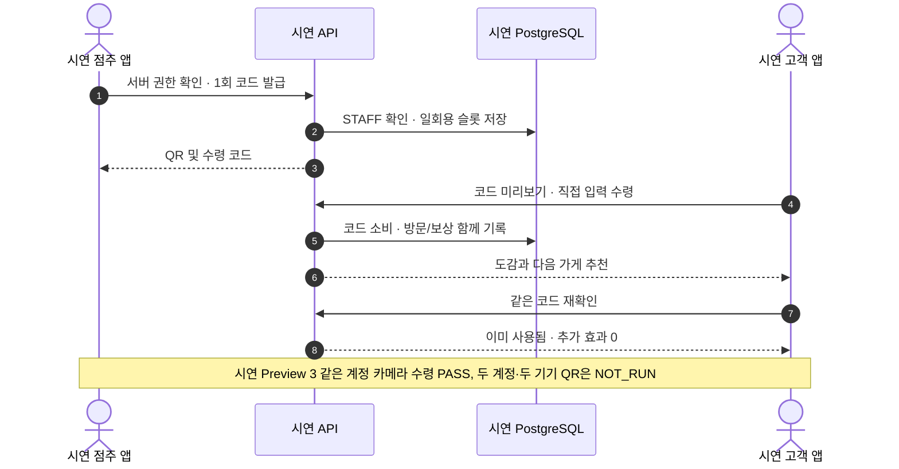
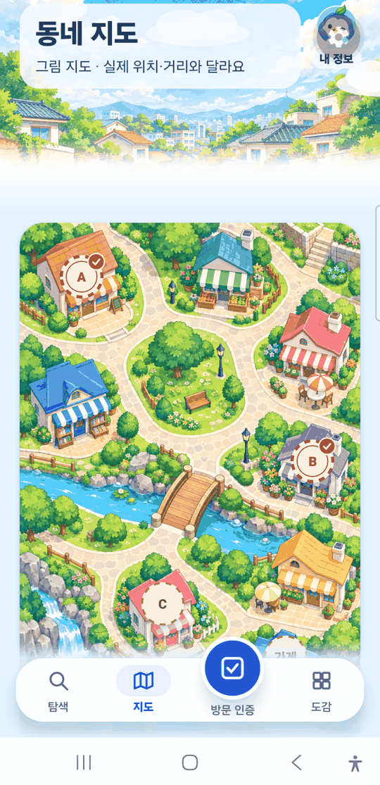
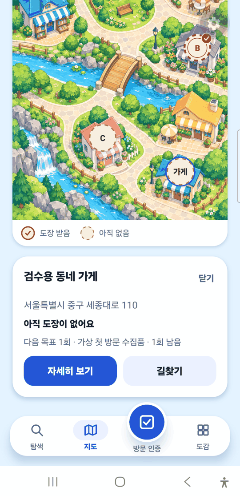
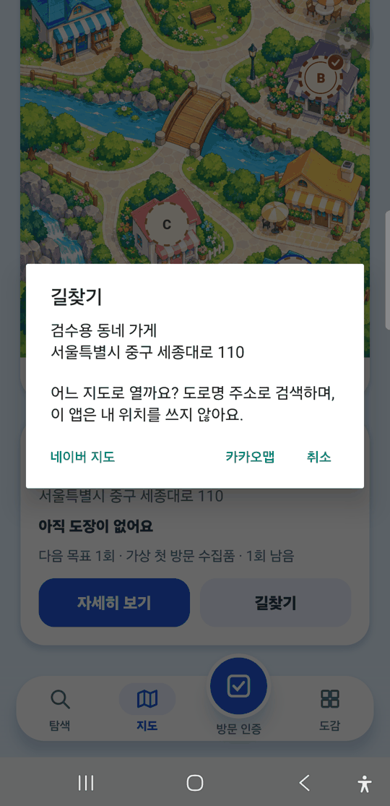
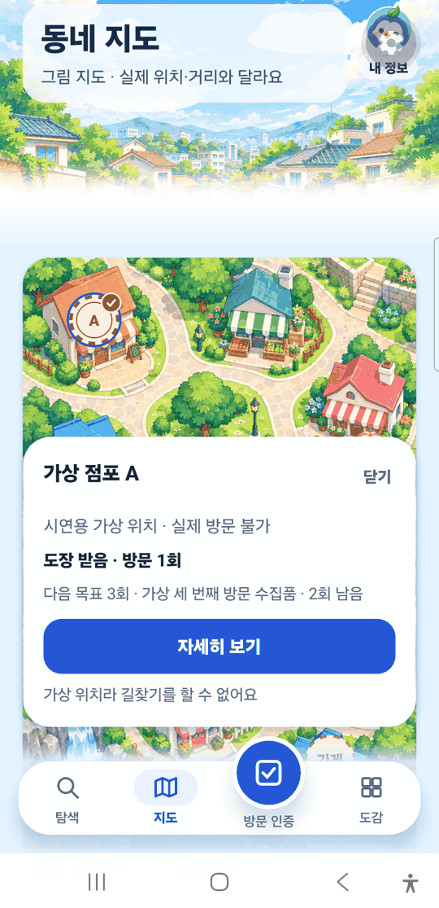
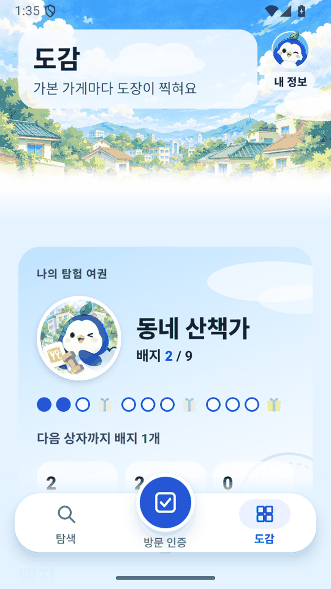
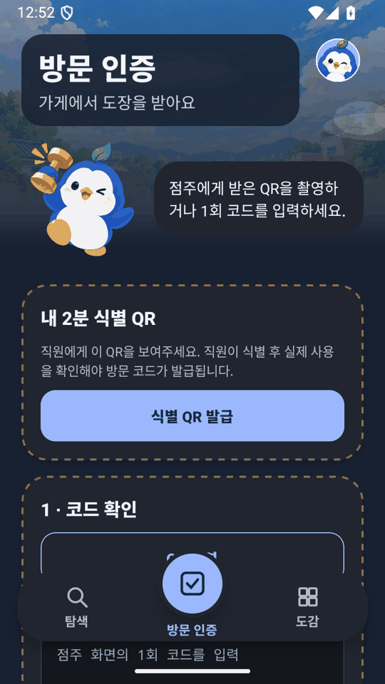
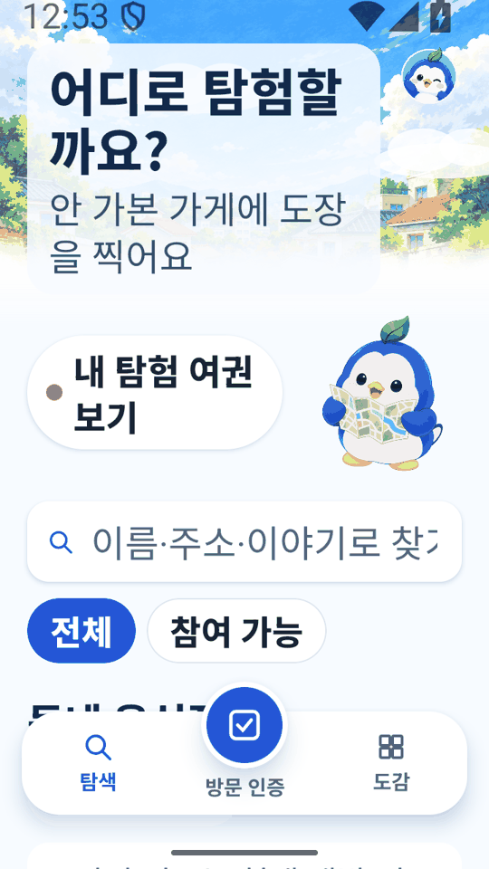
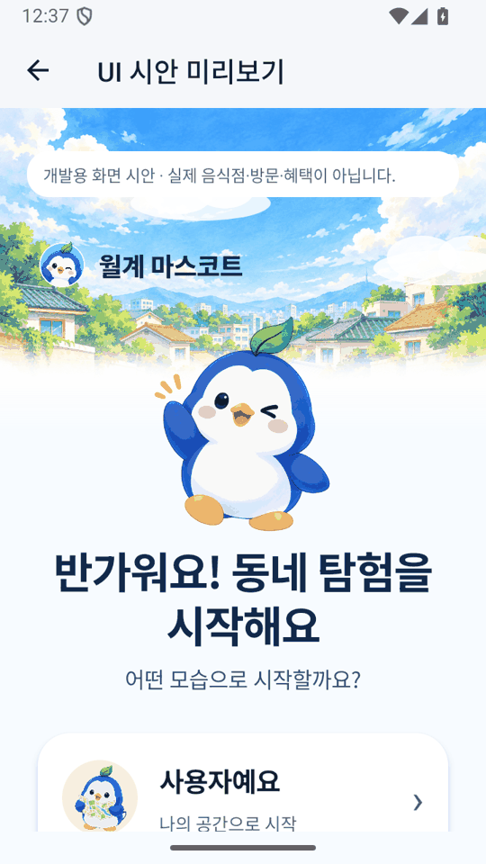
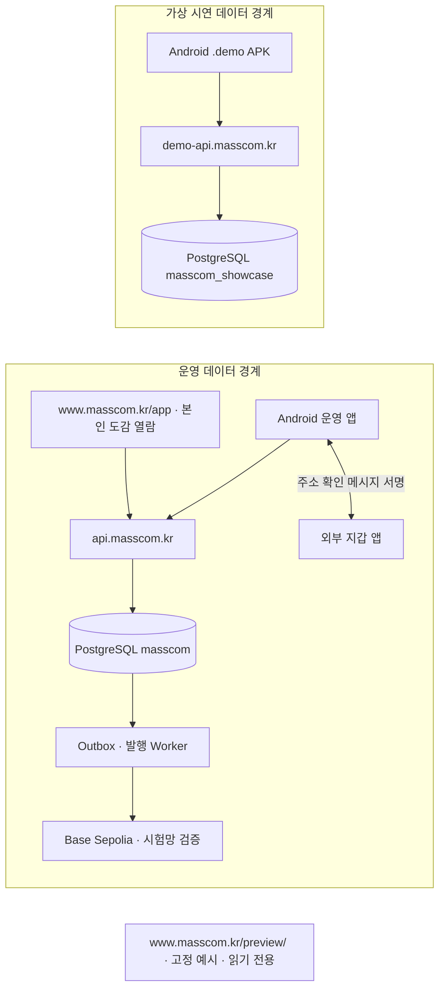

<p align="center">

  
</p>

<h1 align="center">월계 마스코트 · MassCOM</h1>

<p align="center">동네 가게를 발견하고, 방문을 기록하고, 마스코트를 모으는 Android 서비스.<br>외부 지갑 NFT는 선택 기능이며 앱 수집품과 실제 발행 상태를 구분합니다.</p>

<p align="center">
  
  
  
  
  
</p>

<p align="center">
  <a href="https://demo-api.masscom.kr/play/">시연 웹 보기</a> ·
  <a href="https://www.masscom.kr/preview/">도감 미리보기</a> ·
  <a href="https://github.com/2026-KW-HACKATHON/27_MassCOM/releases/tag/showcase-android-v0.1.0-preview.22">시연 APK 받기</a> ·
  <a href="https://github.com/2026-KW-HACKATHON/27_MassCOM/releases/tag/android-v0.1.0-test.13">운영 테스트 APK 받기</a> ·
  <a href="https://www.masscom.kr/app/">운영 웹 보기</a> ·
  <a href="docs/TEST_STATUS.md">검증 현황</a> ·
  <a href="#설치검증">직접 실행</a>
</p>

> 배너는 콘셉트 일러스트입니다. 시연 점포 중 30곳의 이름·주소·위치는 2026-06-30 기준 공공 상가정보에서 가져왔지만, MassCOM에 참여한 가게가 아니며 방문·보상은 시연 데이터입니다. 협약 점포, Google Play 승인, 매출 증가를 뜻하지 않습니다.

## 무엇인가

MassCOM은 동네 가게를 발견하고 방문을 기록해 마스코트를 모으는 Android 서비스입니다.
대상은 지역 이용자와 점주·직원입니다.
흐름은 "가게 탐색 → QR 방문 인증 → 도감·코인 수집 → 놀이·마이룸 → 다음 가게 추천"입니다.
외부 지갑 NFT는 선택 기능입니다. 앱 수집품과 실제 발행 상태를 구분합니다.

## 왜 만드는가

대회 주제는 월계1동 중심의 지역 문제 해결입니다.
우리는 이용자가 익숙한 가게 밖의 지역 음식점을 발견하기 어렵다고 보았습니다. 점주·직원은 방문 확인과 중복 수령을 구분해야 합니다.
이 진단은 설계 가설입니다. 현장 검증은 `NOT_RUN`이고, 월계1동 점주·이용자 기록과 매출 변화 자료는 없습니다. 매출 상승은 검증 전 가설입니다([PRD](docs/PRD.md), [현장 검증 계획](docs/FIELD_VALIDATION.md)).

| 대상 | 다루는 문제 | MassCOM의 접근 | 현재 근거 |
| --- | --- | --- | --- |
| 지역 이용자 | 가게를 찾은 뒤 방문 경험이 이어지지 않음 | 탐색 → 방문 기록 → 마스코트 도감 → 다음 가게 추천 | [가상 점포 3곳·두 계정 폰 실기](docs/evidence/showcase-two-account-phone-2026-09-27.json) |
| 점주·직원 | 방문 확인과 중복 수령을 구분해야 함 | 서버 권한 확인 뒤 일회용 코드 발급, 사용 후 추가 효과 차단 | [Android 발급·수령·재입력](docs/evidence/showcase-two-account-phone-2026-09-27.json) |
| 지갑이 없는 사람 | 탐색과 방문에 암호화폐 지갑이 진입 장벽이 됨 | 앱 수집품은 지갑 없이 사용하고 NFT 발행만 외부 지갑으로 분리 | [도감의 앱 수집품 1·실제 NFT 0](docs/evidence/showcase-android-apk-2026-09-27.json) |

## 바로 체험

| 방법 | 열기 | 참고 |
| --- | --- | --- |
| 웹에서 로그인 없이 | [시연 체험 `/play/`](https://demo-api.masscom.kr/play/) | 공개 체험은 현재 3곳입니다. 이 브랜치의 시연 seed에는 월계동 공공 상가정보 기반 점포 30곳을 더해 총 33곳이 있습니다. 실제 가게의 참여를 뜻하지 않으며, 상세 소개에 시연 고지를 표시합니다. 24시간 임시 계정이며 웹에서는 QR 촬영과 폰 기울임을 쓸 수 없습니다. |
| 설치 링크 고르기 | [masscom.kr/open](https://www.masscom.kr/open) | 운영과 시연 중 고릅니다. 지금 test.13과 Preview 22를 가리킵니다. |
| 시연 Android 앱 | [Preview 22 APK](https://github.com/2026-KW-HACKATHON/27_MassCOM/releases/tag/showcase-android-v0.1.0-preview.22) | 가상 점포·가상 데이터. "로그인 없이 바로 체험"으로 시작합니다. |
| 운영 Android 앱 | [test.13 APK](https://github.com/2026-KW-HACKATHON/27_MassCOM/releases/tag/android-v0.1.0-test.13) | 고객용. 실제 API·DB와 Google 로그인을 씁니다. 운영 점포는 0곳입니다. |
| 설치 없이 보기 | [체험 도감 미리보기](https://www.masscom.kr/preview/) · [운영 웹](https://www.masscom.kr/app/) | 미리보기는 읽기 전용 예시입니다. |

두 APK를 로그인 없이 다시 내려받아 SHA-256을 계산했고 게시 해시와 일치했습니다(PASS): [운영 test.13](docs/evidence/operating-android-test13-2026-10-08.json), [시연 Preview 22](docs/evidence/showcase-preview22-release-2026-10-08.json). 이 T8 브랜치는 서버·웹·앱에 배포하지 않았으므로, 새 30곳은 공개 `/play/`에 아직 나타나지 않습니다.

공개 설치본과 `/play/`는 소스 `5ca98955` 기준이고, 그 뒤 main에 들어간 수정은 다음 빌드부터 반영됩니다. 5분 시연 순서는 [DEMO_RUNBOOK](docs/DEMO_RUNBOOK.md)에 있습니다.

## 지금 한계

- 실제 제휴 점포는 0곳입니다. 운영 점포도 0건입니다. 시연의 30곳은 공공 상가정보로 구성했지만 참여 점포가 아니며, 나머지 가상 점포 A/B/C는 그대로입니다.
- 현장 실증(필드 검증)은 전체 `NOT_RUN`입니다. 재방문율과 매출 효과는 측정하지 않았습니다.
- 최신 APK(test.13·Preview 22)의 실제 휴대전화 실행은 `NOT_RUN`입니다. 서명·해시·권한 검사만 PASS입니다.
- Google Play에는 제출하지 않았습니다. 일반 공개나 심사 승인이 아닙니다.
- 이용약관과 개인정보처리방침은 법률 검토 전 문안입니다.
- NFT는 Base Sepolia 테스트넷까지만 검증했습니다. 메인넷 발행은 없습니다.
- 필수 시험 36개 ID는 31 `PASS` / 2 `BLOCKED` / 3 `NOT_RUN`입니다([시험 원장](docs/TEST_STATUS.md)).

## 증거 링크

- 획득 경험: [보상 전체 결과 → 도감 등록 확인 → 도감·전시](docs/REWARD_ALBUM_QA_2026-10-09.md). 신규 수집품의 등장·도장과 기존 보유 결과를 구분하는 공통 고객 코드 변경이며, 공개 설치본 반영·실제 휴대전화 검증은 별도입니다.

- 시험·상태: [TEST_STATUS](docs/TEST_STATUS.md) · [PROJECT_STATE](docs/PROJECT_STATE.md) · [HANDOFF](docs/HANDOFF.md) · [평가 대응표](docs/EVALUATION_MAP.md)
- 시연: [5분 시연·질의 대비](docs/DEMO_RUNBOOK.md) · [대체 시연 영상(웹 체험 4분 8초, 390×844, 이전 `/play/` 번들)](docs/evidence/submission-2026-10-08-recheck/demo-flow-390.webm) · [공개 체험 재측정](docs/evidence/submission-2026-10-08-recheck/README.md)
- 배포: 운영 API·웹은 main `687427c2`, 시연 API는 `2d483ed`, `/play/` 번들은 소스 `5ca98955`입니다(migration 68건). `687427c2` 재배포의 별도 증거 JSON은 아직 없습니다. 원장을 올린 [`09dfceb0` 운영 배포](docs/evidence/production-deployment-09dfceb-2026-10-08.json)와 [시연 배포](docs/evidence/showcase-deployment-2d483ed-2026-10-08.json)를 함께 봅니다.
- 복원: 운영 DB 복제본으로 한 [실제 복원 리허설](docs/evidence/production-restore-rehearsal-2026-10-08.json)은 PASS입니다.
- 용량·현재 배포: [Android 설치본 용량 분석](docs/APK_SIZE_ANALYSIS.md)(원인은 단정하지 않음) · 현재 배포 상태를 손으로 고치는 기준 파일 [CURRENT_RELEASE.json](docs/CURRENT_RELEASE.json)(`/open` 생성 블록과 일치 검사 범위, 고정 문자열 세 군데는 [운영 절차](docs/OPERATIONS_RUNBOOK.md))
- 비교·제출: [경쟁 비교](docs/DIFFERENTIATION.md) · [제출 체크리스트](docs/SUBMISSION_CHECKLIST.md) · [AI 사용 기록](docs/AI_USAGE.md) · [참여도 근거](docs/CONTRIBUTIONS.md)
- 옛 상태 문단과 Issue별 변경 이력: [HANDOFF_HISTORY](docs/HANDOFF_HISTORY.md)의 맨 위 절에 옮겼습니다.

## 심사위원용 3분 요약

아래 두 표는 위 요약의 근거입니다. 되는 것과 아직 안 된 것을 나눠 적습니다.

| 지금 실제로 되는 것 | 근거 |
| --- | --- |
| 시연 앱: 가상 점포 3곳 탐색·QR 방문·도감, 하늘 동네·탐험 여권(배지·상자·쿠폰), 동네 지도·길찾기, 친구 탭 | [이전 Preview 18 Samsung 고객 방문 5회·골드 수집품·상점 뽑기](docs/evidence/showcase-preview18-release-2026-10-04.json), [이전 Preview 17 에뮬레이터 가상 점포 B 상세](docs/evidence/showcase-preview17-release-2026-10-03.json), [탐험 여권 실기](docs/evidence/explorer-passport-emulator-2026-09-29/README.md), [지도 실폰](docs/evidence/town-map-2026-09-29/README.md), [친구 배포](docs/evidence/friends-deployment-2026-09-29.json) (두 계정 사이 친구 코드·QR 추가는 `NOT_RUN`) |
| 시연 점주 앱: 방문 확인·오늘/현황·가게 꾸미기 3탭, 전체 화면 방문 QR·만료 카운트다운, 쿠폰 시트·방문/쿠폰 되돌리기·손님 의견 | [Issue #341 시험 기록](docs/TEST_STATUS.md) (자동 시험 통과, 실제 설치·카메라·시트 터치·큰 글꼴은 `NOT_RUN`) |
| 점주 웹: 가게 현황(방문·쿠폰 요약 카드, 첫/재방문·수집품·상세 조회 지표, 해결 동작이 붙은 오픈 준비 체크리스트, 운영 배포됨), 사진 수집품 제작기, 방문·쿠폰 되돌리기 화면 | [TEST_STATUS](docs/TEST_STATUS.md) (실제 방문을 되돌리는 실행과 실제 점주 화면 확인은 `NOT_RUN`) |
| 서버: 실제 점포 운영 시작·약관 동의·NFT 메타데이터 API가 운영·시연에 배포됨 | [배포 증거](docs/evidence/store-consent-nft-deployment-2026-09-30.json) |
| NFT: Local Anvil·Base Sepolia 테스트넷 발행·장애 복구 검증 | [Worker 검증](docs/TEST_STATUS.md) |
| 최신 운영 test.13·시연 Preview 22 APK 게시 | [운영 test.13](docs/evidence/operating-android-test13-2026-10-08.json) · [시연 Preview 22](docs/evidence/showcase-preview22-release-2026-10-08.json). 서명·녹음 권한 없음 PASS; 익명 다운로드 해시 대조 PASS; 최신 APK 실폰·에뮬레이터·로그인·QR·지갑·TalkBack은 `NOT_RUN` |
| 도감 카드 실기 확인(라이트·다크·글자 200%, 잘림·명암비 이상 없음) | [실기 캡처](docs/evidence/device-captures-2026-10-01/README.md) |
| DB 백업의 실제 복원(운영 데이터 복제본 migration 43→68건·`account_consents` 5=5 보존, 시연 DB도 PASS) | [운영 복원 리허설](docs/evidence/production-restore-rehearsal-2026-10-08.json) · [시연 배포·복원 증거](docs/evidence/showcase-deployment-2d483ed-2026-10-08.json) |

| 꺼져 있거나 아직 안 된 것 | 근거 |
| --- | --- |
| 실제 제휴 점포 0곳(운영 점포 0건, 시연은 가상 3곳뿐) | [운영 관리자 현황](docs/evidence/operating-admin-status-deployment-2026-09-29.json) |
| 현장 실증(필드 검증) 전체 `NOT_RUN` | [FIELD_VALIDATION](docs/FIELD_VALIDATION.md) |
| AI 가게 그림 실제 호출 꺼짐(OpenAI 키 미투입, [B-026](docs/BLOCKERS.md)) | [켜기 준비 리허설](docs/evidence/ai-art-enable-rehearsal-2026-09-30.json) |
| NFT는 Base Sepolia 테스트넷까지만, 메인넷 발행 없음 | [BLOCKERS](docs/BLOCKERS.md) |
| 새 약관 동의 화면 제출 `BLOCKED`(미동의 허용 계정이 기기 Google 계정 선택기에 없음, 비밀번호 필요한 계정 추가는 금지) | [실기 캡처](docs/evidence/device-captures-2026-10-01/README.md) |
| #257 사진 수집품 native 상세 화면 `NOT_RUN`(보유 계정 없음) | [실기 캡처](docs/evidence/device-captures-2026-10-01/README.md) |

현재 자동 시험 합계(2026-10-09 KST, PR #429 브랜치 `feat/collectible-reeded-edge`에 PR #430 반영 main `a1a3eef3`를 병합한 기준): API 단위 672/672 · 모바일 2148/2148. 필수 36개 시험 ID는 31 `PASS` / 2 `BLOCKED` / 3 `NOT_RUN`([전체 근거](https://github.com/2026-KW-HACKATHON/27_MassCOM/blob/main/docs/TEST_STATUS.md)). 2026-10-01 기준선(main `61bde48`)과 그 뒤 브랜치별 로컬 검증 수치는 [HANDOFF_HISTORY](https://github.com/2026-KW-HACKATHON/27_MassCOM/blob/main/docs/HANDOFF_HISTORY.md)에 보존했습니다.

Issue #412 T3 PR 2의 캠페인 혜택·발급 상한·추가 원가 패널·고객 쿠폰 수령은 로컬 구현/검증됐다([D-094](docs/DECISIONS.md), [실행 결과](docs/TEST_STATUS.md)). 운영·시연 배포와 설치본은 바꾸지 않았다(소유자 결정 A).
코스(Issue #412 T4 A)는 서로 다른 가게 2–4곳에서 받은 코인을 모아 팀이 정한 장면을 여는 기능입니다. 방문 상황에 맞춘 코스를 팀이 구성하고 각 점주의 참여 동의 참조를 기록합니다. 완료는 서버가 보상권으로 확인하고, 리롤은 진행을 지우지 않으며 취소된 방문은 다시 미완료가 됩니다. 완성 재화·쿠폰은 없습니다. 현재 이용할 수 없는 가게는 단계 완료에서 제외하고, 중지·종료된 코스의 장면은 이미 연 사용자에게도 숨깁니다. 코드만 구현했고 배포하지 않았습니다([D-093](docs/DECISIONS.md), [검증](docs/TEST_STATUS.md)).

PR #418 병합 전 검증 기록(2026-10-08 KST, 점주 PR #418에 main `8841efea`의 PR #420·#423 통합 후 재실행): API 단위 601/601 · 모바일 2077/2077. 필수 36개 시험 ID는 31 `PASS` / 2 `BLOCKED` / 3 `NOT_RUN`([전체 근거](docs/TEST_STATUS.md)). 이전 기준선·브랜치별 검증은 [HANDOFF_HISTORY](docs/HANDOFF_HISTORY.md)에 보존했습니다.

점주 웹 두 진입 경로·다음/이전으로 넘기는 단계별 제작기·큰 사진 입력 제한·최근 등록 사진과 로컬 가상 가게의 고객 앱 노출은 [PR #418](https://github.com/2026-KW-HACKATHON/27_MassCOM/pull/418)에서 검증했다. [화면과 전달 조건](docs/evidence/merchant-dual-studio-2026-10-08/WEB_QA.md)을 함께 확인한다. 공개 서비스에는 아직 배포하지 않았다.

최신 후속은 프리즘까지 네 기본 등급과 활성 추가 등급을 모두 발행한다. 프리즘 앞뒤 색은 청록·분홍·보라로 강화했고 뒷면12종은 동일한512px WebP749.1KiB로 줄였다. 추가 등급 ID를 보존하며 총16등급과 전체8MiB 상한을 지킨다. [새 색감·용량 실측·저장 후 회전 비교](docs/evidence/prism-collectibles-2026-10-08/README.md)를 PR에 포함했다. 방문 지급은 1회 브론즈·3회 실버·5회 골드로 유지한다.

앞선 구현에서 원형·우표형·톱니형 × 브론즈·실버·골드·프리즘의 고정 음각 뒷면 12종을 추가했다. 웹·앱은 같은 확정 이미지를 재사용하고 기존 발행본의 뒷면은 유지한다. 사이트 390/390, 모바일 1992/1992, Android export의 12종 번들 포함을 확인했다. [실제 렌더링·생성 프롬프트·배포 크기](docs/evidence/fixed-collectible-backs-2026-10-08/README.md)를 함께 확인한다.

새 점주 제작기 PR은 `feat/collectible-reeded-edge`에서 준비한다. 3단계는 표현 스타일을 위에 두고, 애니메이션과 효과 안에서 **회전**과 **움직임**을 별도 탭으로 분리한다. 2단계는 새 사용자에게 기본 스티커를 자동으로 넣지 않고, 새 점포 추천 motif·메뉴 문구도 스티커로 만들지 않는다. 불꽃은 재질 이미지가 아니라 오라 metadata로 저장하고, 후면12종과 옆면 reeded edge는 런타임 조명·반짝임을 다시 합성한다. [실버·편집기·오라·얇은 옆면 캡처와 저장·성능 실측](docs/evidence/coin-edge-2026-10-09/README.md)을 함께 전달한다. 최대 효과 조건의 긴 프레임은 남아 있으며, CI·Android 실기·운영 배포 경계는 [TEST_STATUS](docs/TEST_STATUS.md)에 기록한다.

소유자의 추가 요청을 반영해 점주 화면은 방문 보상 만들기·방문 확인·운영 결과로 나눴다. 메뉴 등록 없이 **사진 배치 → 사진 편집 → 코인 만들기 → 결과·방문 보상** 순서로 진행한다. 도구 모음·화살표 실행 취소·RGB/HEX 바탕색과 등급별 금속 음각·양각을 적용했다. [첨부 그림을 마우스로 편집한 실제 화면과 저장 결과](docs/evidence/merchant-photo-editor-2026-10-08/README.md)를 PR에 포함한다. 이 변경도 운영 배포 전이다.

PR #425 병합 전 검증 기록(2026-10-08 KST, Issue #412 T3 브랜치 `feat/purpose-campaigns`에 PR #420·#423 반영 main `8841efea`를 병합한 기준): API 단위 615/615 · 모바일 2093/2093. 두 수치 모두 병합 후 이 브랜치에서 측정했습니다(main 대비 API 18건·모바일 16건 증가, PostgreSQL 통합은 543건 중 540 pass / 0 fail / 3 skip). 필수 36개 시험 ID는 31 `PASS` / 2 `BLOCKED` / 3 `NOT_RUN`([전체 근거](docs/TEST_STATUS.md)). 2026-10-01 기준선(main `61bde48`)과 그 뒤 브랜치별 로컬 검증 수치는 [HANDOFF_HISTORY](docs/HANDOFF_HISTORY.md)에 보존했습니다.

아래 "실제 기능 상태" 표가 기능별 자세한 근거이며, 이 요약과 어긋나면 아래 표·링크한 문서를 최신으로 봅니다.

## 지금 열어보기

| 구분 | 바로 열기·받기 | 현재 상태 |
| --- | --- | --- |
| 운영 웹 | [www.masscom.kr/app/](https://www.masscom.kr/app/) | 실제 운영 데이터, Google 로그인·읽기 전용 본인 도감. Samsung Chrome의 www 로그인·재열기·로그아웃 확인 |
| 운영 관리자 웹 | [www.masscom.kr/admin/](https://www.masscom.kr/admin/) | 별도 서버 관리자 권한으로 실제 점포만 관리. [주 계정·빈 운영 현황](docs/evidence/operating-admin-status-deployment-2026-09-29.json)과 [비공개 캠페인 초안 빈 상태](docs/evidence/operating-campaign-draft-deployment-2026-09-29.json)는 인증 브라우저 확인. 실제 점포 등록·캠페인 입력은 `NOT_RUN` |
| **시연 웹** | [설치 없이 바로 보기](https://www.masscom.kr/preview/) · [GitHub 웹 전용 미리보기 태그](https://github.com/2026-KW-HACKATHON/27_MassCOM/releases/tag/showcase-web-v0.1.0-preview.1) | 가상 점포 A·B·C와 예시 수집품을 표시하는 정적 시연, 실제 방문·NFT 실적 아님 |
| 운영 Android 테스트 앱 | [test.13 APK](https://github.com/2026-KW-HACKATHON/27_MassCOM/releases/tag/android-v0.1.0-test.13) | source `5ca98955`, [업로드 인증서·익명 다운로드 재해시·지갑 표면·녹음 권한 없음](docs/evidence/operating-android-test13-2026-10-08.json) PASS. 실제 설치·실행·로그인·실제 QR·지갑·TalkBack·Google Play는 `NOT_RUN`. [이전 test.9 Samsung 설치·실행](docs/evidence/operating-android-test9-2026-10-04.json)은 이전 설치본 증거 |
| **시연 Android 앱** | [공개 Preview 22 APK](https://github.com/2026-KW-HACKATHON/27_MassCOM/releases/tag/showcase-android-v0.1.0-preview.22) · [설치·검증 상태](docs/ANDROID_DOWNLOADS.md) | source `5ca98955`, [시연 전용 API 내장·서명 인증서·익명 다운로드 재해시·녹음 권한 없음](docs/evidence/showcase-preview22-release-2026-10-08.json) PASS. 실제 휴대전화·에뮬레이터 실행, 로그인, 실제 QR, 지갑, TalkBack은 `NOT_RUN`. [이전 Preview 19의 에뮬레이터 임시 체험 진입·동의 거절 후 로그아웃](docs/evidence/showcase-preview19-release-2026-10-05.json)은 이전 설치본 증거 |

대회 [조직 저장소](https://github.com/2026-KW-HACKATHON/27_MassCOM)는 공개·활성 상태이며, 개인 비공개 저장소에서 진행한 작업을 원래 커밋 이력을 보존해 [조직 PR로 통합](docs/PUBLIC_SYNC.md)했습니다. 개인 저장소는 당시 개발 이력으로 남겨 둡니다.

**현재 판정:** 필수 36개 시험 ID는 31 `PASS` / 2 `BLOCKED` / 3 `NOT_RUN`입니다. Base Sepolia 발행과 운영 지갑 검증은 [별도 증거](docs/TEST_STATUS.md)가 있고, 시연 APK에는 전용 지갑·발행 기능을 자동으로 포함하지 않았습니다. [시연 APK 세부 상태](docs/ANDROID_DOWNLOADS.md)와 [현재 차단 항목](docs/BLOCKERS.md)이 아래 그림보다 우선합니다.

## 한눈에 보기

<details>
<summary>개발 문서·검증 근거 전체 보기</summary>


- [모바일 개발용 UI 시안·로컬 실행](apps/mobile/README.md): 개발용 미리보기를 보존하고 시연 APK에는 첫 역할 선택·권한 확인·빈 공간 투어를 분리했다. 운영 앱의 기본 기능 탭은 유지하며 [시연 설치본 실기 범위](docs/evidence/showcase-android-apk-2026-09-27.json)를 따로 기록했다.
- 시연 Android 빌드·배포: 최신 [Preview 22 APK](https://github.com/2026-KW-HACKATHON/27_MassCOM/releases/tag/showcase-android-v0.1.0-preview.22)는 source `5ca98955`이며 [시연 API만 내장·시연 키 서명·녹음 권한 없음](docs/evidence/showcase-preview22-release-2026-10-08.json) PASS입니다. 익명 다운로드 해시 대조는 PASS입니다. 최신 설치본의 실기·에뮬레이터·로그인·방문·QR·지갑은 `NOT_RUN`입니다. 이전 [Preview 21 APK](https://github.com/2026-KW-HACKATHON/27_MassCOM/releases/tag/showcase-android-v0.1.0-preview.21)는 source `9f5ebfa6`이며 [서명·내장 API·녹음 권한 없음](docs/evidence/showcase-preview21-release-2026-10-08.json) PASS인 이전 설치본입니다. 이전 [Preview 19 APK](https://github.com/2026-KW-HACKATHON/27_MassCOM/releases/tag/showcase-android-v0.1.0-preview.19)는 source `db28003`이며 [전용 API·서명 인증서·익명 다운로드 재해시·공개 서버 에뮬레이터 임시 체험 진입·동의 거절 후 로그아웃](docs/evidence/showcase-preview19-release-2026-10-05.json)을 확인했습니다. 동의를 수락하지 않아 이후 홈·방문·점포 C 프리즘·체험 처음부터 다시·체험 점포 점주 화면은 `NOT_RUN`이며 실폰·TalkBack·실제 QR·지갑도 `NOT_RUN`입니다. [이전 Preview 18 Samsung 고객 방문·골드 재질·뽑기](docs/evidence/showcase-preview18-release-2026-10-04.json)는 이전 설치본 증거입니다. 이전 기록: `kr.masscom.wolgye.demo`/`masscom-demo`, 전용 Google·Keychain 서명·[공개 API](https://demo-api.masscom.kr/health)를 사용한다. [당시 공개 Preview 16 APK](https://github.com/2026-KW-HACKATHON/27_MassCOM/releases/tag/showcase-android-v0.1.0-preview.16)는 [전용 API 주소·서명·에뮬레이터 역할 선택 화면](docs/evidence/showcase-preview16-release-2026-10-03.json)까지 확인했고 Samsung 실기기·로그인은 `NOT_RUN`이다. [이전 Preview 15](https://github.com/2026-KW-HACKATHON/27_MassCOM/releases/tag/showcase-android-v0.1.0-preview.15)는 [Samsung 설치·로그인 뒤 흐름](docs/evidence/showcase-preview15-release-2026-10-02.json)을 확인했고 [Preview 14](https://github.com/2026-KW-HACKATHON/27_MassCOM/releases/tag/showcase-android-v0.1.0-preview.14)는 [빌드 검사의 시연 API 주소 확인·Samsung 기존 앱 위 설치·로그아웃 상태 탐색 화면의 가상 점포 3곳](docs/evidence/showcase-preview14-release-2026-10-01.json)을 확인한 이전 설치본이고 [Preview 13](https://github.com/2026-KW-HACKATHON/27_MassCOM/releases/tag/showcase-android-v0.1.0-preview.13)은 [소스·서명 인증서·빌드 시점 provenance·Samsung 기존 앱 위 설치·로그아웃 상태 탐색 화면의 가상 점포 3곳](docs/evidence/showcase-preview13-release-2026-10-01.json)을 확인한 이전 설치본이고(같은 소스로 먼저 만든 후보는 운영 API 주소가 들어가 게시하지 않았다: Issue #273) [Preview 12](https://github.com/2026-KW-HACKATHON/27_MassCOM/releases/tag/showcase-android-v0.1.0-preview.12)는 [소스·서명 인증서·공개 자산 digest·Samsung 기존 앱 위 설치와 첫 실행·첫 로그인 동의 화면 표시·제출](docs/evidence/showcase-preview12-release-2026-09-30.json)를 확인한 이전 설치본이고 [Preview 11](https://github.com/2026-KW-HACKATHON/27_MassCOM/releases/tag/showcase-android-v0.1.0-preview.11)은 [소스·서명 인증서·공개 자산 digest·Samsung 기존 앱 위 설치와 첫 실행·계정 삭제 요청 접수→취소](docs/evidence/showcase-preview11-release-2026-09-30.json)를 확인한 이전 설치본이며 실제 점원의 방문 취소·쿠폰 되돌리기·실제 AI 그림 생성·고객 화면의 AI 그림 표시·두 계정 친구 추가·시연 링크 열기·로그인 뒤 흐름은 `NOT_RUN`이다. [Preview 10](https://github.com/2026-KW-HACKATHON/27_MassCOM/releases/tag/showcase-android-v0.1.0-preview.10)은 [소스·서명 인증서·공개 자산 digest·Samsung 기존 앱 위 설치와 첫 실행·점주 화면의 `가게 그림 만들기` 화면 열기](docs/evidence/showcase-preview10-release-2026-09-30.json)를 확인한 이전 설치본이다. [Preview 9](https://github.com/2026-KW-HACKATHON/27_MassCOM/releases/tag/showcase-android-v0.1.0-preview.9)는 [소스·서명 인증서·공개 자산 digest·Samsung 기존 앱 위 설치와 첫 실행·친구 탭 불러오기](docs/evidence/showcase-preview9-release-2026-09-29.json)를 확인한 이전 설치본이다. [Preview 8](https://github.com/2026-KW-HACKATHON/27_MassCOM/releases/tag/showcase-android-v0.1.0-preview.8)은 [소스·서명·공개 자산 digest](docs/evidence/showcase-preview8-release-2026-09-29.json)만 확인했고 휴대전화 설치는 `NOT_RUN`인 이전 설치본이다. [Preview 7](https://github.com/2026-KW-HACKATHON/27_MassCOM/releases/tag/showcase-android-v0.1.0-preview.7)은 [Samsung 기존 앱 위 설치와 첫 실행](docs/evidence/showcase-preview7-release-2026-09-29.json)을 확인한 이전 설치본이다. [Preview 3](https://github.com/2026-KW-HACKATHON/27_MassCOM/releases/tag/showcase-android-v0.1.0-preview.3)의 [Samsung 같은 계정 카메라 수령](docs/evidence/showcase-preview3-camera-claim-2026-09-28.json)과 Preview 1의 [두 계정 직접 코드 수령](docs/evidence/showcase-two-account-phone-2026-09-27.json)은 이전 설치본 실증이다. 새 2분 식별 QR의 두 계정·두 휴대전화 촬영→수령은 `NOT_RUN`이다.
- 시연 Preview 3 증거의 범위(첫 화면 안내에서 옮김): 시연 Preview 3 APK에서는 기존의 두 계정 **직접 코드 입력 수령**과 별도로, [같은 계정의 점주·고객 역할 전환 후 실제 카메라 QR 촬영→수령](docs/evidence/showcase-preview3-camera-claim-2026-09-28.json)을 확인했습니다. 다른 두 계정·두 휴대전화의 QR 수령, 시연 앱 외부 지갑·NFT 발행은 별도 `NOT_RUN`입니다.
- [시연 호스트 격리](infra/showcase-host/README.md): 기존 Lightsail의 독립 API/DB에 가상 A/B/C를 기동하고 두 초대 계정의 내부 발급→수령→도감·중복 방지를 [당시 내부 API 증거](docs/evidence/showcase-internal-auth-claim-2026-09-27.json)로 확인했다. [PR #192](https://github.com/2026-KW-HACKATHON/27_MassCOM/pull/192) 병합 뒤 **시연 API만** 새 고객 로그인 코드로 [배포](docs/evidence/showcase-open-login-api-deployment-2026-09-27.json)했다. 새 APK 기본 화면은 폰에서 확인했지만 초대 밖 실계정 로그인과 지갑/NFT는 별도 미검증이다.
- [기존 Lightsail의 포털·운영 웹 이관](infra/lightsail/README.md): AWS DNS·공인 TLS와 운영 웹 Google 로그인을 확인했습니다. [이전 apex/www 설치 안내](docs/evidence/public-open-page-2026-09-28.json)는 운영 test.3·시연 Preview 3을 공개 연결했습니다. [Preview 6 설치 안내](docs/evidence/public-open-preview6-deployment-2026-09-29.json)는 apex/www 공개 HTTPS에 반영됐고 소스 해시가 일치합니다(이후 웹 전용 재배포(PR #244 병합 main `f6fa12f`)로 공개 `/open`은 Preview 10 링크를 보입니다(2026-09-30 오케스트레이터가 `https://www.masscom.kr/open`에서 최신 링크가 Preview 10임을 확인했고 HTTP 200이며 경로는 후행 슬래시 없는 `/open`이다(`/open/`은 404); 이 문서에서 다시 확인하지는 않았습니다). Preview 11 링크는 [Issue #250](https://github.com/2026-KW-HACKATHON/27_MassCOM/issues/250) 문서 병합 뒤 웹 전용 재배포로 바뀝니다). 이후 main `3f5b2fa`의 운영 웹 배포 뒤 시점의 [배포 증거](docs/evidence/store-consent-nft-deployment-2026-09-30.json)에서는 `/open`이 Preview 11을 안내했고, Preview 12 링크는 [Issue #261](https://github.com/2026-KW-HACKATHON/27_MassCOM/issues/261) 문서 병합 뒤 다음 운영 웹 배포로 바뀐다고 적었습니다(당시 기록). 2026-10-01 main `1e6bb37`의 운영 웹 배포 뒤 [배포 증거](docs/evidence/deployment-1e6bb37-2026-10-01.json)는 `https://masscom.kr/open`의 HTTP 200만 기록했고 안내 내용은 확인하지 않았습니다. 운영 test.4·시연 Preview 13 링크는 [Issue #274](https://github.com/2026-KW-HACKATHON/27_MassCOM/issues/274) 문서(PR #276)를 병합한 뒤 main `bdb0301`의 운영 웹 배포(`scripts/deploy-lightsail.sh --deploy`, 종료 0)로 라이브가 됐고, 그 뒤 [배포 증거](docs/evidence/deployment-7bcfef9-2026-10-01.json)에서 apex와 www의 `/open`이 test.4·Preview 13을 안내하고 서빙된 `open.html`의 SHA-256 앞 16자 `491f8f2461b768c0`이 그 시점 저장소 파일과 같음을 확인했습니다(2026-10-01). 이어진 main `7bcfef9` 배포에서는 `/open`의 HTTP 200만 기록했습니다. 운영 test.5·시연 Preview 14 링크는 [Issue #277](https://github.com/2026-KW-HACKATHON/27_MassCOM/issues/277) 문서 병합 뒤 다음 운영 웹 배포로 바뀌며 아직 배포 전입니다. Samsung Android Chrome의 서로 다른 Google 계정 2개 순차 로그인·빈 도감·세션 전환은 이전 웹 실증이고 [운영 test.3 APK의 폰 로그인](docs/evidence/operating-android-test3-2026-09-28.json)은 별도 확인했습니다. 실제 기록이 있는 계정 간 도감 격리는 미검증입니다.
- [운영·시연 API·웹 동시 배포(Issue #222)](docs/evidence/explorer-passport-deployment-2026-09-29.json): 2026-09-29 main `758f214`(PR #217·#219·#221)를 기존 Lightsail의 운영 API·웹과 시연 API에 배포했다. 운영 migration은 26→27(0027)이며 혜택·쿠폰·점주·시연 점주는 0건이고, 시연 API는 migration 18→27에 가상 체험 혜택 3건(A 음료·B 디저트·C 세트 할인)을 seed했다. `/presentation`은 404, 익명 `/api/web/badges`는 401·no-store, 두 API health는 200이다. [Preview 7 APK](docs/evidence/showcase-preview7-release-2026-09-29.json)는 공개했고 로그인 뒤 메달→상자→쿠폰→점원 사용 처리 실기는 `NOT_RUN`이다. 공개 `/open`의 Preview 7 링크는 이 문서 병합 뒤 웹 전용 재배포로 반영한다.
- [친구 운영·시연 배포(Issue #230·#234)](docs/evidence/friends-deployment-2026-09-29.json): 2026-09-29 main `87e98f4`(PR #233, main CI 36577029769 PASS)를 운영 API·웹(`scripts/deploy-lightsail.sh --deploy`)과 시연 API에 배포했다. 운영은 API `758f214`·웹 `cd527dd`에서 `87e98f4`로 바뀌었고 migration 0028은 추가만 하는 변경이라 호환된다(배포 스크립트가 migration 전에 자체 pg_dump 백업 `database-before-87e98f464218.dump.oIJ7Ui` 95287바이트를 만들었고 실제 복원은 `NOT_RUN`). 시연 API는 배포 전 백업(mode 600)을 만든 뒤 이미지 `87e98f4`로 교체하고 host seed를 실행했다. 두 API에 친구 테이블 5개가 있고 두 API health는 200, 로그인 없는 `/me/friends`는 401이며 `masscom.kr`·`www`의 `/privacy` 본문 해시가 저장소 `docs/privacy.html`과 같다. [Preview 9 APK](docs/evidence/showcase-preview9-release-2026-09-29.json)를 공개했고 두 계정 친구 추가·시연 링크 열기(`demo.masscom.kr` 인프라 없음)는 `NOT_RUN`이다. 공개 `/open`의 Preview 9 링크는 Issue #234 문서 병합(PR #235) 뒤 웹 전용 재배포로 반영했다(2026-09-29 apex·www 확인).
- [사장님 AI 가게 그림 켜기 준비·컨테이너 리허설([Issue #256](https://github.com/2026-KW-HACKATHON/27_MassCOM/issues/256))](docs/evidence/ai-art-enable-rehearsal-2026-09-30.json): 2026-09-30 소유자가 키는 팀 결제 확정 뒤에 넣기로 해(B-026) 시연 서버의 키는 비어 있고, 켜기 준비만 끝냈다. `infra/showcase-host/enable-ai-art.sh`(켜기·끄기·상태)는 가짜 `docker` 시험 86회 실행(compose처럼 읽는 가짜 docker로 `export`·들여쓰기·콜론·중복·`$`·비ASCII·NUL·권한·심볼릭 링크 거절과 compose 미호출, 물려받은 셸 변수 무시, `bash -x` 무누출, 렌더된 키·한도 범위·설정 어긋남(config-hash) 거절, 켜기·끄기·키 바꾸기 성공, `status` 읽기 전용)을 통과하고 CI에 들어갔다. 진짜 Docker Compose(v2.29.7)와 진짜 컨테이너로도 임시 스택에서 13개 확인이 모두 PASS다(`scripts/rehearse-enable-ai-art-real-compose.sh`, 로컬 전용). 컨테이너 리허설(`scripts/rehearse-ai-art-container.sh`)은 배포와 같은 `infra/lightsail/api.Dockerfile` 이미지를 가짜 키·가짜 OpenAI(루프백)에 붙여 19개 시나리오 224개 확인이 모두 PASS(약 54초, 끝나면 컨테이너·DB·이미지 정리): `AI store art: enabled`/`disabled` 기동 로그, 시안 4장→고급 그림→적용→공개 그림 200·고객 목록 `artUrl`·되돌리기 404, 월 예산 USD 0.05에서 두 번째 라운드·최종 503 `AI_ART_BUDGET_EXHAUSTED`, 하루 한도의 429 `AI_ART_DAILY_LIMIT`, OpenAI 429·500·503의 한 번 재시도(성공·계속 실패)와 400·잔액 소진 429의 무재시도, `ai_art_spend`의 정확한 비용(한 흐름 135,940µUSD)과 실패 호출 0, 로그에 키 값 없음. 월 예산은 USD 5로 확정했고 운영 키는 계속 비운다(D-058). 이 준비는 PR #258로 병합돼 main `3f5b2fa`의 일부로 2026-09-30 운영·시연에 배포됐다([배포 증거](docs/evidence/store-consent-nft-deployment-2026-09-30.json): 운영 `OPENAI_API_KEY`는 비어 있다). **실제 OpenAI 호출·실제 키 입력·서버에서의 `enable-ai-art.sh` 실행은 `NOT_RUN`이고**(B-026: 팀 결제 확정 대기) 실제 비용·지연 측정도 `NOT_RUN`이다.
- [사장님 AI 가게 그림 운영·시연 배포(Issue #236·#240)](docs/evidence/ai-store-art-deployment-2026-09-30.json): 2026-09-30 main `f1bba2d`(PR #239, main CI 36598828345 PASS)를 운영 API·웹(`scripts/deploy-lightsail.sh --deploy`)과 시연 API에 배포했다. 운영은 `DEPLOYED_COMMIT`이 `f1bba2d`이고 migration 0029는 추가만 하는 변경(`87e98f4..f1bba2d`의 migration 차이는 `0029_merchant_art.sql`뿐)이라 호환된다. migration 전에 배포 스크립트의 자체 pg_dump 백업(`database-before-f1bba2dd347f.dump.dnZkTu`, 103256바이트)과 오케스트레이터가 먼저 만든 수동 백업(`pre-f1bba2d-20260930.dump`, 218항목·103256바이트·mode 600)이 있고 실제 복원은 `NOT_RUN`이다. 시연 API는 배포 전 백업(218항목·105671바이트·mode 600)을 만든 뒤 이미지 `f1bba2d`로 교체하고 host seed를 실행했다. 두 API에 `ai_art_spend`·`merchant_art`·`merchant_art_images`·`merchant_art_rounds`가 있고 기동 로그는 모두 `AI store art: disabled (OPENAI_API_KEY is empty)`다(운영 키는 D-050에 따라 비워 둔다). 운영 API health 200, 없는 sha의 `/merchant-art/<sha>.webp` 404, `/merchants`는 `{"merchants":[]}`, 시연 API health 200이며 `masscom.kr`·`www`의 `/privacy` 본문 해시가 저장소 `docs/privacy.html`(OpenAI 처리자·국외 이전 고지)과 같다. [Preview 10 APK](docs/evidence/showcase-preview10-release-2026-09-30.json)를 공개했고 실제 AI 생성은 `NOT_RUN`이다. 공개 `/open`의 Preview 10 링크는 Issue #240 문서 병합(PR #244, main `f6fa12f`) 뒤 웹 전용 재배포로 반영했고 2026-09-30 오케스트레이터가 `https://www.masscom.kr/open`에서 최신 링크가 Preview 10임을 확인했고 HTTP 200이며 경로는 후행 슬래시 없는 `/open`이다(`/open/`은 404), Preview 11 링크는 Issue #250 문서 병합 뒤 웹 전용 재배포로 반영한다.
- [방문·쿠폰 되돌리기와 계정 삭제 처리 운영·시연 배포(Issue #243·#194·#248·#250)](docs/evidence/reversal-deletion-deployment-2026-09-30.json): 2026-09-30 main `02cb7e7`(PR #245·#247, main CI 36643877980 PASS)를 운영 API·웹(`scripts/deploy-lightsail.sh --deploy`)과 시연 API에 배포했다. 운영은 api·production-web 이미지 `02cb7e7c5998`이 2026-09-29T23:14:32Z에 시작해 healthy이고 `f1bba2d`에서 `02cb7e7`까지 migration 0030·0031은 호환 변경(`backward_compatible=yes`)이다: 0030은 널 허용 열·`badge_coupon_audit` 표·색인을 더하고 쿠폰 상태에 `VOIDED`를 허용하며 `reward_entitlements_unique_goal`을 같은 이름의 부분 제외 제약으로 바꾸고, 0031은 접수 표의 PK를 새 `id` 열로 옮기되 `account_id`의 고유 색인을 남겨 옛 API의 삽입 문장이 그대로 동작한다. migration 전에 배포 스크립트의 자체 pg_dump(`database-before-02cb7e7c5998.dump.bbiAOH`, 112234바이트)와 수동 `pre-02cb7e7-20260930.dump`(241항목·112234바이트·mode 600)가 있고, 시연 API는 배포 전 백업(241항목·114642바이트·mode 600)을 만든 뒤 이미지 `02cb7e7`로 교체하고 host seed(`SHOWCASE_HOST_SEEDED`)를 실행했다. 세 백업의 실제 복원은 `NOT_RUN`이다. 두 API health 200, 운영 `/merchants` `{"merchants":[]}`, 접수번호를 모르는 삭제 조회 404, 세션 없는 삭제 접수 401, Origin 없는 조회 403이며 `privacy.html`·`account-deletion.html` 본문 해시가 저장소 `docs/`와 같다(운영에서 계정·방문·쿠폰·삭제 요청은 만들지 않았고 확인은 읽기·거절뿐이다). 운영 기동 로그는 `AI store art: disabled (OPENAI_API_KEY is empty)` 그대로다. [Preview 11 APK](docs/evidence/showcase-preview11-release-2026-09-30.json)는 공개했고 [실기기 캡처](docs/evidence/reversal-deletion-2026-09-30/README.md)를 남겼다(접수번호 한 줄 수정은 PR #249). **`NOT_RUN`: 폐기용 실계정의 운영 삭제 접수·처리([B-020](docs/BLOCKERS.md)), 실제 점원의 방문 취소·쿠폰 되돌리기, 세 백업의 복원, TalkBack.** 새 `VOIDED` 쿠폰·`CANCELED` 방문 행이 생긴 뒤에는 API를 `f1bba2d`로 되돌리지 않고 앞으로 고친다. 공개 `/open`의 Preview 11 링크는 이 문서 병합 뒤 웹 전용 재배포로 반영한다(이후 main `3f5b2fa`의 운영 웹 배포 뒤 공개 `/open`은 Preview 11을 안내한다: 아래 Issue #261 배포 증거).
- [점포 운영 시작·약관 동의·NFT 메타데이터·AI 그림 켜기 준비 운영·시연 배포(Issue #261, 기능은 #246·#253·#254·#256)](docs/evidence/store-consent-nft-deployment-2026-09-30.json): 2026-09-30 main `3f5b2fa7ccf0c625cc40798aca393792bc4543a5`(PR #255·#259·#260·#258, 앞선 PR #249·#251 포함, main CI 36682556552 PASS)를 시연 API(수동 compose)와 운영 API·웹(`scripts/deploy-lightsail.sh --deploy`)에 배포했다. **시연:** `/opt/masscom-showcase`에서 소스 전송·배포 전 백업(`pre-3f5b2fa-20260930.dump`, 262항목·128469바이트·mode 600, migrate 전에 만듦)·이미지 빌드·migrate·showcase-api 교체(`masscom-showcase-api:3f5b2fa`, 2026-09-30T08:58:09Z 시작, healthy)·host seed(`SHOWCASE_HOST_SEEDED`)를 했고 이전 `02cb7e7`(마지막 적용 0031)에서 migration 0032·0033·0036이 적용돼 34개, 마지막 `0036_nft_metadata.sql`이다(0034·0035는 아직 열려 있는 팀원 PR #257의 번호(당시; 이후 7bcfef9 배포에서 적용)). **운영:** 이전 `4081999`(API 코드는 `02cb7e7`)에서 migration 0032(상위 집합 감사 action CHECK·`lock_timeout`)·0033(새 표 하나)·0036(`NOT VALID` 시리즈 id CHECK·새 표)이 `backward_compatible=yes`였고 배포 전 운영 DB는 migration 0031·ACTIVE 점포 0곳·`nft_series` 0행이었다. 배포 전 백업 둘(수동 `pre-3f5b2fa-20260930.dump` 262항목·125622바이트·mode 600과 배포 스크립트의 자체 `database-before-3f5b2fa7ccf0.dump.2zniQM` 125622바이트)이 있고 두 호스트 백업의 실제 복원은 `NOT_RUN`이다. api·production-web 이미지 `3f5b2fa7ccf0`이 2026-09-30T09:00:27Z에 시작해 healthy이고 운영 API는 `NFT_MINTING_MODE=PREPARING`·`NFT_MINT_CONSENT_VERSION=nft-mint-v2`, `OPENAI_API_KEY`는 비어 있다(D-050). **PostgreSQL 재생성:** 운영은 배포가 `POSTGRES_RECREATED_FOR_LOG_SETTINGS`로 한 번, 시연은 `docker compose run --rm migrate`가 postgres 정의 변경 때문에 스스로 한 번 다시 만들었고(시연 안내의 사전 볼륨·지문 기록보다 먼저 일어남) 두 호스트 모두 같은 데이터 볼륨·첫 migration 시각이 그대로이고 로그 순환 10 MB×3·`log_min_error_statement=panic`·`log_error_verbosity=terse`가 적용됐음을 확인했다(시연은 그날 폰에서 접수·취소한 삭제 접수 2행도 그대로). 시연 호스트 안내는 이제 postgres 확인·재생성을 migrate 전에 하도록 순서를 적는다. **보관 기간 정리 작업:** 두 호스트에 설치돼 `systemd-analyze verify`가 무출력이고 첫 실제 실행이 성공했다(시연 2026-09-30 08:59:35 UTC 모든 단계 0·`install.sh --verify` 통과, 운영 만료된 웹 세션 10개·지갑 챌린지 2개만 삭제·백업 삭제 0, 다음 운영 실행 2026-09-30 19:22:53 UTC). **외부 HTTPS(읽기·거절뿐이며 운영에서 계정·방문·쿠폰·동의·삭제 요청은 만들지 않았다):** 두 API `/health` 200, `masscom.kr`·`www.masscom.kr`의 `/terms`·`/privacy`·`/account-deletion` 본문이 저장소 `docs/` 파일과 같음, 세션 없는 `GET /api/web/consent` 401 `WEB_SESSION_INVALID`, 없는 토큰의 NFT 메타데이터 404(JSON·`no-store`·CORS `*` 한 줄), 기본 도장 200 `image/png` 26827바이트(고정 해시와 같음), 실증 토큰 200, `/open`은 Preview 11 그대로. **후속(2026-09-30 18:30 KST 무렵):** 시연 [Preview 12 공개 사전 릴리스](https://github.com/2026-KW-HACKATHON/27_MassCOM/releases/tag/showcase-android-v0.1.0-preview.12)를 게시했다(`3f5b2fa` 소스, SHA-256 `814ad92db647632609f65a308877cc1c4be97e3bb4b04be0b64d75642ddea3f4`, [릴리스 증거](docs/evidence/showcase-preview12-release-2026-09-30.json), Samsung 설치·첫 로그인 동의 화면 확인). (당시) 공개 `/open`은 이 문서 병합 뒤 다음 운영 웹 배포 전까지 Preview 11이었다(이후 웹 배포가 있었다: 아래 Issue #274·#277 항목). **`NOT_RUN`:** Preview 12의 발행 동의 v2 대화상자(지갑 연결 필요)·동의 거절→로그아웃·앱 안 링크 대상 페이지 내용·TalkBack·다크·글자 200%, 운영 Android test.4(당시 이 컴퓨터에 업로드 키 서명 설정이 없어 빌드 못 함, 이후 게시됨), 운영 앱·고객 웹 `/app/`의 새 동의 화면을 거치는 실제 Google 로그인, DB 백업 복원, 실제 관리자 브라우저의 점포 공개·점주 올리기. **API를 이 배포 아래로 되돌리지 않고 앞으로 고친다**([HANDOFF](docs/HANDOFF.md)의 롤백 메모). 이 브랜치는 문서와 증거 JSON만 바꾸고 앱·API·DB·서버는 바꾸지 않았다.
- [운영·시연 재배포와 운영 test.4·시연 Preview 13 공개(Issue #274)](docs/evidence/deployment-1e6bb37-2026-10-01.json): 2026-10-01 main `1e6bb37f255b152e3f31a12be3a4ef8d896700f4`(PR #266·#267·#268·#269·#270·#272)를 시연 API(수동 compose)와 운영 API·웹(`scripts/deploy-lightsail.sh --deploy`)에 배포했다(서버 시계 2026-09-30 약 17:2x~17:5x UTC). **운영:** 배포 전 수동 백업 `pre-1e6bb37-20261001.dump`(135907바이트·mode 600·`pg_restore --list` 283줄, 실제 복원 `NOT_RUN`), `3f5b2fa`와 `1e6bb37` 사이에 `apps/api/migrations`·`apps/worker/migrations`·compose 파일·Caddyfile 변경이 없어 스키마는 0036 그대로, 깨끗한 분리 worktree에서 `--deploy`가 종료 0이었고 api `masscom-api:1e6bb37f255b`·production-web `masscom-production-web:1e6bb37f255b` healthy·caddy 재생성·postgres는 건드리지 않음(가동 8시간). 보관 기간 정리 작업을 다시 설치해 첫 실행이 성공했고 `web_sessions` 1건, 새 `admin_audit_deleted_targets`를 포함한 나머지 단계는 0건·`BACKUPS_DELETED 0`이다. **시연:** 배포 전 백업 `pre-1e6bb37-20260930.dump`(140367바이트·mode 600·283항목), 빌드, `run --rm -T migrate`("database migrations applied", 마지막 `0036_nft_metadata.sql`, postgres 재생성 없음·가동 8시간), `masscom-showcase-api:1e6bb37` healthy, `SHOWCASE_HOST_SEEDED`, 공개 `/merchants`가 가상 점포 3곳을 돌려준다(첫 시도는 도우미가 worktree가 아닌 메인 체크아웃의 HEAD를 봐서 아무것도 하지 않았고 `1e6bb37` worktree에서 다시 실행). **공개 HTTPS:** `api.masscom.kr/health` 200, `masscom.kr/open` 200, `www.masscom.kr/app/` 200, `masscom.kr/terms` 200, `demo-api.masscom.kr/health` 200, 로그인 없는 `api.masscom.kr/me/consent` 401. **앱 릴리스:** [운영 test.4](https://github.com/2026-KW-HACKATHON/27_MassCOM/releases/tag/android-v0.1.0-test.4)([증거](docs/evidence/operating-android-test4-2026-10-01.json))와 시연 [Preview 13](https://github.com/2026-KW-HACKATHON/27_MassCOM/releases/tag/showcase-android-v0.1.0-preview.13)([증거](docs/evidence/showcase-preview13-release-2026-10-01.json))을 공개 사전 릴리스로 게시했다. Issue #271(동의 버튼 글자 잘림)은 test.4에서 실기로 확인돼 닫을 수 있다. **`NOT_RUN`:** 동의 제출 뒤의 모든 앱 흐름·지갑·QR·방문·NFT·TalkBack·다크·글자 200%·Play 업로드, 시연 앱 로그인 뒤 흐름, DB 백업 복원. 이 브랜치는 문서·증거 JSON·`docs/open.html`·포털 검사 기대값만 바꿨다(당시 기록: 공개 `/open`은 다음 운영 웹 배포 전까지 이전 링크였고, 이후 `bdb0301` 웹 배포로 test.4·Preview 13을 안내했다: 아래 Issue #277 항목).
- [운영·시연 서버 배포(`0fcdfe8`, Issue #356)](docs/evidence/deployment-0fcdfe8-2026-10-03.json): 2026-10-03 main `0fcdfe8cc5da500c308d9b2c92404777ef5b5fdc`(PR #355 병합 결과)를 두 서버에 배포했다. migration 0041 적용으로 두 DB의 `schema_migrations`는 41개다. 시연 API와 운영 API·웹은 healthy이고 공개 health·웹·`/open`은 HTTP 200이다. 당시 라이브 `/open`은 test.7·Preview 16을 안내했으며 이후 2026-10-03 main `5a0465e` 운영 웹 재배포로 test.8·Preview 17 링크가 반영됐다(`deploy-lightsail.sh --deploy` 종료 0, 서빙 파일 SHA-256 앞 16자 `799dae6c0de868e5` 일치). 이번 test.9·Preview 18 링크는 문서 병합 뒤 운영 웹 재배포로 반영한다. [운영 test.8](docs/evidence/operating-android-test8-2026-10-03.json)·[시연 Preview 17](docs/evidence/showcase-preview17-release-2026-10-03.json)을 공개 사전 릴리스로 게시했다. Preview 17은 Android 에뮬레이터에서 가상 점포 B의 1·3·5회 수집품 미리보기까지 PASS, 당시 두 APK의 Samsung 실기기는 `NOT_RUN`이었다. 백업 복원과 웹 체험 번들 재빌드도 `NOT_RUN`. 이번 `cb8030a`에는 서버 코드 변경이 없어 API는 재배포하지 않았고 운영 API·웹은 `5a0465ede45788900f9a9f5e31e58a9bc1818324`, 시연 API는 `0fcdfe8`이다.
- 이전 배포 상태(당시 기록): [운영·시연 서버 재배포(`65a0005`, Issue #352)](docs/evidence/deployment-65a0005-2026-10-03.json): 2026-10-03 main `65a0005285e1bfbc04af93903054685118633bff`(PR #351 병합 결과)를 두 서버에 배포했다. migration 0040 적용으로 두 DB의 `schema_migrations`는 40개다. 시연 API와 운영 API·웹은 healthy이고 공개 health·웹·`/open`은 HTTP 200이다. 운영 `/open`은 이 문서 변경의 웹 재배포 전이어서 **여전히 test.6·Preview 15를 안내**한다(서빙된 `open.html` SHA-256 앞 16자 `e902e6bdcb2ce892`). [운영 test.7](docs/evidence/operating-android-test7-2026-10-03.json)·[시연 Preview 16](docs/evidence/showcase-preview16-release-2026-10-03.json)을 공개 사전 릴리스로 게시했다. Preview 16은 Android 에뮬레이터 설치·역할 선택 화면까지 PASS, 두 최신 APK의 Samsung 실기기는 `NOT_RUN`. 백업 복원과 웹 체험 번들 재빌드도 `NOT_RUN`.
- [운영·시연 서버 재배포(`b8d981d`, Issue #321 마무리)](docs/evidence/deployment-b8d981d-2026-10-03.json): 2026-10-03 main `b8d981db48d8ed9644feb1cf7a904bb96094a66f`(PR #327 병합 결과, #322 시연 가상 점포 수집품 시드·#325/#326 앱 빌드 수정 포함)를 시연 API(수동 compose)와 운영 API·웹(`scripts/deploy-lightsail.sh --deploy`)에 배포했다. 배포 전 둘 다 `a39b983`이고 사이에 migration이 없어 `schema_migrations`는 39개 그대로다. **시연:** 배포 전 백업 `pre-b8d981d-20261003.dump`(182049바이트·mode 600·338항목, 복원 `NOT_RUN`), 이미지 `masscom-showcase-api:b8d981d` healthy, host seed로 `campaign_collectible_publications` 0→3, 보관 기간 정리 타이머 재설치·검증·수동 실행 성공(`runtime.env`의 `MASSCOM_SHOWCASE_IMAGE_TAG`는 낡은 `7dba450`인 채로 명령줄에서 덮어써 배포). 웹 체험 번들은 다시 만들지 않았다(`NOT_RUN`, `a39b983` export 그대로). **운영:** migration 호환성 `backward_compatible=yes`, `--dry-run`·`--deploy` 종료 0, `masscom-api:b8d981db48d8`·`masscom-production-web:b8d981db48d8` healthy, 운영 DB `is_demo` 점포·`showcase_guest_trials`·`campaign_collectible_publications` 0, 공개 HTTPS 200과 **라이브 `/open`이 test.6·Preview 15를 안내**(서빙된 `open.html` SHA-256 앞 16자 `e902e6bdcb2ce892` = 저장소 파일). **실기:** Samsung SM-S928N 시연 Preview 15에서 가상 점포 C 테스트 방문 뒤 "받은 수집품 보기"가 나타나고 봉투 열기(#297)·"가상 점포 C 방문 수집품" NEW 1/1까지 확인했다(시연 서버에서 봉투 열기의 첫 실기 확인, Issue #322 해소, 스크린샷은 `docs/evidence/deployment-b8d981d-2026-10-03/`). 시연 앱이 콜드 스타트마다 역할 선택 화면을 보이는 점은 관찰로만 남긴다. 백업 복원·웹 체험 번들 재빌드·승인자 부트스트랩·실제 QR·NFT·지갑·Google Play는 `NOT_RUN`.
- [운영·시연 서버 재배포(`a39b983`, Issue #321 서버 부분)](docs/evidence/deployment-a39b983-2026-10-02.json): 2026-10-02 main `a39b983c02de032ea24602f635cca94bf6319d93`(PR #312 병합 결과)을 시연 API·웹 체험 번들과 운영 API·웹(`scripts/deploy-lightsail.sh --deploy`)에 배포했다. 배포 전 운영은 `61bde48`, 시연은 `7bcfef9`이고 migration 0037~0039를 적용해 두 DB의 `schema_migrations`가 39개다. 소유자가 "운영 배포 먼저, APK는 나중에"를 골라 순서를 바꿨고 **APK(Preview 15·test.6)는 만들지 않았으므로** 공개 설치본과 `/open`은 여전히 운영 test.5·시연 Preview 14다(당시 기록, 이후 b8d981d 배포로 해소). 실제 브라우저로 시연 웹 체험의 테스트 방문·도감·상점 뽑기를 확인했고 시연에서 봉투 열기는 닿지 못했다(Issue #322, 당시 기록, 이후 b8d981d 배포로 해소). 백업 복원·승인자 부트스트랩·웹의 실제 Google 로그인·지갑·QR·NFT는 `NOT_RUN`.
- [운영·시연 재배포(`7bcfef9`)와 운영 test.5·시연 Preview 14 공개(Issue #277, 기능은 PR #257 사진 수집품 제작기)](docs/evidence/deployment-7bcfef9-2026-10-01.json): 2026-10-01 main `7bcfef9fa52842f4a9a5a089a64293f6cd26df92`(PR #257 병합)를 운영 API·웹과 시연 API에 배포했다(서버 시계 2026-09-30 약 19:xx~20:xx UTC). **앞선 웹 전용 배포:** `bdb0301`(PR #276 문서·PR #275 스크립트, 런타임·스키마 변경 없음)을 배포 전 수동 백업 `pre-bdb0301-20261001.dump`(135830바이트·mode 600·283항목)와 `scripts/deploy-lightsail.sh --deploy`(종료 0)로 올렸고 apex·www `/open`이 test.4·Preview 13을 안내하며 서빙된 `open.html`(SHA-256 앞 16자 `491f8f2461b768c0`)이 저장소 파일과 같았다. **CI 사건:** PR #257의 CI 런 36761017176 첫 시도가 `시연 웹 라이트·다크 실제 브라우저 검사` 단계에서 67분 넘게 멈췄다(같은 시험은 로컬에서 약 5초에 통과). 강제 취소 뒤 다시 돌려(두 번째 시도) 성공했고 멈춘 원인은 조사하지 못했다(`NOT_RUN`). **운영:** `bdb0301`에서 `7bcfef9`로, 배포 전 수동 백업 `pre-7bcfef9-20261001.dump`(135830바이트·mode 600·283항목, 실제 복원 `NOT_RUN`), 호환성은 0034·0035가 표와 트리거만 더하고 이전 API가 호환, `database migrations applied`로 `schema_migrations` 36개(0036 뒤에 0034·0035가 적용됨), api `masscom-api:7bcfef9fa528`·production-web healthy·caddy 재생성, 보관 기간 정리 작업의 첫 실행 성공(`admin_audit_deleted_targets` 0·`BACKUPS_DELETED 0`). **시연:** `1e6bb37`에서 `7bcfef9`로, 백업을 만들었고(크기는 기록하지 않음) 마이그레이션 적용 후 `schema_migrations` 36개, `masscom-showcase-api:7bcfef9` healthy, `SHOWCASE_HOST_SEEDED`. **공개 HTTPS:** `api.masscom.kr/health` 200 `{"status":"ok"}`, `www.masscom.kr/app/` 200, `www.masscom.kr/merchant/` 200, `/open` 200, 로그인 없는 `www.masscom.kr/api/web/collectibles/x` 401. **앱 릴리스:** [운영 test.5](https://github.com/2026-KW-HACKATHON/27_MassCOM/releases/tag/android-v0.1.0-test.5)([증거](docs/evidence/operating-android-test5-2026-10-01.json))와 시연 [Preview 14](https://github.com/2026-KW-HACKATHON/27_MassCOM/releases/tag/showcase-android-v0.1.0-preview.14)([증거](docs/evidence/showcase-preview14-release-2026-10-01.json))를 공개 사전 릴리스로 게시했다. **결과:** 처리방침 `privacy-2026-10-01`을 서버가 요구해 새 버전에 동의하지 않은 계정은 test.4와 Preview 12·13에서 '앱을 업데이트해 주세요' 안내에 막힌다(D-059·D-061). 소유자 조치: 운영 test.5에서 동의를 제출하고 시연 앱에 다시 로그인한다. **`NOT_RUN`:** 동의 제출과 그 뒤 모든 흐름, 사진 수집품의 기기 수령·재생, 점주 웹 제작기의 실제 사진·녹음 게시, 지갑, QR·방문·NFT, TalkBack·다크·글자 200%, Play 업로드, 내려받은 APK의 해시 재대조, DB 백업 복원. 이 브랜치는 문서·증거 JSON·`docs/open.html`·포털 검사 기대값만 바꿨고 공개 `/open`의 test.5·Preview 14 링크는 이 변경의 다음 운영 웹 배포 전까지 라이브가 아니다(아직 배포 전).
- [기존 서버 SSH 접속](docs/SERVER_ACCESS.md): 이 Mac의 `ssh masscom` 및 더블클릭 접속 파일 사용법. AWS 콘솔 로그인과 별개이며 개인키는 Git 밖에 보관

- [모바일 디자인 기준](DESIGN.md): 탐색·방문 인증·도감·내 정보와 읽기 전용 시연 웹의 파란 팔레트·접근성 원칙
- [AI 모델 사용 기준](docs/AI_MODEL_ROUTING.md): 2026-10-08부터의 실제 운용(Codex 일시 중지)과 GPT‑6 Luna/Sol/Astra 작업별 사용처·검증 경계
- [모바일 UI 변경 명세](docs/superpowers/specs/2026-09-23-mobile-ui-navigation-design.md): Issue #126의 범위·보존 조건·검증 기준
- [프로젝트 포털](docs/index.html): 흐름·아키텍처·평가 증거·결정 상태를 시각적으로 탐색
- [공개 프로젝트 포털](https://www.masscom.kr): 다운로드 없이 열리는 기존 AWS Lightsail의 실제 HTTPS 배포
- [Android 설치본 상태](docs/ANDROID_DOWNLOADS.md): 운영 테스트 APK와 별도 시연 APK의 설치 링크·패키지·미검증 범위
- [시연용 읽기 전용 웹](apps/showcase-web/README.md) · [운영용 읽기 전용 웹](apps/production-web/README.md): 별도 코드·데이터 경계. 기존 apex에서 Android Chrome의 서로 다른 2계정 순차 로그인은 확인했고, 새 www에서는 1계정 로그인·로그아웃과 apex 세션 유지까지 확인했습니다. www의 두 번째 계정과 기록이 있는 도감의 교차 노출은 미검증입니다.
- [현재 HTTPS 시연 웹](https://www.masscom.kr/preview/): 가상 점포 A·B·C 고정 예시. 기존 Vercel 주소는 장애 복구용으로 보존
- [공개 계정 삭제 안내](https://www.masscom.kr/account-deletion): 웹 Google 로그인(최근 10분 안)으로 본인을 확인해 접수하면 접수번호를 받고(24시간 안 취소 가능), 운영자가 접수 뒤 7일 안에 처리하며 접수번호로 결과를 조회합니다([D-052](docs/DECISIONS.md), [설계](docs/superpowers/specs/2026-09-30-account-deletion-processing-design.md)). 시연 앱은 앱 안에서 같은 방식으로 접수하고 운영자가 CLI로 처리합니다. 앱 안 직접 삭제의 5분 `auth_time` 조건(D-026)은 그대로입니다. 이 버전은 [PR #247](https://github.com/2026-KW-HACKATHON/27_MassCOM/pull/247)로 main `02cb7e7`에 병합돼 운영 API·웹과 시연 API에 배포됐고 migration 0031이 적용됐습니다([배포 증거](docs/evidence/reversal-deletion-deployment-2026-09-30.json): 접수번호를 모르는 조회 404·세션 쿠키 없는 접수 401·Origin 없는 조회 403, 관리자 웹에 `계정 삭제 요청`). 운영에서 접수하거나 처리한 계정은 없고([옛 접수 전용 배포 기록](docs/evidence/operating-deletion-intake-deployment-2026-09-28.json)은 이전 버전), 폐기용 실계정의 종단 실행은 `NOT_RUN`, Play 제출은 [미완료](docs/BLOCKERS.md)입니다.
- [공개 이용약관](https://www.masscom.kr/terms) · [개인정보처리방침](https://www.masscom.kr/privacy): 무료 개발 단계·양도 불가 NFT·점주가 제공하는 혜택·금지 행위·책임 한계와, 실제로 실행되는 보관 기간(계정 삭제 때까지, 세션 만료, 삭제 접수·감사 기록 1년, 백업 30일, 컨테이너 로그는 용량 기준)·OpenAI 문의처. 첫 로그인 동의로 두 버전을 기록한다
- [현장 검증 빈 기록지](docs/FIELD_VALIDATION.md): 동의·과업·결과를 미리 채우지 않은 양식
- [제출 체크리스트](docs/SUBMISSION_CHECKLIST.md): 승인 전 공개·태그·제출 금지 경계
- [제출 증거 manifest](docs/SUBMISSION_EVIDENCE.json): 2026-10-01 main `61bde483` 기준선(PR #278까지)의 CI·PR·스크린샷·BLOCKED/NOT_RUN 기계 판독 기록. 이후 상태는 [현재 상태](docs/PROJECT_STATE.md)가 우선
- [포털 시각 검증](docs/evidence/project-portal-visual-verdict.json): 데스크톱·모바일 뷰포트와 접근성 결과
- [현재 상태](docs/PROJECT_STATE.md): 실제 완료·미완료·BLOCKER
- [PR #374 병합 복구](docs/PR374_REPAIR.md): 다섯 리뷰 결함 수정, 11개 충돌 통합, 로컬 검사·구매 복구 증거; PR CI/merge 기록과 공개 배포는 별도
- [전체 경험 품질 개선 보고서 (Issue #373)](docs/EXPERIENCE_QUALITY.md): 네 게임·첫 방문→뽑기·장착·친구 공간·공유의 로컬 검증; PR 통합 기록을 따르며 공개 배포는 별도
- 이슈 [#136](https://github.com/2026-KW-HACKATHON/27_MassCOM/issues/136)·[#137](https://github.com/2026-KW-HACKATHON/27_MassCOM/issues/137)은 미완료 상태로 다시 열었습니다. [시연 앱 진입 계획](docs/superpowers/plans/2026-09-24-issue136-showcase-entry.md), [외부 시연 전달 계획](docs/superpowers/plans/2026-09-24-issue137-showcase-delivery.md), [운영 웹 본인 도감 계획](docs/superpowers/plans/2026-09-24-issue137-production-collection.md)은 실행 계획이지 구현·실기 검증 완료 증거가 아닙니다.
- [제품 요구사항](docs/PRD.md): RQ-001~RQ-021
- [결정 기록](docs/DECISIONS.md): 승인·제안·외부 확인 구분
- [테스트 원장](docs/TEST_STATUS.md): v3 19절의 36개 ID와 실행 근거
- [Phase 1 지갑 연결](docs/PHASE1_WALLET_LINK.md): Android·Reown·SIWE 구현과 실제 MetaMask 검증
- [실제 Android 기기 증거](docs/evidence/android-physical-device.json): 빌드·설치·실행·복귀·MetaMask 준비 상태
- [실제 지갑 흐름 증거](docs/evidence/android-wallet-connection.json): 연결·체인 전환·서명·서버 확인·복원 결과
- [미설치 지갑 복귀 증거](docs/evidence/android-wallet-missing.json): 스토어 이동·수동 복귀·한국어 재시도 안내
- [지갑 주소 변경 증거](docs/evidence/android-wallet-address-change.json): 계정별 확인 격리와 MetaMask 세션 한계
- [음식점 탐색 Android 증거](docs/evidence/android-merchant-discovery.json): 지갑 없는 목록·상세·선택적 지갑 이동
- [방문 수령·도감 Android 증거](docs/evidence/android-claim-collection.json): 점주 권한·1회 코드·고객 수령·상태 분리
- [다음 가게 추천 Android 증거](docs/evidence/android-recommendations.json): 미방문 우선·이유 공개·정원 제외·상세 복귀
- [NFT 계약 로컬 증거](docs/evidence/foundry-contract-local.json): C01~C04·상한·reward key·영구 잠금·Anvil 발행
- [Phase 3 발행·복구 증거](docs/evidence/phase3-worker-anvil-android.json): W07·M01~M08·Android 접수/완료·재발행 없는 복구
- [계정 삭제·개인정보 증거](docs/evidence/account-deletion-privacy.json): D01·D03·Android 삭제 안내와 운영 경계
- [출시 준비 체크리스트](docs/RELEASE_READINESS.md): AAB·서명·16KB·App Links·Data safety·폐쇄 테스트
- [보안 경계](docs/SECURITY.md): 허용 메서드·nonce·의존성 위험
- [전체 보안 감사](docs/SECURITY_AUDIT_2026-09-20.md): Claude·독립 리뷰 HIGH 수정과 운영 전 MEDIUM
- [평가 대응표](docs/EVALUATION_MAP.md): 요구사항·Issue·PR·코드·시험·실증·발표 연결
- [Play Console 등록 초안](docs/PLAY_CONSOLE_DRAFT.md): 실제 Console 입력 전 준비한 텍스트·자료 초안

### 포털 로컬 미리보기

```bash
python3 -m http.server 4173 --directory docs
```

브라우저에서 `http://127.0.0.1:4173/`을 엽니다. GitHub Pages 공개 배포는 저장소 가시성과 조직 요금제를 확인한 뒤 별도 승인으로 진행합니다.

</details>

## 핵심 사용자 흐름



두 초대 계정의 Android **직접 코드 입력** 흐름은 [폰·DB 실측](docs/evidence/showcase-two-account-phone-2026-09-27.json)에서 확인했습니다. 지갑은 선택 기능이라 시연 앱에서 없어도 탐색·방문 인증·도감을 사용합니다. 앱 수집품과 실제 발행 NFT는 별도 상태이며, 시연 앱의 지갑·NFT는 아직 활성화하지 않았습니다.

## 실제 Android 화면

### 동네 지도(Issue #228): 실제 휴대전화 로컬 확인

아래는 이 기능을 반영한 개발 앱(`kr.masscom.wolgye.dev`)을 Samsung SM-S928N에서 촬영한 화면입니다. 일회용 로컬 API·PostgreSQL의 가상 시연 seed를 썼고 운영·시연 서버와 공개 APK는 쓰지 않았습니다. "검수용 동네 가게"는 길찾기 경로를 시험하려고 **로컬 QA DB에만** 넣은 가짜 가게이며 실제 협약 점포가 아닙니다. 모두 라이트 모드·기본 글자 크기이고, 오른쪽 위의 회색 톱니는 개발 클라이언트 도구 버튼입니다. 환경·결함·`NOT_RUN`은 [증거 README](docs/evidence/town-map-2026-09-29/README.md)에 있습니다.

| 지도 탭: 그림 지도와 핀 | 핀 카드: 길찾기 가능한 가게 |
| :---: | :---: |
|  |  |
| **길찾기: 지도 앱 선택** | **가상 점포는 길찾기 대신 이유** |
|  |  |

### 하늘 동네 개편(Issue #224): 에뮬레이터 로컬 확인

아래는 이 개편을 반영한 개발 앱(`kr.masscom.wolgye.dev`)을 Android 에뮬레이터 `MassCOM_Design_QA`(360dp)에서 촬영한 화면입니다. 로컬 API·일회용 PostgreSQL의 가상 시연 seed를 썼고 운영·시연 서버와 공개 APK는 쓰지 않았습니다. **휴대전화에 설치한 화면이 아니며** 공개된 어떤 APK에도 아직 들어 있지 않습니다. 전후 비교와 결함·`NOT_RUN`은 [증거 README](docs/evidence/sky-town-redesign-2026-09-29/README.md)에 있습니다.

| 도감 표지: 하늘 그림 위 머리글과 여권 | 방문 인증(다크): 도장 카드와 마스코트 |
| :---: | :---: |
|  |  |
| **글자 200% 탐색** | **역할 선택 시안(개발 빌드)** |
|  |  |

### 개편 전 화면(2026-09-27 촬영한 이전 UI)

아래는 마스코트 UI를 반영한 시연 APK(source `c956d1f`, [#185](https://github.com/2026-KW-HACKATHON/27_MassCOM/pull/185)·[#186](https://github.com/2026-KW-HACKATHON/27_MassCOM/pull/186))를 Samsung SM-S928N·Android 16에서 촬영한 화면입니다([실기 기록](docs/evidence/ui-mascot-2026-09-27/device-check.json)). [Preview 1 Release](https://github.com/2026-KW-HACKATHON/27_MassCOM/releases/tag/showcase-android-v0.1.0-preview.1)의 APK는 이전 UI(source `c53c199`)이며, 이전 화면은 [기록 폴더](docs/evidence/readme-showcase-2026-09-27/)에 보존합니다. 점포·방문·수집품은 모두 **가상 시연 데이터**이며 화면 이미지는 기획 목업이 아닙니다.

| 시연 진입 | 가상 점포 탐색·마스코트 배너 |
| :---: | :---: |
|  |  |
| **도감 스탬프판: 방문 2 · 앱 수집품 1 · 실제 NFT 0** | **다음 가게 추천: 가본 곳만 스탬프** |
|  |  |

### 가상 점포별 수집품 그림

가상 점포 A·B·C의 [카드 그림 3종과 적용 기준](docs/SHOWCASE_COLLECTIBLE_ART.md)을 만들었습니다. [Preview 2 APK](https://github.com/2026-KW-HACKATHON/27_MassCOM/releases/tag/showcase-android-v0.1.0-preview.2)에서는 해당 점포의 **본인 도감에 존재하는 가상 보상권 카드에만** 그림을 보여줍니다([새 APK 실기](docs/evidence/showcase-collectible-art-2026-09-27/device-check.json)). 아래는 이미지 자산 미리보기이지 발행 완료 NFT나 세 점포의 수집 실적이 아닙니다.

| A | B | C |
| :---: | :---: | :---: |
|  |  |  |

외부 지갑의 NFT 썸네일은 별개입니다. 현재 실증 메타데이터에 이미지 URI가 없어 이번 앱 그림을 온체인 표시 완료로 계산하지 않습니다. 앞으로 발행하는 토큰은 발행 확정 때 고정한 메타데이터에 가게 그림 또는 기본 도장 이미지 주소가 들어갑니다(Issue #254, 실제 발행은 `NOT_RUN`).

## 단계별 진행

| 단계 | 확인된 것 | 아직 남은 것 |
| --- | --- | --- |
| 0 · 기반 | 저장소·CI·요구사항·평가 근거 | 심사 시 공개 전환은 별도 승인 |
| 1 · 외부 지갑 | 개발 앱의 MetaMask 주소 확인 서명·서버 검증 | 시연 APK의 전용 Reown 연동, 동일 세션 주소 변경·미지원 지갑 실기 |
| 2 · 방문·도감 | 시연 APK 두 계정 직접 코드 수령과 같은 계정 카메라 QR 촬영→수령·앱 도감 | 서로 다른 두 계정/두 휴대전화 QR, 실제 제휴 점포 |
| 3 · NFT | Local Anvil·Base Sepolia 발행/복구 검증 | 시연 앱 별도 지갑·발행 연동, 메인넷은 별도 승인 |
| 4–5 · 출시·실증 | 개인정보 안내·발표 자료·private 시연 APK | Play 제출·현장 실증·최종 제출 |

[36개 필수 시험 ID와 실행 근거](docs/TEST_STATUS.md)에서 `PASS / BLOCKED / NOT_RUN`을 구분합니다. 목표 인원·점포 수는 확보 실적이 아닙니다.

## 실제 기능 상태

T8 월계동 공공 상가정보 시연 점포 측정 기록(2026-10-09 KST, `feat/showcase-wolgye-stores`, 기준 `055d05237a6f65cfe4b00e29ce95c26d6eb67ece`): API 단위 615/615 · PostgreSQL 549건 중 546 PASS / 0 FAIL / 3 SKIP · 모바일 2105/2105 (PASS). SKIP 대상 hosted 전용 시험 3건은 전용 disposable runner에서 3/3 PASS. CI wiring·접근성·웹 export·문서 검사와 전체 gate PASS. 필수 36개 시험 ID는 31 `PASS` / 2 `BLOCKED` / 3 `NOT_RUN`(자세한 내용은 `docs/TEST_STATUS.md`). 이전 기준선·브랜치별 로컬 검증 수치는 `docs/HANDOFF_HISTORY.md`에 보존했습니다.

방문 인증한 가게에 특징 태그(최대 3개)·바라는 점(최대 2개)·100자 의견을 남기거나 고칠 수 있습니다. 공개 화면은 태그 집계만, 점주 웹은 바라는 점과 의견도 보여 줍니다(Issue #334 2단계, 실기 검증 전).

| 영역 | 상태 | 증거 또는 다음 조건 |
| --- | --- | --- |
| 저장소·문서·CI 기준선 | `VERIFIED` | PR #2·#4 merge, GitHub Actions PASS |
| 프로젝트 포털 | `VERIFIED` | PR #6, CI PASS, 접근성·반응형 증거 저장 |
| 운영용 웹 | `IN_PROGRESS` | AWS HTTPS `/app/`·공개 점포 0건, 데스크톱 본인 빈 도감·새로고침·로그아웃·익명 401 PASS. Samsung Android Chrome에서 Google A/B 순차 로그인, A 로그아웃 후 B 세션 유지 PASS. 실제 기록이 있는 계정 간 격리·최신 Android APK는 `NOT_RUN` |
| Android 고객 앱 | `IMPLEMENTED` | Expo 57 dev-client, Android 16 AVD와 Samsung SM-S928N 실기기 debug APK 설치·실행·복귀 |
| Android 기본 UI 네 탭 | `VERIFIED` | 탐색·방문 인증·도감·내 정보, 360dp·200% 글씨·실시간 다크 모드·뒤로 가기·개발 scheme를 Samsung Android 16에서 확인. 모바일 자동 146개·typecheck·lint·Android export PASS([증거](docs/evidence/android-ui-navigation-2026-09-23.json)) |
| 탐색 검색·참여 상태 필터 | `IN_PROGRESS` | 공개 API가 반환한 실제 점포 이름·주소·이야기·캠페인만 로컬 검색. 모바일 148개 자동 시험 PASS. Samsung에서 실제 0건의 라이트·다크·상태표시줄을 확인했으나 점포가 없어 검색·필터 실기는 `NOT_RUN`([증거](docs/evidence/android-discovery-2026-09-23.json)) |
| 공개 점포·캠페인 API | `IMPLEMENTED` | PR #14 merge `a27d0d0`, main CI run `35300158651` PASS |
| Android 음식점 목록·상세 | `VERIFIED` | PR #45, Samsung Android 16에서 DEMO 3곳 목록→상세→선택적 지갑 이동 PASS |
| 점주·직원 권한 API | `IMPLEMENTED` | PR #18 merge `e242c99`, main CI run `35302502498` PASS |
| 일회용 QR 슬롯 API | `IMPLEMENTED` | PR #20, 원문 미저장·버전 잠금 재발급·preview·단일 소비 기반 |
| 방문·고정 보상권 | `IMPLEMENTED` | PR #22, QR 소비·KST 일일 진행·첫/3/5회 보상권을 한 DB 트랜잭션으로 처리 |
| 점주·직원 방문 확인 UI | `VERIFIED` | PR #46, loopback DEMO 계정의 STAFF 권한 확인→1인 코드 발급·재발급 Android 실기 PASS; 운영 인증·별도 웹은 미구현 |
| 고객 방문 수령·도감 | `VERIFIED` | PR #46, preview→redeem→방문 1·앱 수집품 1·실제 NFT 0 분리 표시와 중복 409 PASS |
| 다음 음식점 추천 | `VERIFIED` | PR #47, 정원 마감 제외·미방문 우선·다음 고정 보상 설명·한국 날짜별 회전·상세 연결 PASS |
| 캠페인 참여 등록 API | `IMPLEMENTED` | Issue #73, `POST /campaigns/:id/enrollments` 정원 원자 예약·멱등 재요청, R02 PostgreSQL 동시 20요청 PASS. Android 참여 화면과 수령 시 등록 요구는 미구현(`PLANNED`) |
| 주소 확인 API | `IMPLEMENTED` | ERC-4361 challenge·실제 서명 복구·nonce 소비 15 tests PASS |
| PostgreSQL | `IN_PROGRESS` | 점포·캠페인·멤버십·claim slot·방문·보상권·지갑 challenge·Google session migration 구현. Lightsail 사설 Compose DB에서 migration·session 발급 확인, 운영 DB 백업으로 복제본 복원 리허설 PASS([증거](docs/evidence/production-restore-rehearsal-2026-10-08.json)), 서버 밖 보관·복원의 실행 기록은 없음(`NOT_RUN`) |
| NFT 계약 | `VERIFIED` | Foundry 8/8·fuzz 128·Anvil 발행과 Base Sepolia 계약·role·cap 1 proof series·Worker token #1 PASS. 상한 1 시리즈는 실증 전용이며 운영 발행에는 쓰지 않음([D-095](docs/DECISIONS.md)) |
| wallet binding·mint job·Outbox | `IMPLEMENTED` | PR #50, SIWE 영속화·동시 20요청 job/Outbox 하나·고정 수령인 PostgreSQL 통합 PASS |
| Worker | `VERIFIED` | PR #51, PostgreSQL lease heartbeat·시도·이벤트·자산, 체인 설정 사전 검사, receipt/event/state 대조, 응답 유실·lease·재조직 전 확정 복구를 로컬 Anvil에서 검증 |
| Reown 외부 지갑 코드 | `IMPLEMENTED` | AppKit 2.0.6, 외부 지갑 전용 기능 플래그·메서드 allowlist |
| 외부 지갑에 표시할 서비스 출처 | `IN_PROGRESS` | [PR #134](https://github.com/2026-KW-HACKATHON/27_MassCOM/pull/134)에서 메타데이터를 `https://masscom.kr`과 기존 포털 표식으로 변경. 공개 자산 HTTPS는 `VERIFIED`; MetaMask 재연결은 지갑 잠금으로 `BLOCKED`, 운영 APK 반영은 `NOT_RUN` |
| 외부 지갑 실기 | `VERIFIED` | MetaMask 핵심 흐름·W06 PASS; W04 동일 세션 주소 전환과 W05 미지원 스마트지갑은 준비된 외부 환경 부재로 `BLOCKED` |
| NFT 발행 전체 흐름 | `VERIFIED` | Local Anvil 장애·복구와 Base Sepolia PostgreSQL job/Outbox→암호화 service minter→receipt/event/owner/locked→DB FINALIZED·재실행 무작업 PASS |
| 계정 삭제·개인정보 | `IN_PROGRESS` | D01·D03 로컬 PASS. Google 웹 세션에 묶인 **삭제 의사 접수**는 [운영 HTTPS 배포](docs/evidence/operating-deletion-intake-deployment-2026-09-28.json)와 미로그인 401·Origin 없는 요청 403까지 확인(접수만 있던 이전 버전). [5분 재인증·발행 최종성 보안 수리](docs/PRIVACY_DELETION.md)도 서버에 반영. D-052의 접수번호·24시간 취소·운영자 처리·접수번호 조회는 코드와 로컬 시험을 마치고 main `02cb7e7`로 운영·시연에 배포했지만([배포 증거](docs/evidence/reversal-deletion-deployment-2026-09-30.json)의 조회 404·세션 없는 접수 401 등 읽기·거절 확인뿐) 폐기용 실계정의 종단 실행은 미완료([B-020](docs/BLOCKERS.md)) |
| 외부 HTTPS·Play 제출 | `IN_PROGRESS` | 공개 API·포털 HTTPS와 [GitHub 운영 test.9 APK](docs/evidence/operating-android-test9-2026-10-04.json)의 서명·공개 다운로드·Samsung 기존 test.8 위 설치·실행 PASS. 운영 로그인은 `NOT_RUN`; Play App Signing OAuth·Console 제출은 `NOT_RUN/BLOCKED` |
| 점포 실운영(운영 관리자 웹) | `IN_PROGRESS` | [Issue #246](https://github.com/2026-KW-HACKATHON/27_MassCOM/issues/246), PR #255 병합, main `3f5b2fa`로 운영·시연 배포([증거](docs/evidence/store-consent-nft-deployment-2026-09-30.json)): migration 0032·0033·0036 적용, `NFT_MINTING_MODE=PREPARING`. 인증된 관리자 브라우저의 실제 점포 공개·점주 올리기·혜택 등록·캠페인 공개는 `NOT_RUN`이며 운영 점포는 0곳 |
| 방문 취소·쿠폰 되돌리기 | `IMPLEMENTED` | [Issue #243](https://github.com/2026-KW-HACKATHON/27_MassCOM/issues/243), PR #245 병합 main `1c59f9a`, main `02cb7e7`로 운영·시연 배포·migration 0030 적용([증거](docs/evidence/reversal-deletion-deployment-2026-09-30.json)). 시연 Preview 11에서 점주 화면 새 카드 두 개의 빈 상태만 확인했고 실제 점원의 방문 취소·쿠폰 되돌리기 기기 실행은 `NOT_RUN` |
| 약관·첫 로그인 동의·보관 기간 | `IN_PROGRESS` | [Issue #253](https://github.com/2026-KW-HACKATHON/27_MassCOM/issues/253), PR #259·#257 병합, migration 0033 적용, 보관 기간 정리 작업이 운영·시연 호스트에 설치돼 첫 실행 성공([증거](docs/evidence/store-consent-nft-deployment-2026-09-30.json)). 운영 test.5에서 새 처리방침(`privacy-2026-10-01`) 필수 동의 화면 표시 PASS([증거](docs/evidence/operating-android-test5-2026-10-01.json))지만 실제 계정 제출은 하지 않았다. 시연 앱의 동의 제출은 `BLOCKED`: 아직 동의하지 않은 허용 계정이 기기 Google 계정 선택기에 나타나지 않고(23개 등록 계정 중 18개만 표시), 계정 추가는 비밀번호가 필요해 시도하지 않았다([증거](docs/evidence/device-captures-2026-10-01/README.md)) |
| NFT 메타데이터(가게·동네·업종·그림 고정) | `IMPLEMENTED` | [Issue #260](https://github.com/2026-KW-HACKATHON/27_MassCOM/issues/260), PR #260 병합, migration 0036 적용, 공개 `GET/HEAD /nft-metadata/...` 경로 운영·시연 HTTPS 확인(없는 토큰 404, 기본 도장 200)([증거](docs/evidence/store-consent-nft-deployment-2026-09-30.json)). 운영 발행이 `PREPARING`이라 새 형식 메타데이터를 실제로 담은 토큰은 아직 없어 `NOT_RUN` |
| 사장님 AI 가게 그림 | `IMPLEMENTED`(꺼짐) | [Issue #236](https://github.com/2026-KW-HACKATHON/27_MassCOM/issues/236)·[#256](https://github.com/2026-KW-HACKATHON/27_MassCOM/issues/256), PR #239·#258 병합·배포. 운영·시연 두 서버 모두 `OPENAI_API_KEY`가 비어 `AI store art: disabled` 상태([B-026](docs/BLOCKERS.md), 팀 결제 확정 대기). 가짜 OpenAI로 켜기 리허설 19개 시나리오 224개 확인 PASS([증거](docs/evidence/ai-art-enable-rehearsal-2026-09-30.json)); 실제 OpenAI 호출·비용·지연은 `NOT_RUN` |
| 친구(코드·QR 추가, 여권 보기) | `IN_PROGRESS` | [Issue #230](https://github.com/2026-KW-HACKATHON/27_MassCOM/issues/230), PR #233 병합 main `87e98f4`로 운영·시연 배포([증거](docs/evidence/friends-deployment-2026-09-29.json)). 친구 탭이 든 [시연 Preview 9 APK](docs/evidence/showcase-preview9-release-2026-09-29.json)의 Samsung 설치·친구 탭 불러오기 PASS. 두 시연 계정의 실제 친구 추가·시스템 공유창·App Link 열기는 `NOT_RUN` |
| 하늘 동네·탐험 여권(메달·상자·쿠폰·지도) | `VERIFIED` | [Issue #216](https://github.com/2026-KW-HACKATHON/27_MassCOM/issues/216)·[#224](https://github.com/2026-KW-HACKATHON/27_MassCOM/issues/224)·[#228](https://github.com/2026-KW-HACKATHON/27_MassCOM/issues/228), 에뮬레이터·Samsung 실기에서 방문→축하→상자→쿠폰→점원 사용 처리 확인([증거](docs/evidence/explorer-passport-emulator-2026-09-29/README.md)). 운영 혜택은 0건이고 TalkBack 낭독·시연 빌드 반영 확인은 `NOT_RUN` |
| 사진 수집품 제작기 | `IMPLEMENTED` | [Issue #329](https://github.com/2026-KW-HACKATHON/27_MassCOM/issues/329) 폰 개편은 `feat/329-creator-wizard-mobile`에서 4단계 펼침·접힘, 전체 화면 작업 영역, 고정 머리글·하단 바, ⋯ 메뉴, 뒤로가기와 음성 파형을 구현했다. 로컬 QA fixture 브라우저 화면과 347/347 시험·gate는 PASS, Samsung 실기·Android 제스처 뒤로가기·기기 실제 음성 파형은 `NOT_RUN`이며 이 개편의 운영 배포 근거는 아니다([화면 구성](docs/COLLECTIBLE_CREATOR.md#화면-구성-issue-329-2026-10-03), [검증·캡처](docs/TEST_STATUS.md)). [Issue #252](https://github.com/2026-KW-HACKATHON/27_MassCOM/issues/252), PR #257 병합 main `7bcfef9`로 운영·시연 배포, 운영 test.5·시연 Preview 14부터 포함(당시 최신은 test.9·Preview 18, 현재 최신은 test.13·Preview 22)([증거](docs/evidence/deployment-7bcfef9-2026-10-01.json)). 시연 앱 도감 카드의 실기 확인(라이트·다크·글자 200%, 잘림 없음)은 PASS했지만 이 카드는 일반 보상권이고, `artwork`가 있는 #257 수집품의 native 상세 화면은 보유 허용 계정이 없어 `NOT_RUN`이다([실기 캡처](docs/evidence/device-captures-2026-10-01/README.md)). 실제 브라우저 녹음 업로드·실제 카메라 사진은 `NOT_RUN`([세부](docs/COLLECTIBLE_CREATOR.md)). [Issue #284](https://github.com/2026-KW-HACKATHON/27_MassCOM/issues/284) 표현 v2(스티커 배치·뒷면·모션 재생·인사말 개별화·패럴랙스·living picture·각도 프레임·기울임)는 스키마·웹 A·Android·웹 B 네 WP가 모두 코드·node/모바일 단위 시험으로 완료됐다(세부는 [COLLECTIBLE_CREATOR.md](docs/COLLECTIBLE_CREATOR.md#wp3-웹-b-구현-결과-issue-284-2026-10-02--네-wp-전부-완료)). 실제 브라우저로 패럴랙스·living·각도 프레임을 눈으로 확인하는 스크린샷과 Android 실기기·에뮬레이터의 새 필드 조합 확인은 `NOT_RUN`이다 |
| 발견→방문→다음 방문 연결과 점주 효과 지표 | `IMPLEMENTED`(운영·시연 배포) | [Issue #354](https://github.com/2026-KW-HACKATHON/27_MassCOM/issues/354): 가게 상세에 방문 전 수집품 미리보기(등급 그림·획득 조건)·내 진행·길찾기, 방문 뒤 상태별 주요 행동 하나, 도감·수집품·친구 여권에서 가게로 연결, 홈 다음 목표. 점주 웹 체크리스트의 항목별 해결 동작과 제작기 첫 시작 기본값, 점주 앱의 방금 처리한 방문·쿠폰 되돌리기. 점주 현황의 첫/재방문·수집품 획득·쿠폰 발급 대비 사용·가게 상세 조회, 운영자 흐름 지표. 조회는 계정·기기·IP 없이 가게·날짜·경로별 횟수만 센다(D-071). 지표는 방문 인증 기준이며 매출이 아니다(D-072). [0fcdfe8 배포](docs/evidence/deployment-0fcdfe8-2026-10-03.json)·[Preview 17 가상 점포 B 상세](docs/evidence/showcase-preview17-release-2026-10-03.json) 확인. [Preview 18 Samsung 고객 흐름](docs/evidence/showcase-preview18-release-2026-10-04.json)은 가상 점포 C 방문 5회·보상·골드 상세·점포 재진입 PASS이며 점주 앱 실기는 권한이 없어 `NOT_RUN` |
| 시연 전부 체험(보너스 마일리지·테스트 방문·임시 계정) | `IMPLEMENTED`(시연 배포) | 시연 체험 마일리지 100,000P와 서로 다른 날의 테스트 방문, 목표 1·3·5 유지. A·B는 브론즈·실버·골드, C는 5회 프리즘이며 기존 발급 보상은 그대로. 네이티브 시연에도 24시간 임시 체험·다시 시작 추가, 운영 앱 제외. [로컬 에뮬레이터 근거](docs/evidence/demo-ready-2026-10-05/README.md); 실제 서버 재시작 성공·체험 점포 점주 화면·웹 체험 브라우저 사용은 `NOT_RUN`; [db28003 서버 배포·새 APK 게시·웹 번들 재빌드·일일 seed 설치 검증](docs/evidence/deployment-db28003-2026-10-05.json) PASS |
| 점주 가게 정보·포스터·캠페인 안내 | `IMPLEMENTED`(운영 배포, [배포 증거](docs/evidence/deployment-db28003-2026-10-05.json)) | 소개·영업시간·메뉴 편집, 종료 14일 전 안내, 설치 QR A4 포스터. [mock API 웹 확인](docs/evidence/demo-ready-2026-10-05/README.md) PASS; 실제 Google 웹 세션·기기 점주 홈/현황·종이 인쇄 `NOT_RUN` |
| 운영자 캠페인 연장 | `IMPLEMENTED`(운영 배포, [배포 증거](docs/evidence/deployment-db28003-2026-10-05.json)) | 남은 일수·30/90일 연장, 종료 시각 비교 후 갱신·365일 상한·감사 기록(migration 0043). 로컬 mock API 30일 연장 확인 PASS, 실제 Google 웹 세션 `NOT_RUN` |
| 쿠폰 만료·캠페인 종료 앱 안내 | `IMPLEMENTED`(test.10·Preview 19 게시) | 홈 쿠폰 만료 3일 이내 안내·쿠폰 칩, 점주 현황 캠페인 종료 14일 이내 안내, push 없음. 쿠폰 안내 에뮬레이터 PASS, 기기 점주 현황 안내 `NOT_RUN` |

상태 정의는 `PLANNED / IN_PROGRESS / IMPLEMENTED / VERIFIED / BLOCKED / NOT_RUN / RETIRED`입니다. `RETIRED`는 이후 소유자 결정으로 폐기된 요구사항입니다. 구현 코드가 있어도 필요한 환경에서 검증하지 않았다면 `VERIFIED`로 올리지 않습니다.

## 보안·제품 경계

- 기존 블록체인을 사용하며 자체 체인·자체 사용자 지갑을 만들지 않습니다.
- 사용자 개인키·복구 문구를 요구하거나 보관하지 않습니다.
- 외부 지갑에는 주소 확인용 메시지 서명만 요청합니다.
- 송금·`approve`·`permit`·스왑·구매·내장 지갑 기능을 넣지 않습니다.
- 발행 요청의 수령 주소와 연결 버전을 고정하고 재시도로 중복 발행하지 않습니다.
- DEMO 계정 헤더는 loopback 이외 바인드에서 API 기동을 거부합니다. 운영 Caddy는 로그인 제한용 원 클라이언트 IP를 덮어써 전달하고 API는 명시 설정에서만 사용합니다. [운영 API·Caddy 배포와 HTTPS/401 확인](docs/evidence/lightsail-api-deployment-2026-09-23.json)은 `PASS`; 외부 두 IP 제한 실증은 `NOT_RUN`입니다.
- 체인 이벤트의 블록 해시와 현재 정식 블록 해시가 다르면 Worker는 최종 완료로 저장하지 않고 재시도합니다. 오프라인 로그아웃 시 로컬 정보는 지우되 서버 세션 회수 실패를 알립니다.
- 개인정보·주문번호·정확한 식사 시각을 온체인/IPFS에 넣지 않습니다.

## 아키텍처



시연 DB는 운영 DB와 계정·볼륨·Docker 네트워크를 공유하지 않습니다([공개 edge 실측](docs/evidence/showcase-public-edge-2026-09-27.json)). `apps/mobile`, `apps/api`, `apps/worker`, `apps/api/migrations`, `contracts`, `infra/lightsail`이 구현됐고 별도 점주 웹은 후속 범위입니다. 운영 앱의 시험망 NFT 검증과 시연 앱의 가상 수집품을 같은 완료 상태로 보지 않습니다.

### 기술 구현에서 중요한 경계

| 문제 | 구현에서 지키는 조건 | 코드·검증 |
| --- | --- | --- |
| 같은 날 반복 방문 | 방문 이벤트는 남겨도 한국 날짜의 보상 진행은 한 번만 증가 | [방문 트랜잭션](apps/api/src/postgres/claim-slot-service.ts) · [두 계정 폰 재입력 증거](docs/evidence/showcase-two-account-phone-2026-09-27.json) |
| Worker 동시 재시도 | 발행 작업과 Outbox를 함께 잠그고, 불확실한 거래는 기존 해시부터 대조 | [작업 lease](apps/worker/src/postgres-mint-repository.ts) · [Anvil 장애 복구](docs/evidence/phase3-worker-anvil-android.json) |
| 지갑 요청의 범위 | 주소 확인용 메시지 서명만 허용하고 송금·승인·구매 메서드는 차단 | [메서드 정책](apps/mobile/src/wallet/wallet-method-policy.ts) · [회귀 시험](apps/mobile/src/wallet/wallet-method-policy.test.ts) |

예를 들어 방문 진행을 기록하는 SQL은 이미 유효한 같은 점포·같은 한국 날짜의 진행이 있으면 두 번째 보상 진행 행을 만들지 않습니다.

```sql
ON CONFLICT (customer_account_id, merchant_id, business_date)
  WHERE status = 'VALID' AND progress_counted
DO NOTHING
```

이것은 [실제 구현의 일부](apps/api/src/postgres/claim-slot-service.ts)이며, 방문 2건과 앱 수집품 1개가 동시에 성립한 [시연 DB·폰 결과](docs/evidence/showcase-two-account-phone-2026-09-27.json)와 연결됩니다. 발행 Worker가 시연 APK에서 가동된다는 뜻은 아닙니다.

## 기술 선택 상태

| 영역 | 채택한 기술 | 이 프로젝트에서 맡는 일 | 실제 상태 |
| --- | --- | --- | --- |
| Android | React Native · Expo SDK 57 · TypeScript | 운영·시연 package를 분리하고 같은 코드의 사용자 흐름을 검증 | 시연 APK 폰 실기 `PASS`, Play 제출 `NOT_RUN` |
| 서버·DB | Node.js · TypeScript · PostgreSQL | 점주 권한, 일회용 코드, 방문·보상권을 서버/트랜잭션에서 판정 | 시연 HTTPS·두 계정 수령·중복 거절 `PASS` |
| 배포 | 기존 AWS Lightsail · Docker Compose · Caddy | 운영/시연 DB 격리와 각 HTTPS host의 TLS·라우팅 | [외부 서버 실측](docs/evidence/showcase-public-edge-2026-09-27.json) `PASS` |
| 외부 지갑 | Reown AppKit · SIWE 주소 확인 | 개인키를 보관하지 않고 지갑의 주소 통제를 검증 | 운영 개발 앱 실기 근거 있음, 시연 APK 연결 `NOT_RUN` |
| 블록체인 | Foundry · Base Sepolia | 기존 체인에서 NFT 계약·발행/복구를 시험 | 시험망 검증 `PASS`, Base 메인넷 배포 `NOT_RUN` |

D-004~D-008은 2026-09-18 승인됐습니다. 유료 자원 생성·메인넷·공개 배포는 이 승인에 포함되지 않습니다.

## 설치·검증

저장소 기준선 검사는 추가 패키지가 필요하지 않습니다.

```bash
git clone --recurse-submodules https://github.com/2026-KW-HACKATHON/27_MassCOM.git
cd 27_MassCOM
git submodule update --init --recursive  # 이미 clone한 저장소에서 실행
bash tests/bootstrap/check_secrets_test.sh
PR_TITLE='한국어 PR 제목'
PR_BODY='변경 내용과 실제 검증 결과를 설명하는 한국어 본문'
bash scripts/check-pr-korean.sh "$PR_TITLE" "$PR_BODY"
bash tests/bootstrap/check_pr_korean_test.sh  # checker 자체 회귀 시험
bash tests/bootstrap/verify_bootstrap_test.sh
bash tests/site/check_site_accessibility_test.sh
bash tests/site/verify_project_site_test.sh
```

Phase 1·2 앱과 API 검증:

```bash
npm ci --prefix apps/api
npm test --prefix apps/api
npm run typecheck --prefix apps/api
npm ci --prefix apps/mobile
npm test --prefix apps/mobile
npm run typecheck --prefix apps/mobile
npm run lint --prefix apps/mobile
npm run export:android --prefix apps/mobile
bash scripts/check-privacy.sh
bash tests/bootstrap/check_privacy_test.sh
```

Phase 3 계약·Worker 검증:

```bash
./scripts/forge.sh fmt --check
./scripts/forge.sh build
./scripts/forge.sh test -vvv
./scripts/forge.sh lint
npm ci --prefix apps/worker
npm test --prefix apps/worker
npm run typecheck --prefix apps/worker
TEST_DATABASE_URL='postgresql://사용자@127.0.0.1:5432/masscom_test' npm run test:postgres --prefix apps/worker
```

`npm run test:anvil --prefix apps/worker`는 별도 로컬 Anvil과 `_test` 데이터베이스가 필요합니다. Worker 실행 entrypoint는 `CHAIN_ID=31337`과 `ALLOW_UNLOCKED_LOCAL_MINTER=true`를 동시에 요구해 운영 키나 공개 체인에 사용할 수 없도록 제한했습니다. `CHAIN_REORG_MARGIN`은 cursor보다 다시 확인할 블록 수이며 현재 로컬 기본값은 12입니다. `MINTER_MIN_BALANCE_WEI`(기본 0) 이하로 민터 잔액이 내려가면 신규 전송을 미루고 재시도합니다.

Base Sepolia에는 계약 `0x1edca95bb453d8456cfe28c6e24c4e51172e36c4`를 암호화 Foundry keystore로 배포했고, cap 1 proof series에서 실제 Worker job/Outbox→service minter→receipt/event/owner/locked/metadata→DB FINALIZED를 PASS했습니다. 이 실증 시리즈에는 운영 발행을 보내지 않습니다. mainnet 배포는 하지 않았습니다.

```bash
scripts/deploy-base-sepolia.sh <keystore-account>          # 시뮬레이션
scripts/deploy-base-sepolia.sh <keystore-account> --broadcast  # 실제 배포(NOT_RUN)
```

`BASE_SEPOLIA_ADMIN`·`BASE_SEPOLIA_MINTER`·`BASE_SEPOLIA_PAUSER` 환경 변수가 필수이며 `BASE_SEPOLIA_RPC_URL`은 선택(기본 `https://sepolia.base.org`)입니다. Android 운영 package `APP_VARIANT`와 release AAB 빌드는 [`apps/mobile/README.md`](apps/mobile/README.md)를 따릅니다.

Phase 2 점포 카탈로그, 점포별 권한, QR 수령 슬롯, 방문·보상권 검증은 실제 PostgreSQL 연결이 필요합니다.

```bash
export DATABASE_URL='postgresql://사용자@127.0.0.1:5432/masscom_dev'
read -s MERCHANT_REFERENCE_HMAC_SECRET && export MERCHANT_REFERENCE_HMAC_SECRET
read -s PGPASSWORD && export PGPASSWORD
npm run db:migrate --prefix apps/api
export TEST_DATABASE_URL='postgresql://사용자@127.0.0.1:5432/masscom_test'
DATABASE_URL="$TEST_DATABASE_URL" npm run db:migrate --prefix apps/api
npm run test:postgres --prefix apps/api
```

통합 테스트는 테이블을 비우므로 DB 이름이 `_test`로 끝나는 전용 데이터베이스만 허용합니다. `GET /merchants`는 로그인·지갑 없이 활성 점포와 공개 중인 현재 캠페인만 반환합니다. 점주용 API는 활성 점포 멤버십을 매 요청 확인합니다. QR token은 SHA-256, 주문 참조는 점포 범위 HMAC-SHA-256만 저장합니다. 재발급은 직전 `tokenVersion`을 조건으로 한 요청만 성공시킵니다. 수령 POST는 슬롯 소비·방문 이벤트·한국 날짜 진행도·첫/3/5회 보상권을 한 트랜잭션으로 처리합니다. 저장소에는 실제 협약 점포 seed를 넣지 않으며 테스트 fixture는 `demo: true`로 구분합니다.

상세 development build 절차와 환경 변수는 [`apps/mobile/README.md`](apps/mobile/README.md), [`apps/api/README.md`](apps/api/README.md), [`apps/worker/README.md`](apps/worker/README.md)를 따릅니다.

## 데모·배포·출시

- 정적 프로젝트 포털: [https://www.masscom.kr](https://www.masscom.kr)·`/privacy`·`/account-deletion` 공인 TLS와 HTTPS 200 `VERIFIED`; 기존 apex 호환 경로도 유지
- 읽기 전용 시연 웹: [https://www.masscom.kr/preview/](https://www.masscom.kr/preview/)의 가상 A·B·C HTML/CSS가 저장소 원본과 바이트 일치([전환 증거](docs/evidence/www-web-cutover-2026-09-25.json)). 로컬 라이트/다크·대비·반응형 검사도 PASS([기존 증거](docs/evidence/design-consistency-2026-09-24/README.md)). Android 시연 앱과 진행 동기화되지 않으며 고정 예시는 실제 협약 점포·방문·NFT 실적이 아닙니다.
- 읽기 전용 운영 웹: [https://www.masscom.kr/app/](https://www.masscom.kr/app/)이 기존 Lightsail의 운영 데이터(현재 공개 점포 0곳)를 표시합니다. OAuth 비밀값은 Git 밖 권한 600 런타임에 있습니다. Samsung Android Chrome에서 www의 한 기존 Google 계정 로그인·빈 도감·URL 재열기·로그아웃과 www 로그아웃 뒤 apex 로그인 유지가 PASS입니다. 기존 apex의 두 계정 순차 로그인은 [이전 증거](docs/evidence/android-web-auth-2026-09-25.json)이고, www의 두 번째 계정과 기록이 있는 도감의 교차 노출은 `NOT_RUN`입니다.
- 운영 Android UI: Issue #142·#146의 화면 수정과 [Samsung Android 16 개발 앱 UI](docs/evidence/android-dev-ui-2026-09-24/README.md)는 이전 실기입니다. 최신 [운영 test.13 APK](docs/evidence/operating-android-test13-2026-10-08.json)의 업로드 인증서·AAB 서명·지갑 표면·녹음 권한 없음은 확인했고 실제 휴대전화 설치·실행·로그인은 `NOT_RUN`입니다. [이전 test.12 APK](docs/evidence/operating-android-test12-2026-10-08.json)(source `9f5ebfa6`)는 이전 설치본 근거입니다. [이전 test.7 서명·공개 다운로드](docs/evidence/operating-android-test7-2026-10-03.json)는 이전 설치본 근거입니다. [test.6의 Samsung 설치·세션 복원·화면 확인](docs/evidence/operating-android-test6-2026-10-02.json)과 [test.5의 새 버전 동의 화면](docs/evidence/operating-android-test5-2026-10-01.json)은 이전 설치본 증거입니다.
- 로컬 API 시연 데이터: [전용 DB 실행 방법](apps/api/README.md#격리된-로컬-시연-점포)에 따라 `masscom_showcase_test`에 가상 점포 A·B·C와 각 점포의 1/3/5회 목표를 생성. 실제 영업점·방문·NFT가 아니며 운영 API/DB에는 미적용. 정적 시연 웹과도 아직 실시간 연결되지 않습니다.
- 로컬 시연 API·DB: [독립 Docker 환경](infra/showcase-local/README.md)은 운영 Compose와 다른 프로젝트·볼륨·loopback 포트로만 실행합니다. 이는 [현재 외부 시연 API](docs/evidence/showcase-public-edge-2026-09-27.json)와 별도이며, 외부 API·폰 로그인의 최신 판정은 위 실증을 따릅니다. 고객 QR 수령·지갑·NFT는 이 로컬 환경과 외부 시연 앱 모두에서 별도 미검증입니다.
- 운영 API: AWS Lightsail 서울 리전의 기존 [배포 이력](docs/evidence/lightsail-api-deployment-2026-09-23.json)에 이어 코드 PR #169의 merge `3c59ac0`을 배포했고 `https://api.masscom.kr/health` 200, 웹 호스트 경계 DB migration 0016·0017 및 기존 PostgreSQL 컨테이너 보존을 확인했습니다([전환 증거](docs/evidence/www-web-cutover-2026-09-25.json)). DB·API 내부 포트는 비공개이며 www 단일 계정 로그인은 PASS, 기록이 있는 두 계정 도감 격리는 별도 `NOT_RUN`입니다.
- Google 로그인: Samsung SM-S928N Android 16에서 실제 동의→ID token→외부 API session·콜드 스타트 복원·logout revoke `PASS`; 두 번째 계정 전환은 `NOT_RUN`
- Android debug APK: Android 16 16KB AVD와 Samsung SM-S928N 실기기에서 빌드·설치·실행·홈 복귀·콜드 스타트 검증, 저장소에는 미포함
- Android 음식점 탐색: 로컬 PostgreSQL의 `demo: true` 점포 3곳으로 목록·상세·고정 보상 조건·선택적 지갑 이동 검증
- Android 방문 수령: loopback DEMO에서 점주 권한→1회 코드→고객 수령→도감 검증; 점주 화면의 QR을 고객 화면에서 촬영해 같은 수령 API로 연결(권한 거부 시 수동 입력, 수령용이 아닌 QR·연속 인식은 앱에서 걸러냄). 실제 촬영→수령 실기는 `NOT_RUN`
- Android 다음 가게: 미방문·다음 고정 보상 이유를 표시하고 기존 상세 탐색으로 복귀하는 순환 검증
- NFT 계약: 고정 Docker Foundry로 C01~C04와 로컬 Anvil 발행 검증; 테스트넷·메인넷으로 표현하지 않음
- NFT 발행 요청: 클라이언트 주소·series 입력을 무시하고 검증된 binding/version에서 수령인을 고정해 보상권·job·Outbox 원자 저장
- NFT 발행 Worker: Local Anvil에서 중복 Worker·응답 유실·설정 오류·이벤트 불일치·확정 전 재조직·DB 복구와 RPC 중단·발행 중지·민터 잔액 부족·DB 장애 뒤 자동 복구(O02, Issue #77)를 검증하고 Android가 접수/확인 중/등록 완료를 구분
- 공개 GitHub 설치본: [운영 test.7](https://github.com/2026-KW-HACKATHON/27_MassCOM/releases/tag/android-v0.1.0-test.7)과 [시연 Preview 16](https://github.com/2026-KW-HACKATHON/27_MassCOM/releases/tag/showcase-android-v0.1.0-preview.16)은 로그인 없이 각각 내려받습니다. APK SHA-256·서명·내장 API 주소 검사는 [운영](docs/evidence/operating-android-test7-2026-10-03.json)·[시연](docs/evidence/showcase-preview16-release-2026-10-03.json) 증거를 따릅니다. 게시 당시(2026-10-03) 실기기는 두 설치본 모두 `NOT_RUN`이었고 시연 에뮬레이터의 역할 선택 화면만 확인했습니다(이전 설치본 기록).
- 운영 package ID `kr.masscom.wolgye`(개발 `kr.masscom.wolgye.dev`), scheme `masscom`/`masscom-dev`: `IMPLEMENTED`; 시연 `kr.masscom.wolgye.demo`/`masscom-demo`는 별도 API·키로 서명. 최신 test.13·Preview 22는 서명·녹음 권한 없음 PASS이며 실제 휴대전화 설치·실행은 `NOT_RUN`이다. 이전 Preview 19 공개 서버 에뮬레이터의 임시 체험·동의 화면·동의 거절 후 로그아웃 PASS, 동의 이후 고객/점주 흐름은 `NOT_RUN`이다. test.9·Preview 18 Samsung 설치·고객 방문·골드·뽑기는 이전 설치본 근거다. 시연 가상 데이터는 운영에 없음
- 백업·복원 drill: `scripts/db-restore-drill.sh`로 dump→scratch DB 복원→행 수·migration 대조를 로컬 PostgreSQL 18에서 PASS. 운영 DB 백업으로 복제본 복원 리허설 PASS([증거](docs/evidence/production-restore-rehearsal-2026-10-08.json)). 서버 밖 보관·복원의 실행 기록은 없음(`NOT_RUN`)
- 실기 시험 절차는 [`docs/DEVICE_TEST_PLAN.md`](docs/DEVICE_TEST_PLAN.md), 외부 HTTPS·로그인 실제 결정은 [`docs/HOSTING_LOGIN_PROPOSAL.md`](docs/HOSTING_LOGIN_PROPOSAL.md)를 따릅니다.
- 운영 AAB 지갑 진입점 검사(W08): upload key 서명본을 공식 bundletool로 읽어 package와 source marker를 확인하고 결제 권한·결제/온램프/내장 지갑 SDK·AppKit 기능 flag·계정 화면 도달 경로·세션 메서드를 정적 검사해 PASS. 실기기 UI는 별도 `NOT_RUN`
- upload keystore·공개 인증서 핀·[test.7 AAB/APK](docs/evidence/operating-android-test7-2026-10-03.json)의 서명 인증서 일치: `VERIFIED`. [이전 test.3 AAB/APK의 Samsung 로그인·16KB AVD 설치](docs/evidence/operating-android-test3-2026-09-28.json)는 이전 설치본의 증거입니다. 자동 App Link 열기는 폰 설정으로 `BLOCKED`, Play Console 제출은 `NOT_RUN`
- 운영 AAB 서명 비밀번호를 키체인에 두기([Issue #262](https://github.com/2026-KW-HACKATHON/27_MassCOM/issues/262)): `~/.gradle/gradle.properties`의 평문 비밀번호 대신 소유자가 한 번만 `security add-generic-password -U -s masscom-upload-keystore -a masscom-upload -w`를 실행해(비밀번호는 화면에 보이지 않게 두 번 묻는다) 넣고 `MASSCOM_RELEASE_USE_KEYCHAIN=1 bash scripts/build-release-aab.sh`로 빌드한다. 키 저장소는 `~/.android/masscom-upload.jks`, 별칭은 `masscom-upload`가 기본이다(`MASSCOM_RELEASE_KEYSTORE_FILE`·`MASSCOM_RELEASE_KEY_ALIAS`로 바꾼다). 빌드 전에 인증서 SHA-256이 승인된 업로드 인증서 `5e5ed3c3…fa395`와 같은지 확인하고 다르면 Gradle 전에 멈춘다. 비밀번호는 `gradlew` 자식 프로세스의 환경에만 전달하며 출력·파일·명령줄 인자에 남기지 않고 `set -x`(셸 추적)에서는 거절한다. `MASSCOM_RELEASE_USE_KEYCHAIN`이 없으면 기존 gradle.properties 방식 그대로다. 자동 시험은 가짜 `security`·`keytool`로 하며 실제 키체인·키 저장소·AAB는 쓰지 않는다(`bash tests/release/verify_release_keychain_test.sh`). 2026-09-30에 소유자 키체인·실제 업로드 키로 운영 AAB 검증 빌드를 해 인증서 일치·서명 검증을 확인했다(TEST_STATUS).
- 시연·운영 빌드가 다른 쪽 API 주소를 담지 않게 막기([Issue #273](https://github.com/2026-KW-HACKATHON/27_MassCOM/issues/273)): 시연 APK의 JS 번들에 운영 `EXPO_PUBLIC_API_URL`이 들어간 일이 있었다. 원인은 추정이다: 시연 스크립트의 Gradle 단계가 `CI=1`이면 Expo가 Metro 캐시 재생성을 건너뛰는 것으로 보이며, 공용 캐시에 남은 다른 빌드의 값이 인라인된 것으로 짐작한다. 그래서 시연 Gradle 단계도 운영처럼 `CI=0`으로 바꿨지만 이것이 원인 제거인지는 확인하지 못했다. 실제 방어는 빌드 뒤 `scripts/check-embedded-api.sh`다: APK·AAB의 JS 번들(`assets/index.android.bundle`)을 읽어 시연은 `https://demo-api.masscom.kr`만, 운영은 `https://api.masscom.kr`만 들어 있을 때만 통과시킨다(어긋나면 빌드 실패·`rm -rf "${TMPDIR:-/tmp}/metro-cache"` 뒤 재빌드 안내, 시연 provenance의 `checks.embeddedApi`). 앱 소스에 API origin을 리터럴로 두면 모든 variant 번들에 들어가 이 검사에 걸리므로([Issue #325](https://github.com/2026-KW-HACKATHON/27_MassCOM/issues/325): 체험 로그인 가드의 시연 주소가 운영 AAB를 막았다), 시연 전용 값은 `app.config.ts`의 시연 `extra`로만 넣고 `apps/mobile/src/config/embedded-api-origin.test.ts`가 소스 리터럴을 CI에서 먼저 잡는다. 자동 시험은 가짜 APK·AAB로 하며(`bash tests/release/check_embedded_api_test.sh`) 실제 빌드 재확인은 `NOT_RUN`
- 계정 삭제: 앱 내부 Local DEMO와 PostgreSQL 미전송 취소·제출 거래 보존·비식별화 PASS; 외부 HTTPS 삭제 URL PASS(옛 접수 전용 버전), 웹 접수→운영자 처리(D-052)는 로컬 PostgreSQL 시험 PASS·main `02cb7e7` 운영·시연 배포(외부 HTTPS의 조회 404·세션 없는 접수 401)이고 폐기용 실계정 종단 실행은 `NOT_RUN`, 직접 fresh reauthentication 삭제는 `NOT_RUN`
- 실제 Reown 지갑 흐름: 개발 package MetaMask 연결·서명·자동 복귀·콜드 스타트 서버 binding 복원과 W06 `PASS`; Account 1 검증이 Account 2 재연결에 승계되지 않음 `PASS`; 운영 release package, 정확한 W04 동일 세션 변경과 W05 스마트지갑은 `NOT_RUN/BLOCKED`
- 테스트넷 계약·Worker 발행 1건: `VERIFIED` Base Sepolia, [구조화 증거](docs/evidence/base-sepolia-deployment.json)
- 메인넷·Google Play·대회 제출: 명시 승인 전 실행 금지
- 저장소: 대회 조직 저장소 `PUBLIC`·활성, 개인 저장소 `PRIVATE`. [통합 이력](docs/PUBLIC_SYNC.md)을 보존하며 심사 공개·최종 제출 방식은 [대회 규칙](docs/COMPETITION.md)과 실제 제출 공지를 재확인

개인 Google Play 계정 적격성, 사업자·법률·개인정보·금융 기능 신고는 실제 기능과 Console 기준으로 다시 확인합니다.

## 대회·기여·출처

- 대회 규칙과 일정: [docs/COMPETITION.md](docs/COMPETITION.md)
- 자료명·버전·SHA-256: [docs/SOURCE_INDEX.md](docs/SOURCE_INDEX.md)
- AI 사용과 사람 검토 구분: [docs/AI_USAGE.md](docs/AI_USAGE.md)
- 외부 코드·자산·라이선스: [THIRD_PARTY_NOTICES.md](THIRD_PARTY_NOTICES.md)
- 인수인계: [docs/HANDOFF.md](docs/HANDOFF.md)

없는 협약 점포·현장 검증·Play 승인·매출 증가·사람의 기여를 만들지 않습니다. 목표 인원과 점포 수는 확보 실적과 분리합니다.

## Git·리뷰 운영

`Issue → 작업 브랜치 → 테스트 → 한글 PR → CI → merge → main CI` 순서를 사용합니다. main은 통합 기준선으로 유지하고, merge된 원격 브랜치와 worktree는 상태를 확인한 뒤 정리합니다. 커밋은 왜 변경했는지와 `Tested / Not-tested` 경계를 Lore trailer로 남깁니다. 보안·계정·민팅 변경은 독립 code-reviewer와 architect가 모두 증거를 반환하기 전 merge-ready로 표시하지 않습니다.

## 사진 수집품 제작기

[Issue #252](https://github.com/2026-KW-HACKATHON/27_MassCOM/issues/252)의 새 제작기는 점주 웹 `/merchant/`에서 사진 한 장으로 시작합니다. 원형·우표·톱니, 자르기·보정·스티커, 자유로운 등급과 홀로그램 등 재질, 회전·움직임·오라·두께·인사말·음성·가게 이야기를 편집하고 초안을 저장할 수 있습니다. 게시할 때 기존 캠페인 목표에 외형을 직접 연결하며, 이후 받은 수집품에는 획득 당시 게시 버전을 보관합니다. 고객 웹·Android 도감에서 다시 열 수 있습니다. 회전 속도와 움직임 템플릿은 별도 설정이다.

사진·음성은 외부 AI에 보내지 않습니다. 제작은 서버가 확인한 점포 권한, 보유품 상세는 보유자 권한으로 제한합니다. 운영 반영에는 사진 migration `0034`·`0035`와 웹·API 배포, `expo-audio`가 포함된 Android 새 빌드가 필요합니다. 점주는 게시한 수집품을 게시 중지하거나 삭제할 수 있고, 점주 계정을 삭제하면 그 계정이 만든 게시 수집품도 새 고객에게 더 나가지 않습니다. 사진 속 인물·목소리의 삭제 요구는 운영자 제거 절차([API 안내](apps/api/README.md#운영자-게시-미디어-제거-절차))로 이미 받은 고객의 도감에서도 지웁니다. 저장할 때 사진 EXIF와 MP3 태그를 서버가 지웁니다. 처리방침에 사진·목소리 처리 안내가 더해져 처리방침 버전을 `privacy-2026-10-01`로 올렸으므로 배포 뒤 모든 계정이 첫 로그인 동의를 다시 봅니다(약관 `terms-2026-09-30`은 그대로, [D-061](docs/DECISIONS.md)). 현재 PR의 로컬 구현·검증과 운영 배포·실기기 확인을 구분하며, [세부 명세와 제한](docs/COLLECTIBLE_CREATOR.md)·[시험 상태](docs/TEST_STATUS.md)를 참고하세요.

[current-test-status]: docs/TEST_STATUS.md
[current-handoff-history]: docs/HANDOFF_HISTORY.md
