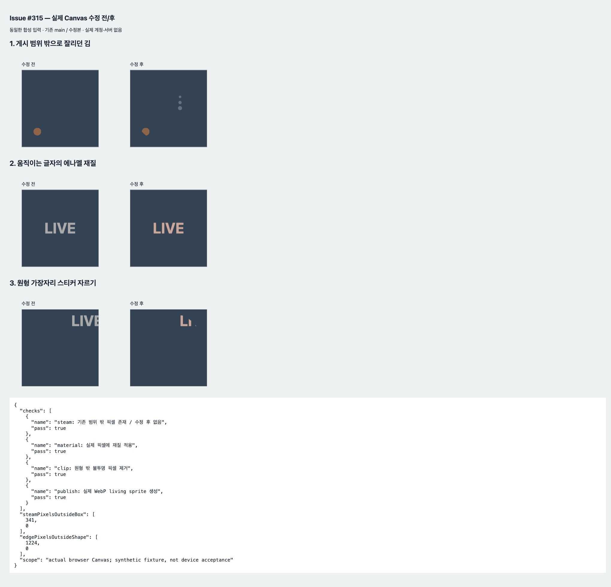

# Issue #315 살아 있는 겹침층 검증

기준: main `51e2df21`, 브랜치 `fix/315-living-overlays`, macOS·Node 25·Chrome, 2026-10-07. 실제 점포·사용자 데이터가 없는 합성 Canvas 입력이다.

- 제품 변경: 김 상승 범위를 게시 bbox에 포함하고, 움직이는 스티커도 기존 등급 효과를 받으며, 공통 living overlay를 수집품 모양으로 자른다. API·Android 파서·저장 스키마 변화 없음.
- **PASS** 수정 전 새 회귀 3건 각각 실패 → 수정 후 집중 37/37. 독립 검토의 추가 기존 회귀 포함 53/53. 전체 사이트 `node --test tests/site/*.mjs` 519/519, 0 FAIL/SKIP. 서로 포함되는 수는 합산하지 않는다.
- **PASS** 변경 JS/시험 `node --check`, `git diff --check`; 코드 검토 확정 결함 0, 구조 검토 CLEAR. LSP 전용 도구는 없으므로 LSP PASS로 기록하지 않는다.
- **PASS** 실제 브라우저 Canvas: 김 bbox 밖 픽셀 341→0, 원형 밖 픽셀 1224→0, 등급 재질 픽셀 변화, 실제 WebP living sprite 생성. 콘솔 오류·경고 0. [결과](browser.json), [시각 판정](visual-verdict.json).
- **NOT_RUN** 실제 서버 게시·공개 배포·지정 Android 설치본. 일반 웹과 시연에서 공유하는 renderer를 수정했으며 이미 게시된 정적 sprite의 재생성은 하지 않았다.

## 재현

```sh
node --test tests/site/collectible-living-overlays.test.mjs tests/site/collectible-parallax-living.test.mjs tests/site/collectible-pr310-p2.test.mjs tests/site/collectible-pr310-p2b.test.mjs
node --test tests/site/*.mjs
bash tools/gate.sh
```


