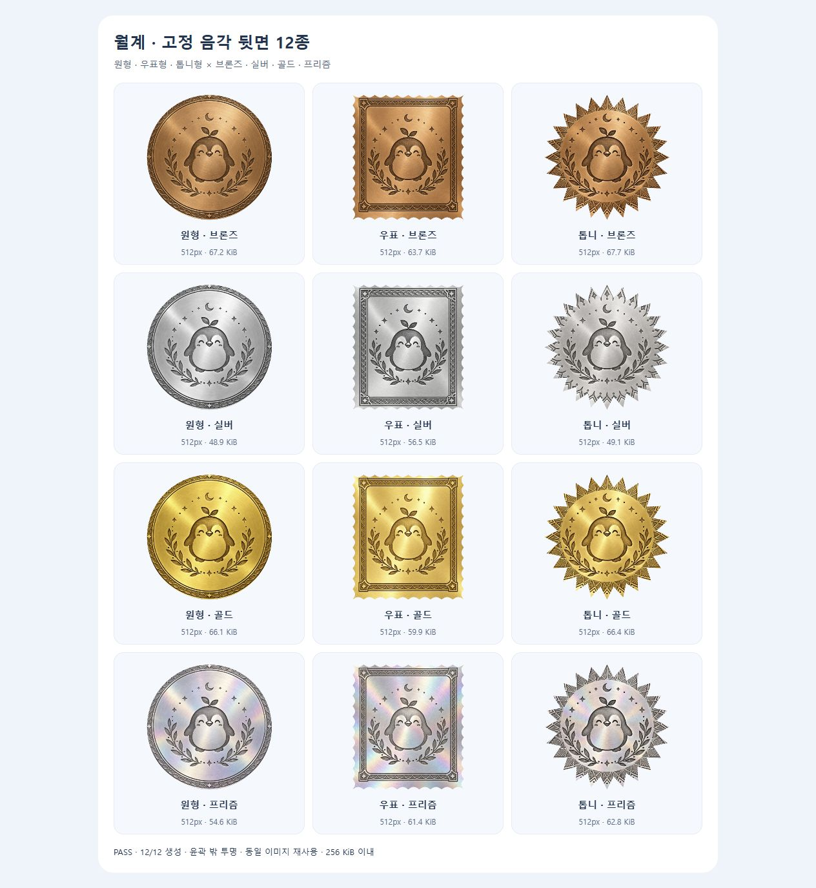

# 모양·등급별 고정 음각 뒷면 — 2026-10-08

점주가 앞면을 자유롭게 만들고, 뒷면은 미리 확정한 금속 음각 이미지를 계속 재사용한다. `circle`(원형)·`stamp`(우표/엽서형)·`serrated`(톱니형) 각각 `bronze`·`silver`·`gold`·`prism`을 두어 총 12종이다. 새로 입력한 이름·가게명·사진·스티커·바탕색으로 뒷면을 덧그리지 않는다.



## 이미지 생성과 고정 파일

- 기본 제공 `image_gen.imagegen`으로 **한 장씩 12회** 생성했다. 외부 API/CLI fallback은 쓰지 않았다.
- 원형 기준 음각의 마스코트·새싹·달·월계 문양을 유지하고, 우표는 사각 장식 테두리, 톱니는 방사형 문양으로 만들었다. 브론즈는 구릿빛, 실버는 백금빛, 골드는 금빛, 프리즘은 은색 바탕의 진주빛 반사다.
- [전체 프롬프트](prompts.json)에는 12개 프롬프트와 원본 파일 이름, 웹·모바일 상대 경로를 기록했다. 생성 원본은 Codex 기본 생성 폴더에 보존했다. 선택한 PNG 픽셀은 수정하지 않고 프로젝트에 복사했다.
- 웹: `apps/production-web/assets/collectible-backs/v1/{shape}-{grade}.png`.
- 앱: `apps/mobile/assets/images/collectibles/backs/v1/{shape}-{grade}.png`.
- [자산 해시](assets.json): 12장 모두 1254×1254이고 웹·모바일 바이트가 같다. 한 벌 41,909,062B(약 40MiB)다. 앱에 번들되는 PNG 용량은 배포 검토 사항이다. 게시 데이터는 아래처럼 512px WebP로 줄여 저장한다.
- `v1`은 확정 디자인이다. 다음 디자인은 파일을 교체하지 말고 별도 버전으로 추가한다.

## 렌더링과 호환

웹 `backFor()`가 고정 파일을 읽고 기존 `traceShape()` 윤곽으로 자른다. 게시 시 기존 `backImageDataUrl` 계약(512px, 256KiB 이내)을 지킨다. 고객 웹과 앱은 이미 발행된 `backImageDataUrl`을 우선 사용하고, 그 값이 없는 예전 수집품만 같은 고정 이미지로 보완한다. 기존 back 편집 메타데이터는 보존하지만 새 게시 결과에 합성하지 않는다. `gear`는 톱니 별칭, 알 수 없는 모양은 원형, canonical 4등급 이외의 사용자 등급은 이름과 관계없이 브론즈다.

점주 편집기에서는 뒷면 모드·색·스티커 면 선택을 제거했다. 2단계에 현재 모양·등급의 고정 음각 안내를 표시하고, 3단계 스티커는 앞면에만 둔다.

## 브라우저 검수 재현

```powershell
$env:COLLECTIBLE_QA_PORT='4190'
$env:COLLECTIBLE_QA_AI='1'
node tests/fixtures/collectible-qa-server.mjs
```

- `http://127.0.0.1:4190/fixed-backs/`: 실제 production `backFor()`와 `encodeImage()`를 import하는 검수 페이지다. 12종을 굽고, 이름·back 색/모드를 바꾼 뒤 같은 이미지인지 비교하며 윤곽 바깥의 투명 픽셀과 256KiB 제한을 검사한다.
- [브라우저 결과](browser-results.json): 12/12 PASS, 512px WebP 50,096~69,320B. 오류·경고 콘솔 0건.
- `http://127.0.0.1:4190/merchant/`: 합성 AI 초안 선택 → 1 → 2 → 3 → 4단계 이동, 180° 회전, 프리즘 선택에 따른 고정 음각 안내와 로컬 캠페인 게시 `v2` 성공을 확인했다. [2단계 캡처](14-studio-fixed-back-step.jpg).
- 이 fixture의 AI·점주·캠페인은 로컬 UI 검수용이다. 운영 계정 권한, 실제 AI 생성/과금, 공개 서비스 게시, Android 실기기 렌더를 입증하지 않는다.

## 앱 번들 검사

`apps/mobile`에서 개발 variant로 `npx --no-install expo export --platform android`를 실행해 PASS했다. [번들 증거](android-export.json)는 export metadata가 참조하는 파일의 SHA-256을 원본과 비교한 것으로, 12/12 이미지가 실제 번들에 포함된다. APK 빌드·설치·실기기 렌더는 실행하지 않았다.

독립 코드 리뷰에서 차단 지적은 없었다. 시험 합계와 남은 운영 검증은 [TEST_STATUS](../../TEST_STATUS.md)에 기록한다. 신규 API·DB migration이나 방문·쿠폰·NFT 규칙 변경은 없다.
