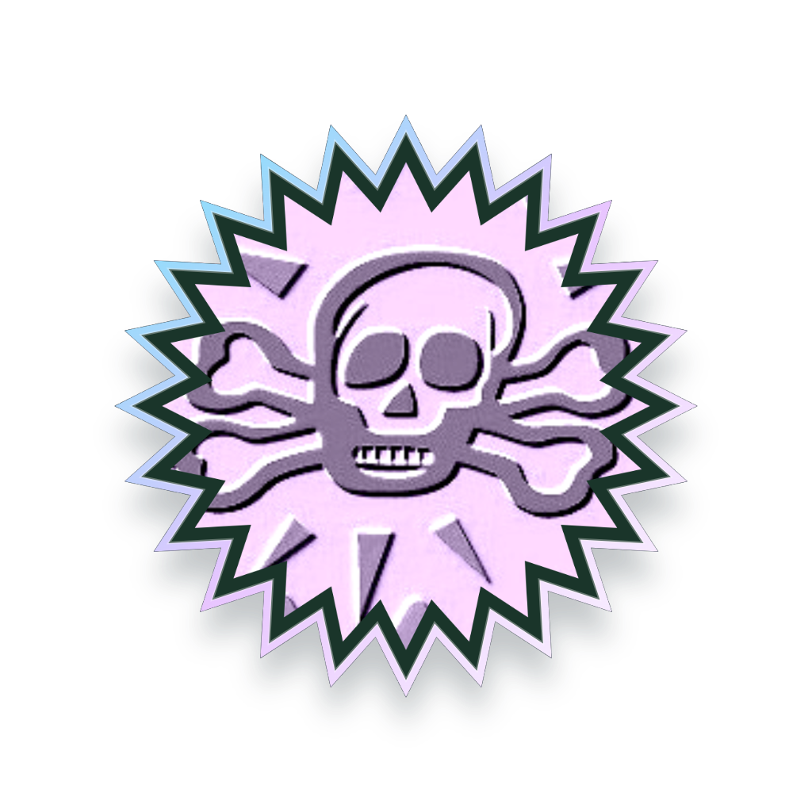

# 점주 방문 보상 사진 편집기 검수

2026-10-08 KST, PR #418 후속. `http://127.0.0.1:4190/merchant/`의 **합성 점주 fixture**에서 실제 Codex in-app Chromium 조작으로 확인했다. 실제 운영 계정·AI 모델·PostgreSQL의 증거가 아니다. 가상 가게의 실제 DB·고객 앱 검증은 [앞선 별도 기록](../merchant-dual-studio-2026-10-08/WEB_QA.md)을 읽는다.

## 직접 조작한 내용

준비 이미지 경로의 파일 선택창으로 사용자 첨부 `87_55169d4f1d3c8_1309.png`를 넣었다. 톱니 모양으로 바꾸고 마우스로 사진 위치를 움직였으며, 잡티 제거 획·화살표 실행 취소·다시 실행을 확인했다. 시연 획은 사진 보정 초기화로 정리하고 기본 스티커 세 개를 삭제했다. 배경색 버튼과 RGB 입력으로 `#1a352a`(26, 53, 42)를 적용했다. 네 등급의 양각과 골드 음각을 직접 비교했다.

4단계의 실제 **코인 이미지 저장** 버튼으로 네 등급의 1024px PNG를 다운로드했다. 낮은 원본 해상도에 따른 픽셀감은 남아 있으며 새 이미지 생성이나 업스케일 모델은 사용하지 않았다. 이름은 `해골 탐험 · 방문 코인`, 로컬 캠페인의 1·3·5회 목표는 각각 브론즈·실버·골드다. 저장 v4 뒤 최종 수정·게시 v6과 게시본 재열기를 확인했다. 이 캠페인의 게시 성공은 운영 배포·실제 방문 지급을 의미하지 않는다.

## 캡처와 완성품

| 파일 | 확인한 화면 |
| --- | --- |
| [01-photo-placement.jpg](01-photo-placement.jpg) | 준비한 이미지·톱니 자르기·1/4 다음 |
| [02-photo-editor.jpg](02-photo-editor.jpg) | 2/4 화살표 실행 취소/다시 실행·아이콘 도구·사진 캔버스 |
| [03-silver-raised.jpg](03-silver-raised.jpg) | 실버 양각의 은색 미리보기 |
| [04-gold-incised.jpg](04-gold-incised.jpg) | 골드 음각 선택과 금색 스타일 타일 |
| [05-prism-raised.jpg](05-prism-raised.jpg) | 프리즘 양각 선택과 보라색 스타일 타일 |
| [06-bronze-raised.jpg](06-bronze-raised.jpg) | 브론즈 양각 스타일 |
| [07-background-rgb.jpg](07-background-rgb.jpg) | 색상 버튼·HEX·R/G/B 실제 입력값 |
| [08-result-export.jpg](08-result-export.jpg) | 결과 단계의 PNG 저장과 수집품 이름 |
| [09-visit-rewards-published.jpg](09-visit-rewards-published.jpg) | 1/3/5 보상 매핑·게시 v6 |
| [10-merchant-visit-only.jpg](10-merchant-visit-only.jpg) | 첫 화면은 방문 보상 제작 한 구역만 표시 |
| [11-complete-gold-preview.jpg](11-complete-gold-preview.jpg) | 게시한 제작물을 다시 연 골드 결과 미리보기 |

아래 PNG 네 장은 같은 사진·모양·배경·양각 설정에서 **미리보기 등급만** 바꾸어 내보낸 결과다. [원자료 해시](browser-results.json)로 파일을 대조할 수 있다.

| 브론즈 | 실버 | 골드 | 프리즘 |
| --- | --- | --- | --- |
|  |  |  |  |

## 재현

저장소 루트 PowerShell에서 `$env:COLLECTIBLE_QA_PORT='4190'; $env:COLLECTIBLE_QA_AI='1'; node tests/fixtures/collectible-qa-server.mjs`를 실행하고 위 URL을 연다. fixture 저장은 프로세스 내 메모리이므로 서버를 다시 시작하면 새로 제작한다. 첨부 이미지는 PR에 원본 파일로 복사하지 않았으며 캡처와 내보낸 코인만 포함했다.

자동 회귀: `node --test tests/site/*.test.mjs` → 401/401 PASS, skip 0. 웹 editor·renderer·studio·merchant의 `node --check`, staged diff, `bash tools/gate.sh`와 최종 PR 한국어 검사를 통과했다. [실행 결과](validation.txt). 원형·우표·톱니의 기존 확정 음각 뒷면 12종은 바꾸지 않았다.
