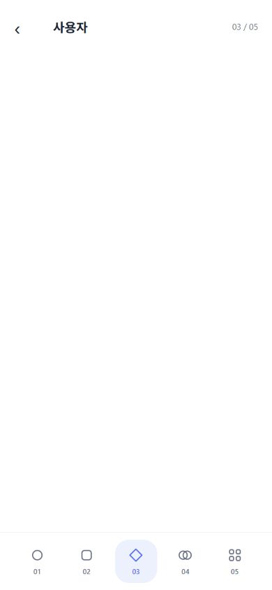
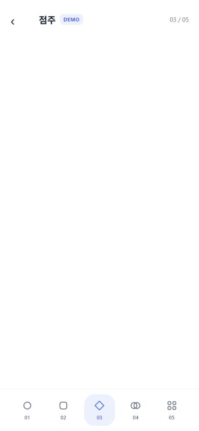

# 모바일 UI 기초 검증 — Issue #136

2026-09-23 최초 시안 기록: Windows / Node / Expo SDK 57, 당시 기준 main `60d37a7`, 브랜치 `feat/mobile-ui-foundation`. 아래 캡처와 검사 수치는 **최초 PR head의 브라우저 시안**에만 해당한다. 이후 같은 PR에서 역할 선택과 다섯 공간을 개발용 미리보기로 옮겼고, 운영 시작 경로와 네 탭은 유지했다. 아래 과거 검사 결과를 수정된 경로의 Android 실기 PASS로 해석하지 않는다.

## 자동 검사

- PASS: `npm test --prefix apps/mobile` — 153개. 기존 인증·외부지갑 회귀 포함, 새 공개 경계와 페이지 범위/폭 변경 검사 추가.
- PASS: `npm run typecheck --prefix apps/mobile`, `npm run lint --prefix apps/mobile`.
- PASS: `npm run export:android --prefix apps/mobile` — Android JS 번들. 설치용 APK나 실기 성공을 의미하지 않는다. 기존 의존성의 package exports fallback 경고는 남아 있다.
- PASS: bootstrap, operations docs, accessibility semantics, secret-scanner regression, privacy 검사와 `git diff --check`.
- 독립 소스 리뷰에서 루트 navigator remount, 숨겨진 시작 화면의 Android BackHandler, 지갑 취소 시 history 처리 문제를 발견해 수정했다. 수정 후 두 리뷰는 APPROVE / CLEAR.

## UI 실행 검사

실제 `FoundationScreen`을 React Native Web으로 렌더링한 로컬 하네스에서 확인했다. 시스템 appearance·reduce motion 입력은 하네스에서 지정했다. 아래 PNG는 **브라우저 미리보기이며 Android 캡처가 아니다**.

- PASS: 390×844 역할 선택 → 사용자 → 선택 지갑 안내 → 건너뛰기 → 중앙(03) 빈 공간.
- PASS: 점주 선택 → DEMO 표식 → 중앙 빈 공간.
- PASS: 다섯 탭, 처음/마지막/빠른 탭 전환, 04→03 수평 스크롤에 페이지 번호·선택 표시 연동.
- PASS: 390→320px 폭 변경 시 04 유지, 라이트/다크, 모션 감소 설정의 즉시 탭 이동, 웹 `aria-selected`.
- PASS(당시 head 한정): 당시 RouteBoundary에 명시적인 auth/router mock을 주입하여 signedOut/restoring/switchingAccount의 보호 자식 미마운트, 로그인 완료 후 wallet 목적지 유지, 계정 변경 시 보호 자식 remount, history 유무에 따른 back/replace 복귀를 확인했다. 수정된 PR은 해당 별도 제공자 경계를 제거하고 기존 루트 인증·Reown 경계를 복원했다. 이 과거 mock 결과는 수정본 검증에 재사용하지 않는다.

| 역할 선택 | 지갑 선택 | 사용자 | 점주 DEMO |
| --- | --- | --- | --- |
|  |  |  |  |

[320px 다크 화면](customer-dark-320.png)

## PR #138 수정본 검증

- 모바일 단위 152/152, typecheck, lint, Android JS export, `tests/release/check_release_wallet_surface_test.sh` PASS. 기존 PR의 Reown import 위반은 새 route-boundary/provider를 제거하고 기존 루트 제공자 경계를 복원해 해결했다.
- `/`는 다시 네 기능 탭 중 탐색이며, `foundation-preview`는 개발용 로그인 뒤 `내 정보`에 진입 링크를 제공한다(인증된 개발 빌드의 직접 경로 접근도 가능). release 빌드에서는 설정 진입점이 없고 직접 URL은 `/`로 돌아간다. 역할 선택·선택적 지갑 문구·다섯 페이지 전환 시안은 미리보기 안에 남는다.
- Android 16 16KB 에뮬레이터에서 수정된 개발 JS를 실행했으나 저장된 운영 로그인 구성의 인증 화면에 머물러 미리보기 진입은 `NOT_RUN`이다. 기존 계정·지갑 저장소를 지우거나 실제 Google 로그인을 대신 수행하지 않았다. 웹 앱 전체 미리보기는 기존 네이티브 Reown 모듈의 `react-native`/`react-native-web` 빌드 오류로 `BLOCKED`이며 위 최초 head 캡처를 수정본 스크린샷으로 재사용하지 않는다.

## 미실행 범위

NOT_RUN: 새 UI의 Android 설치·터치 관성/드래그 취소·하드웨어 뒤로가기·실제 safe area, TalkBack, 200% 시스템 글꼴, 실제 Google 로그인·외부지갑 연결/복귀·딥링크·계정 전환. 기존 지갑 코드와 auth-provider는 변경하지 않았으며 과거 실기 PASS를 이번 UI 증거로 쓰지 않는다. GitHub CI 결과는 PR의 실제 check 상태에서 확인한다.
