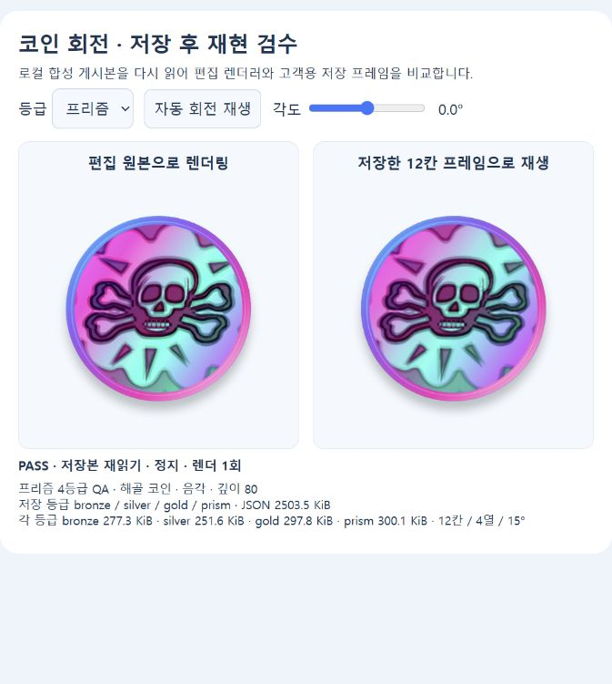
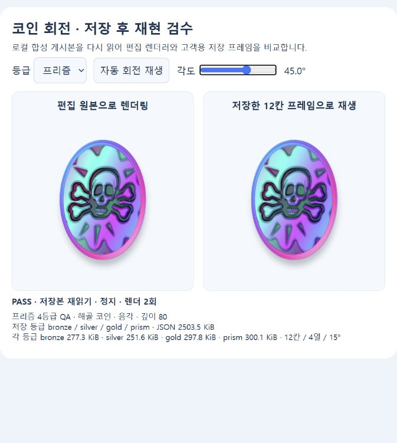
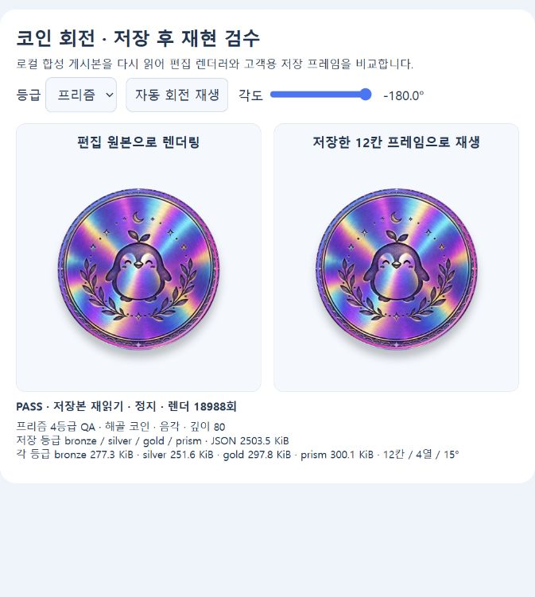
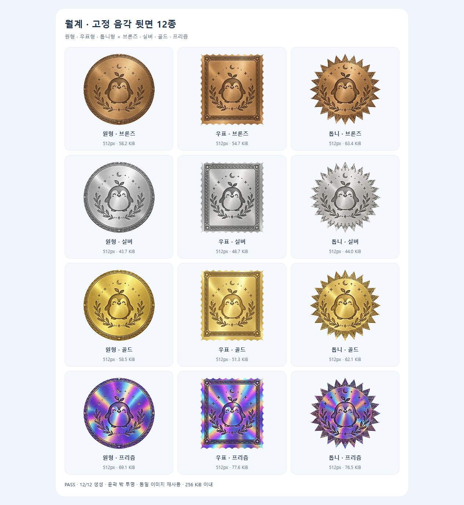

# 프리즘 네 등급·색감·용량 검수 — PR #418

2026-10-08 최신 사용자 요청: 프리즘까지 포함하고 추가 등급과 용량을 고려하며, 정면·후면을 실버와 구분되는 갖고 싶은 색감으로 개선한다. 이 기록이 앞선 세 등급 발행 및 v1 PNG 번들 설명을 대체한다.

## 현재 동작

기본 제작·발행 등급은 브론즈·실버·골드·프리즘 네 개다. 기본 네 등급은 끌 수 없고 모든 활성 특수등급까지 저장한다. 방문 지급은 계속 1회 브론즈·3회 실버·5회 골드이며, 프리즘의 새로운 지급 조건을 임의로 만들지 않았다. 실제 고객의 획득품은 해당 발행본과 등급을 참조하므로 이미 받은 이미지도 보존한다.

프리즘 음각·양각은 별도 효과 선택 없이 청록·분홍·보라의 공간별 금속색과 각도별 색 이동을 사용한다. 테두리도 같은 프리즘 계열이다. 기존 원본 스타일의 사진 색은 유지한다. 후면 세 장은 기존 펭귄·월계수 음각 문양을 유지해 built-in 이미지 생성으로 색을 편집했다. 창작 원본은 작업공간 `.omx/prism-back-source-v2/`에 보존하고, 배포 파일은 기존 sharp로 512px WebP quality80으로 인코딩했다. [정확한 프롬프트·입출력 위치](prompts.json).









## 용량과 저장

| 자료 | 실제 결과 또는 상한 |
| --- | --- |
| 웹·앱 공용 후면 12종 | 767,082바이트 = 749.1KiB = 0.73MiB; 양쪽 동일 SHA-256 |
| 이전 원본 PNG 한 벌 | 41,909,062바이트; 현재 자산은 98.17% 감소 |
| 가장 큰 공용 후면 파일 | 98,572바이트; 전부 512×512px |
| 브라우저에서 윤곽을 구운 후면 | 12/12 통과; 모두 256KiB 이하, 윤곽 밖 투명, 이름·색 변경과 관계없이 재사용 |
| 실제 네 등급 게시 프로젝트 JSON | 2,563,589바이트 = 2,503.5KiB = 2.45MiB |
| 실제 등급별 12칸 앞면 스프라이트 | 약 251.6~300.1KiB; 각 1MiB 이하 |
| 전체 게시 요청 상한 | UTF-8 JSON 8MiB |
| 해상도 조절 | 모든 활성 등급을 포함해 448→384→320→256px; 자동 등급 삭제 없음 |
| Android 내보내기 | 현재 WebP 12장 포함·이전 PNG 0장 포함을 실제 산출물 해시로 확인 |

후면의 대용량 v1 PNG는 원본 이력과 기존 웹 URL을 위해 남기되 모바일 `require`는 v2만 사용한다. [자산 해시](assets.json), [압축 수치](storage.json), [브라우저 후면 검수](back-render-results.json), [Android 내보내기 해시 검사](android-bundle.json).

초안에는 원본·붓·스티커·설정 JSON을 보존하고 게시할 때 완성 이미지와 프레임을 만든다. 고객 화면은 기존 정면·썸네일·12칸/4열/15° 정적 WebP 스프라이트·고정 후면·동작 JSON을 사용한다. MP4/GIF 하나로 저장하면 각도 조작과 편집을 보존하기 어려워 기존 형식을 유지했다. WebP 미지원 시 PNG를 사용하며 그때도 동일한 상한을 검사한다. 축소 후에도 상한을 넘으면 초안과 기존 게시본을 보존하고 오류를 안내한다.

압축 바이트와 디코딩 메모리는 다르다. 512px RGBA 한 장은 계산상 1MiB, 448px×12칸 스프라이트 한 장은 약 9.19MiB다. 웹 이미지 캐시는 12개, 보정 사진 캐시는 3개로 제한한다. 실제 GPU·Android 메모리와 FPS는 실측하지 않았다. 등급이 늘어날 때 모든 프레임을 한꺼번에 화면에 올리지 않고, 목록은 썸네일·상세는 현재 등급 프레임을 사용하는 구조를 유지해야 한다.

현재 공개 미디어는 기존 JSON/base64와 PostgreSQL 불변 발행본에 저장한다. 장기 확장에서는 원본 비공개 보관과 SHA-256 기반 공유 미디어 URL·versioned 후면 참조로 중복을 줄이는 방식을 검토한다. 이 PR에서 URL 기반 스키마나 CDN 배포는 하지 않았다. 프로젝트 100개·미디어가 남은 발행본 100개 상한도 유지한다.

## 새로운 등급이 생기면

1. 기존 `gradeId`를 이름이나 배열 순번 대신 유지한다. 초안·재열기·미리보기와 실제 PostgreSQL 불변 발행 행까지 임의 ID를 보존한다. 총 16등급, 새 프로젝트는 기본4+특수12까지다.
2. 기본 네 등급의 활성 상태를 검사하고, 모든 활성 등급의 정면·썸네일·필요한 living 자료가 준비되어야 발행한다. 조작된 API 입력의 특수등급 missing derived/missing living도 거절한다.
3. 현재 등록되지 않은 재질과 고정 후면은 브론즈로 대체한다. 새로운 고유 외형을 도입하려면 웹·모바일 재질 정의, 후면 카탈로그의 모양 세 장, API 기본 등급 목록 및 호환 시험을 함께 갱신한다. 단순 특수등급 추가에는 방문 지급 규칙을 바꾸지 않는다.
4. 기존 발행본을 덮어쓰지 않고 새 자산 버전과 새 발행본을 만든다. 옛 앱의 대체 외형도 확인한다. 오래된 초안이 이미 16개이며 기본 등급이 빠져 있으면 복구 후 상한을 넘을 수 있다. 이때 사용자 등급을 몰래 삭제하지 않는다.

## 검증과 재현

원격 main `8841efea`(PR #420·#423)을 통합한 뒤 API·사이트·모바일 전체와 타입·lint·Android export를 재검증했다. Windows 경로 구분자가 새 최소 크기 시험의 예외 파일 비교를 깨뜨려 경로만 정규화했다. 보안 관련 Worker 시험5건은 Windows 파일 권한/심볼릭 링크 한계, Docker 관련8건과 macOS Chrome 전용 테마 한 파일은 환경상 검증하지 못했다. [명령별 경계](../../TEST_STATUS.md).

- API 단위 601/601·타입·빌드, 실제 PostgreSQL 관련 통합 29/29 통과. 기본4 필수·추가 custom ID 발행·미디어 제거·권한·기존 발행 보존을 검증했다.
- 모바일 전체 LF 체크아웃 2,077/2,077·타입·린트·Android Metro/Hermes export 통과. 내보내기는 서명 APK나 실기 설치를 뜻하지 않는다.
- 웹 핵심 프리즘·relief·프레임·후면 시험 67/67, 모델·저장·스타터 26/26, 편집기 92/92 통과. 전체 웹 최종 결과는 [TEST_STATUS](../../TEST_STATUS.md)에 기록한다.
- 별도 읽기 전용 리뷰에서 발견한 추가 등급 living 누락 경계를 수정하고 재현 입력이 거절됨을 확인했다. 최종 차단 지적 0건.
- 로컬 합성 점주 fixture에서 실제 게시 버튼을 눌러 새 네 등급 자료를 만들고 HTTP로 다시 읽었다. 0/±45/180도와 자동 회전에서 편집 원본과 저장 프레임을 비교했다. [크기·프레임·자동 회전](browser-results.json), [캡처 해시](capture-hashes.json). 렌더 누적 횟수는 FPS 수치가 아니다. `02-prism-front-45-initial.png`는 추가 색 보완 전 비교 이력이다.

```powershell
$env:COLLECTIBLE_QA_PORT='4191'
node tests/fixtures/collectible-qa-server.mjs
```

위 화면에서 준비 이미지로 제작·게시한 뒤 다른 터미널에서 `node tests/fixtures/collectible-relief-qa-server.mjs`를 실행한다. `http://127.0.0.1:4192/`에서 동적 등급 목록·회전·게시본 비교를 확인한다. 후면 12종은 `http://127.0.0.1:4191/fixed-backs/`다. fixture는 외부 계정·실제 방문·보상을 사용하지 않는다. 실제 운영 배포와 Android 실기 색감·재생은 별도 검증이다.
