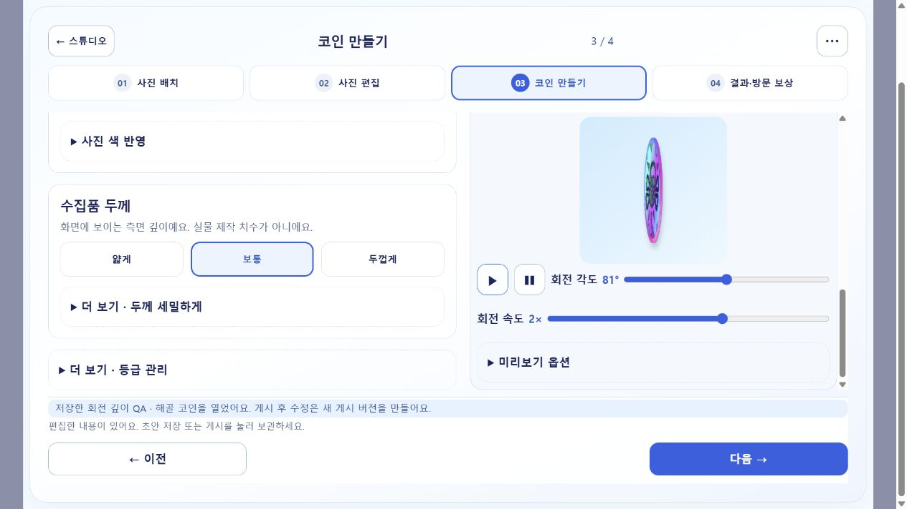
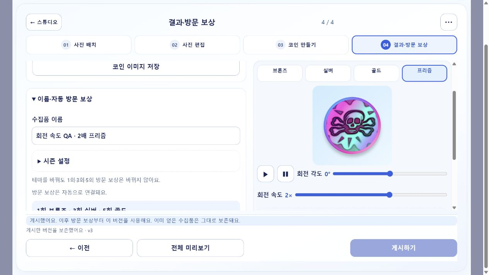
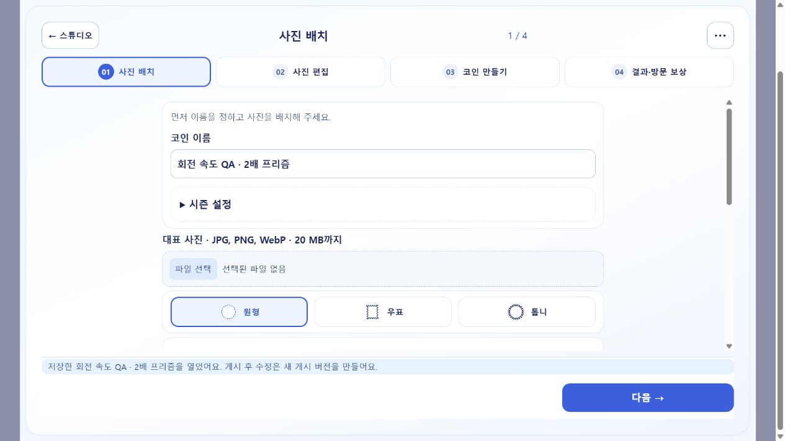
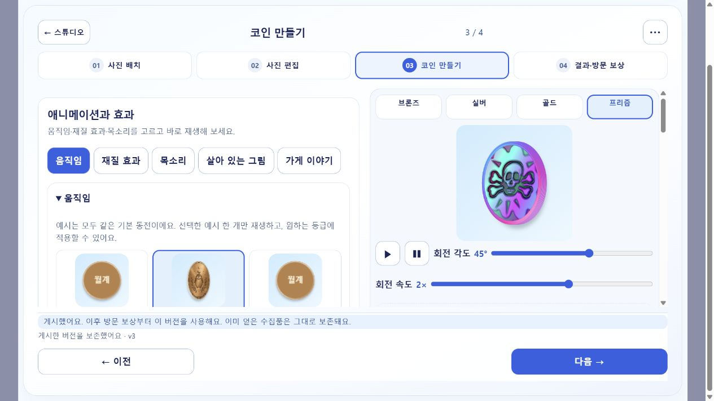
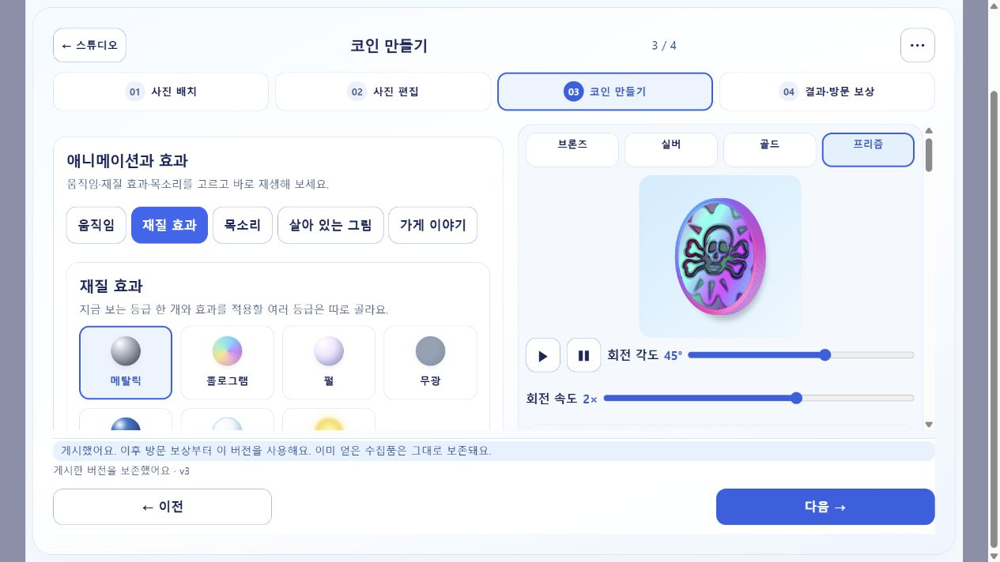
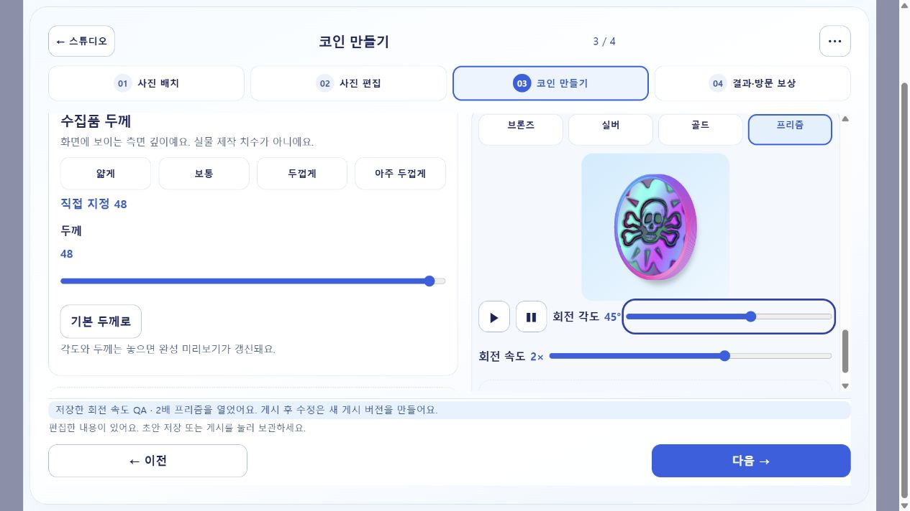
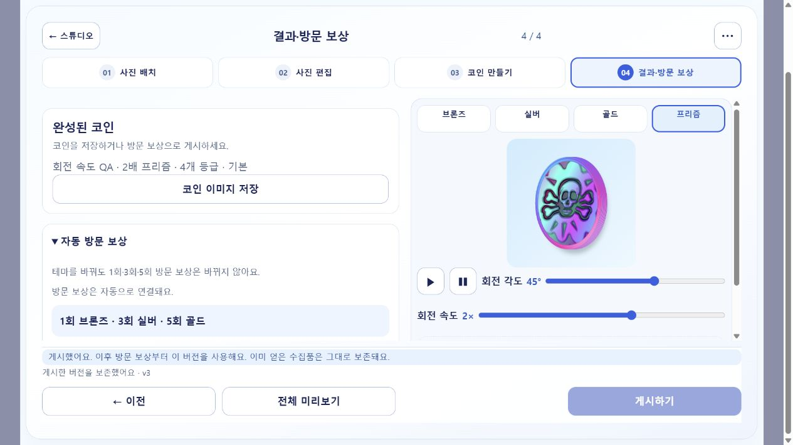

# 재생 회전·속도 저장 검수 (PR #418)

2026-10-08 KST. 제작기의 재생과 전체 미리보기는 등급의 동작 연결과 별개로 회전한다. 재생 옆의 속도0.25~3배는 각도를 이어 변경하며 정지/재개·다시 보기·수동 각도·움직임 줄이기를 지원한다. 선택 `rotationSpeed`를 초안·모든 등급 게시/획득 상세에 저장하고 누락한 기존 게시본은1배로 읽는다. 앱은 기존 rotate 동작의 각속도에 적용한다. 기존 웹75ms/도·앱90ms/도의 절대 속도 차이는 유지한다.

## 실제 화면과 저장

`COLLECTIBLE_QA_PORT=4193`, `COLLECTIBLE_QA_SEED_FILE=.omx/depth-qa-seed.json`으로 띄운 **격리 합성 점주 fixture**에서 사용자 첨부 해골 그림의 기존 게시본을 열었다. 실제 버튼·키보드로 프리즘·속도2배를 고르고 재생에서5°→-177°로 각도 변화를 확인했다. 정지는-145°를 유지하고 정면 보기는0°로 복귀했다. 이름을 `회전 속도 QA · 2배 프리즘`으로 바꾸어 게시한 뒤 HTTP로 다시 읽은 프로젝트와 합성 획득 상세 모두 속도2, 네 등급 자료를 확인했다. 운영 계정·실제 보상 수령을 검증한 것은 아니다. 이미지와 UUID·해시는 [브라우저 결과](browser-results.json)에 기록했다.

## 검증

- PASS: `node --test tests/site/collectible-*.test.mjs` 웹290/290. 표시 각도 드래그 방어의 최신 집중 회귀1/1, fixture·저장본 렌더 비교7/7.
- PASS: API 관련45/45, 모바일 관련60/60, API·모바일 타입 검사와 변경 앱 파일 ESLint.
- PASS: 재생은 motion 없는 코인도 회전, 속도 변경 연속성, 정지/재개, 재생 중 재클릭, 다시 보기, 동작 줄이기, 수동 각도, 초안 저장/재열기. 실제 canvas의 편집/저장본 투영 각도도 일치한다.
- PASS: 읽기 전용 독립 리뷰에서 뒷면 정지 시 앞면 스티커 드래그 결함을 수정하고 회귀를 재실행한 뒤 APPROVE·차단 지적0.
- 실제 PostgreSQL 속도 게시→획득 왕복은 기존 통합 시험에 assertion을 추가하여 최신 PR CI에서 검증한다. Android 실기·운영 배포는 NOT_RUN.

새 이미지·스프라이트·등급을 추가하지 않아 속도 저장은 작은 JSON 숫자 한 필드뿐이다. SQL migration·의존성·방문 지급·기존 발행본 덮어쓰기는 없다. 같은 재생 배율이 플랫폼 사이의 실제 회전 시간을 같게 만들지는 않는다.

## 제작 순서·두께 추가 요청

코인 이름·시즌을1단계로 옮기고3단계 맨 위에서 애니메이션과 효과 탭을 바로 보여 준다. 움직임은 기본으로 펼쳐지며 재질 효과·목소리·살아 있는 그림·이야기는 같은 단계에서 설정한다.4단계는 완성 결과·자동 방문 보상·게시만 남긴다. 항목700·패널 제목800 굵기는 실제 브라우저 계산 스타일로 확인했다. 두께는24→48, 기존4/8/14 프리셋에32(아주 두껍게)를 추가했다. 슬라이더는 접힘 없이 보인다.

실제 UI에서 두께48·각도45°·속도2를 선택해 게시하고 HTTP 재읽기한 프로젝트 및 합성 획득 상세에서48/2를 확인했다. 이전 게시본을 편집하면 새 프로젝트 게시본을 만드는 기존 동작은 유지한다. 새 UUID·해시·화면 계약은 [추가 브라우저 결과](studio-order-results.json)에 기록했다. 과거 속도 검수 [browser-results.json](browser-results.json)은 당시 저장본 기록으로 보존한다.

API 관련45/45·모바일 관련60/60·양쪽 typecheck·변경 모바일 ESLint PASS. PostgreSQL에는 두께48/속도2 게시→획득 assertion을 추가했다. Android 실기와 운영 배포는 실행하지 않았다. **두께25~48 게시본은 구 APK의24상한 파서가 읽지 못하므로 고객 앱 업데이트를 함께 배포한다.** 저장 형식·8MiB 전체/1MiB 프레임 상한·1/3/5 지급 규칙은 유지한다.
독립 단계 변경 리뷰에서 빈 이름 저장의 null 접근과 옛4단계 녹음 조건을 고친 뒤 APPROVE·추가P1/P2없음. 최신 웹 전체290/290, 단계·모델·편집 집중162/162(배치51/51), 빈 이름/시즌 안내·3단계 녹음·living 검증·두께48/32프리셋 회귀 PASS. 저장소 비밀·큰 파일·충돌·bootstrap·운영 문서·증거 정합·현재 배포 단일 원본 검사와 실제 PR 한국어 검사 PASS.
